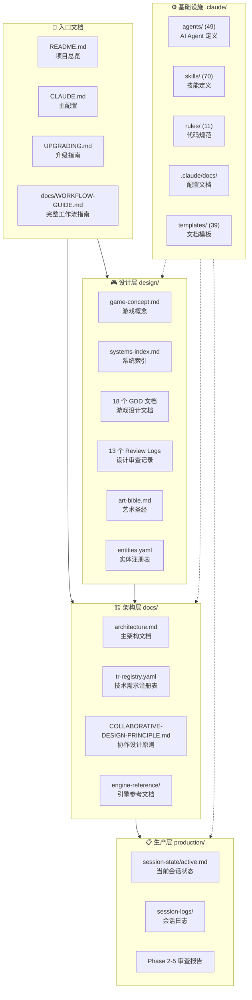
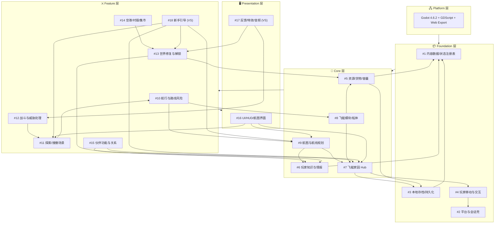
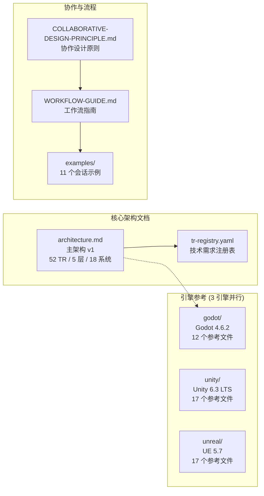
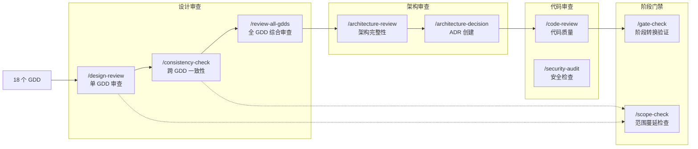
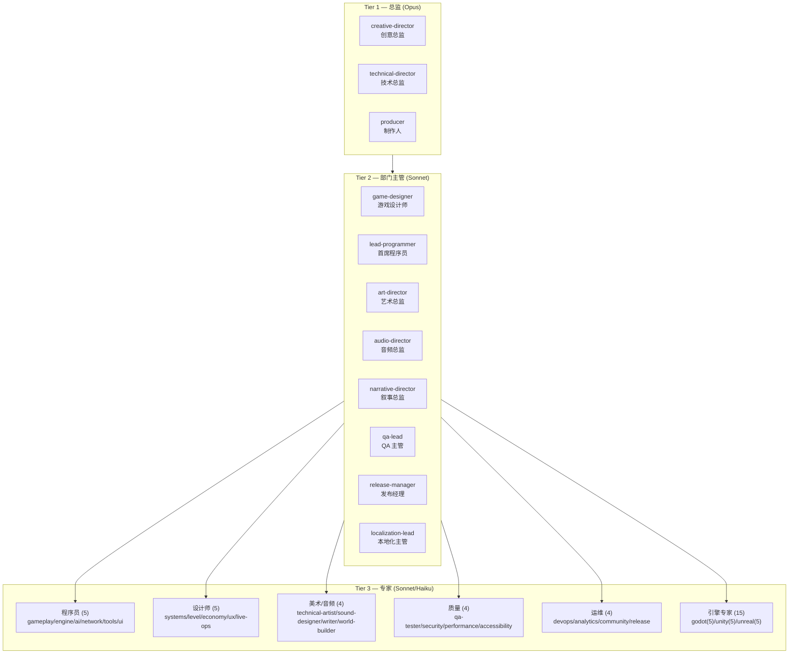
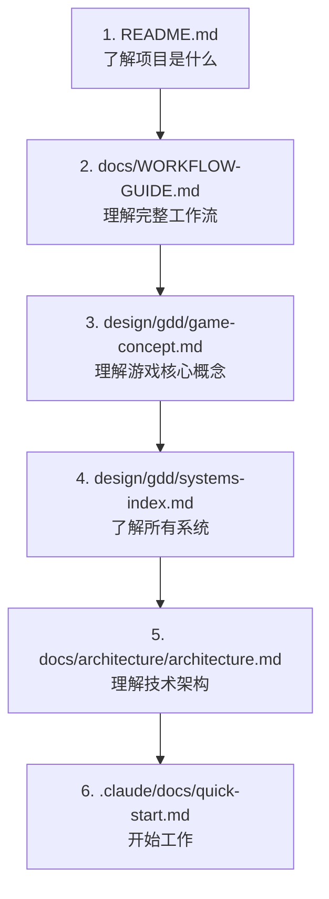

# 云海织航 — 文档索引

> **最后更新**: 2026-05-04
> **项目阶段**: Technical Setup — 主架构已完成
> **引擎**: Godot 4.6.2 + GDScript (Web-first)
> **文档总数**: ~320 个 .md 文件 + 9 个配置文件

---

## 一、文档全景图



### 入口文档

| 文件 | 说明 |
|------|------|
| [README.md](../README.md) | 项目总览、Studio 层级、Slash 命令概览 |
| [CLAUDE.md](../CLAUDE.md) | 主配置 — 技术栈、目录结构、编码标准 |
| [UPGRADING.md](../UPGRADING.md) | 升级指南 |
| [docs/WORKFLOW-GUIDE.md](WORKFLOW-GUIDE.md) | 完整工作流指南 (1684 行) |
| [docs/COLLABORATIVE-DESIGN-PRINCIPLE.md](COLLABORATIVE-DESIGN-PRINCIPLE.md) | 协作设计原则 |

### 设计层快速入口

| 文件 | 说明 |
|------|------|
| [design/gdd/game-concept.md](../design/gdd/game-concept.md) | 游戏概念 — 核心幻想、MDA 分析 |
| [design/gdd/systems-index.md](../design/gdd/systems-index.md) | 系统索引 — 18 个系统的边界与约束 |
| [design/art/art-bible.md](../design/art/art-bible.md) | 艺术圣经 (2111 行) |
| [design/registry/entities.yaml](../design/registry/entities.yaml) | 实体注册表 |

### 架构层快速入口

| 文件 | 说明 |
|------|------|
| [docs/architecture/architecture.md](architecture/architecture.md) | 主架构 — 52 TR / 5 层 / 18 系统 (TD+LP 双签收) |
| [docs/architecture/tr-registry.yaml](architecture/tr-registry.yaml) | 技术需求注册表 |
| [docs/engine-reference/godot/VERSION.md](engine-reference/godot/VERSION.md) | Godot 4.6.2 版本锁定 |

### 生产层快速入口

| 文件 | 说明 |
|------|------|
| [production/session-state/active.md](../production/session-state/active.md) | 当前会话状态 |
| [production/session-logs/session-log.md](../production/session-logs/session-log.md) | 会话日志 |

---

## 二、游戏设计文档 (GDD) — 依赖关系图

> 18 个系统，5 层架构。实线箭头 = 运行时依赖，虚线 = 信号/事件订阅。



### GDD 文件清单

| # | 系统名 | 文件 | 层级 | 状态 |
|---|--------|------|------|------|
| 1 | 内容数据与状态注册表 | [content-data-state-registry.md](../design/gdd/content-data-state-registry.md) | Foundation | ✅ 已审查 |
| 2 | 平台与会话壳 | [platform-session-shell.md](../design/gdd/platform-session-shell.md) | Foundation | ✅ 已审查 |
| 3 | 本地存档与世界状态持久化 | [local-save-world-state-persistence.md](../design/gdd/local-save-world-state-persistence.md) | Foundation | ✅ 已审查 |
| 4 | 玩家移动与交互 | [player-movement-interaction.md](../design/gdd/player-movement-interaction.md) | Foundation | ✅ 已审查 |
| 5 | 资源、货物与容量 | [resources-goods-capacity.md](../design/gdd/resources-goods-capacity.md) | Core | ✅ 已审查 |
| 6 | 玩家知识与情报 | [player-knowledge-intel.md](../design/gdd/player-knowledge-intel.md) | Core | ✅ 已审查 |
| 7 | 飞艇家园 Hub | [airship-hub.md](../design/gdd/airship-hub.md) | Core | ✅ 已审查 |
| 8 | 飞艇模块与船体状态 | [airship-modules-hull-state.md](../design/gdd/airship-modules-hull-state.md) | Core | ✅ 已审查 |
| 9 | 航图与航线规划 | [chart-route-planning.md](../design/gdd/chart-route-planning.md) | Core | ✅ 已审查 |
| 10 | 航行与路线风险 | [navigation-route-risk.md](../design/gdd/navigation-route-risk.md) | Feature | ✅ 已审查 |
| 11 | 探索 / 搜撤场景 | [exploration-scavenge-scenario.md](../design/gdd/exploration-scavenge-scenario.md) | Feature | ✅ 已审查 |
| 12 | 战斗与威胁处理 | [combat-threat-handling.md](../design/gdd/combat-threat-handling.md) | Feature | ✅ 已审查 |
| 13 | 世界修复与解锁 | [world-repair-unlock.md](../design/gdd/world-repair-unlock.md) | Feature | ✅ 已审查 |
| 14 | 空港/村镇状态与集市交易 | [port-village-market.md](../design/gdd/port-village-market.md) | Feature | ✅ 已审查 |
| 15 | 伙伴功能与关系 | [partner-relationships.md](../design/gdd/partner-relationships.md) | Feature | ✅ 已审查 |
| 16 | UI / HUD / 航图界面 | [ui-hud-chart-interface.md](../design/gdd/ui-hud-chart-interface.md) | Presentation | ✅ 已审查 |
| 17 | 反馈、特效与音频语义 | *(Vertical Slice)* | Presentation | ⏳ VS |
| 18 | 新手引导与首轮闭环 | *(Vertical Slice)* | Feature | ⏳ VS |

### GDD 审查记录 (Review Logs)

| 系统 | Review Log |
|------|------------|
| #1 内容数据 | [review-log](../design/gdd/reviews/content-data-state-registry-review-log.md) |
| #2 平台会话壳 | [review-log](../design/gdd/reviews/platform-session-shell-review-log.md) |
| #3 本地存档 | [review-log](../design/gdd/reviews/local-save-world-state-persistence-review-log.md) |
| #4 移动交互 | [review-log](../design/gdd/reviews/player-movement-interaction-review-log.md) |
| #5 资源货物 | [review-log](../design/gdd/reviews/resources-goods-capacity-review-log.md) |
| #7 飞艇家园 | [review-log](../design/gdd/reviews/airship-hub-review-log.md) |
| #8 模块船体 | [review-log](../design/gdd/reviews/airship-modules-hull-state-review-log.md) |
| #9 航图规划 | [review-log](../design/gdd/reviews/chart-route-planning-review-log.md) |
| #11 探索搜撤 | [review-log](../design/gdd/reviews/exploration-scavenge-scenario-review-log.md) |
| #12 战斗威胁 | [review-log](../design/gdd/reviews/combat-threat-handling-review-log.md) |
| #13 世界修复 | [review-log](../design/gdd/reviews/world-repair-unlock-review-log.md) |
| #14 空港集市 | [review-log](../design/gdd/reviews/port-village-market-review-log.md) |
| 跨 GDD 审查 | [cross-review-2026-05-03](../design/gdd/gdd-cross-review-2026-05-03.md) |

> **VS** = Vertical Slice 阶段实现，MVP 不要求完整版本。

---

## 三、架构文档结构



### 架构文档清单

| 文件 | 说明 |
|------|------|
| [architecture.md](architecture/architecture.md) | 主架构 — v1 签收 (TD+LP 双签收) |
| [tr-registry.yaml](architecture/tr-registry.yaml) | 52 条技术需求注册表 |
| [registry/architecture.yaml](registry/architecture.yaml) | 架构注册表 |
| [COLLABORATIVE-DESIGN-PRINCIPLE.md](COLLABORATIVE-DESIGN-PRINCIPLE.md) | 协作设计原则 |
| [WORKFLOW-GUIDE.md](WORKFLOW-GUIDE.md) | 完整工作流指南 (1684 行) |
| [examples/](examples/) | 11 个会话流程示例 |

### 引擎参考文档 (当前使用: Godot)

| 文件 | 说明 |
|------|------|
| [VERSION.md](engine-reference/godot/VERSION.md) | 版本锁定: Godot 4.6.2 |
| [breaking-changes.md](engine-reference/godot/breaking-changes.md) | Godot 4.4→4.6 破坏性变更 |
| [current-best-practices.md](engine-reference/godot/current-best-practices.md) | 当前最佳实践 |
| [deprecated-apis.md](engine-reference/godot/deprecated-apis.md) | 废弃 API |
| [modules/animation.md](engine-reference/godot/modules/animation.md) | 动画参考 |
| [modules/audio.md](engine-reference/godot/modules/audio.md) | 音频参考 |
| [modules/input.md](engine-reference/godot/modules/input.md) | 输入参考 |
| [modules/navigation.md](engine-reference/godot/modules/navigation.md) | 导航参考 (⚠️ NavigationServer2D 4.5+) |
| [modules/networking.md](engine-reference/godot/modules/networking.md) | 网络参考 |
| [modules/physics.md](engine-reference/godot/modules/physics.md) | 物理参考 |
| [modules/rendering.md](engine-reference/godot/modules/rendering.md) | 渲染参考 (WebGL 2 约束) |
| [modules/ui.md](engine-reference/godot/modules/ui.md) | UI 参考 (🔴 Dual-focus 4.6) |

---

## 四、审查与质量门禁流程



### 已完成审查记录

| 日期 | 审查 | 结果 | 报告 |
|------|------|------|------|
| 2026-04-30 | `/consistency-check` 跨 GDD 一致性 | 通过 | [cross-review-2026-04-30](../design/gdd/gdd-cross-review-2026-04-30-consistency.md) |
| 2026-05-03 | `/review-all-gdds` Phase 2 — 跨 GDD 一致性 | 5 BLOCKING/CRITICAL 已修复 | [phase2-report](../production/session-state/phase2-cross-gdd-consistency-report.md) |
| 2026-05-03 | `/review-all-gdds` Phase 3 — 游戏设计整体审查 | 通过 | [phase3-report](../production/session-state/phase3-game-design-holism-review.md) |
| 2026-05-04 | `/review-all-gdds` Phase 4 — 跨系统场景走查 | 通过 | [phase4-report](../production/session-state/phase4-cross-system-scenario-walkthrough.md) |
| 2026-05-04 | `/review-all-gdds` Phase 5 — 最终裁决 | PASS WITH NOTES | [phase5-report](../production/session-state/phase5-final-verdict.md) |
| 2026-05-04 | `/create-architecture` — 主架构 | TD+LP 双签收 | [architecture.md](architecture/architecture.md) |

---

## 五、Studio 基础设施

### Agent 体系 (49 个)



### Skill 体系 (70 个) — 按工作流阶段


### 完整 Skill 分类

| 类别 | 技能 | 数量 |
|------|------|------|
| **入门引导** | `/start` `/help` `/project-stage-detect` `/setup-engine` `/adopt` `/onboard` | 6 |
| **创意构思** | `/brainstorm` `/map-systems` | 2 |
| **设计创作** | `/design-system` `/quick-design` `/ux-design` `/art-bible` `/reverse-document` | 5 |
| **设计审查** | `/design-review` `/ux-review` `/consistency-check` `/review-all-gdds` | 4 |
| **架构** | `/create-architecture` `/architecture-decision` `/architecture-review` `/create-control-manifest` | 4 |
| **规划** | `/create-epics` `/create-stories` `/sprint-plan` `/sprint-status` `/estimate` | 5 |
| **实现** | `/dev-story` `/prototype` `/story-readiness` `/story-done` | 4 |
| **代码质量** | `/code-review` `/security-audit` `/scope-check` `/tech-debt` `/simplify` | 5 |
| **测试** | `/qa-plan` `/smoke-check` `/soak-test` `/regression-suite` `/test-flakiness` `/test-evidence-review` `/playtest-report` `/test-setup` `/test-helpers` | 9 |
| **性能** | `/perf-profile` `/asset-audit` `/content-audit` | 3 |
| **平衡** | `/balance-check` `/propagate-design-change` | 2 |
| **发布** | `/gate-check` `/launch-checklist` `/release-checklist` `/changelog` `/patch-notes` `/day-one-patch` `/hotfix` | 7 |
| **回顾** | `/milestone-review` `/retrospective` | 2 |
| **本地化** | `/localize` | 1 |
| **Bug** | `/bug-report` `/bug-triage` | 2 |
| **团队** | `/team-audio` `/team-combat` `/team-level` `/team-live-ops` `/team-narrative` `/team-polish` `/team-qa` `/team-release` `/team-ui` | 9 |

---

## 六、规范与模板

### 路径规则 (11 个)

[`.claude/rules/`](../.claude/rules/) 目录下的代码规范，按文件类型自动激活：

| 规则文件 | 适用范围 |
|----------|----------|
| [ai-code.md](../.claude/rules/ai-code.md) | AI 行为树/状态机代码 |
| [data-files.md](../.claude/rules/data-files.md) | 数据文件 |
| [design-docs.md](../.claude/rules/design-docs.md) | 设计文档 (8 个必需节) |
| [engine-code.md](../.claude/rules/engine-code.md) | 引擎代码 |
| [gameplay-code.md](../.claude/rules/gameplay-code.md) | 游戏玩法代码 |
| [narrative.md](../.claude/rules/narrative.md) | 叙事文本 |
| [network-code.md](../.claude/rules/network-code.md) | 网络代码 |
| [prototype-code.md](../.claude/rules/prototype-code.md) | 原型代码 (宽松标准) |
| [shader-code.md](../.claude/rules/shader-code.md) | Shader 代码 |
| [test-standards.md](../.claude/rules/test-standards.md) | 测试标准 |
| [ui-code.md](../.claude/rules/ui-code.md) | UI 代码 |

### 核心配置文档

| 文件 | 说明 |
|------|------|
| [.claude/settings.json](../.claude/settings.json) | 项目设置 (权限/Hooks) |
| [.claude/docs/agent-roster.md](../.claude/docs/agent-roster.md) | Agent 完整名册 |
| [.claude/docs/agent-coordination-map.md](../.claude/docs/agent-coordination-map.md) | Agent 协调委托关系图 |
| [.claude/docs/coordination-rules.md](../.claude/docs/coordination-rules.md) | Agent 协调规则 |
| [.claude/docs/directory-structure.md](../.claude/docs/directory-structure.md) | 目录结构 |
| [.claude/docs/technical-preferences.md](../.claude/docs/technical-preferences.md) | 技术偏好 (待配置) |
| [.claude/docs/coding-standards.md](../.claude/docs/coding-standards.md) | 编码标准 |
| [.claude/docs/context-management.md](../.claude/docs/context-management.md) | 上下文管理策略 |
| [.claude/docs/review-workflow.md](../.claude/docs/review-workflow.md) | 审查工作流 |
| [.claude/docs/skills-reference.md](../.claude/docs/skills-reference.md) | Skill 参考 |
| [.claude/docs/director-gates.md](../.claude/docs/director-gates.md) | 总监门禁模式 |
| [.claude/docs/quick-start.md](../.claude/docs/quick-start.md) | 快速入门 |
| [.claude/docs/hooks-reference.md](../.claude/docs/hooks-reference.md) | Hooks 参考 |
| [.claude/docs/rules-reference.md](../.claude/docs/rules-reference.md) | 规则参考 |
| [.claude/docs/setup-requirements.md](../.claude/docs/setup-requirements.md) | 安装要求 |
| [.claude/agent-memory/lead-programmer/MEMORY.md](../.claude/agent-memory/lead-programmer/MEMORY.md) | Lead Programmer Agent 记忆 |

---

## 七、文档阅读路线图

### 新成员入门路径



### 按角色推荐阅读

| 角色 | 必读文档 | 选读 |
|------|----------|------|
| **新成员** | [README](../README.md) → [WORKFLOW-GUIDE](WORKFLOW-GUIDE.md) → [game-concept](../design/gdd/game-concept.md) | [examples/](examples/) |
| **游戏设计师** | [game-concept](../design/gdd/game-concept.md) → [systems-index](../design/gdd/systems-index.md) → [全部 GDD](../design/gdd/) | [reviews/](../design/gdd/reviews/) |
| **程序员** | [architecture](architecture/architecture.md) → [coding-standards](../.claude/docs/coding-standards.md) → [engine-reference/godot/](engine-reference/godot/) | [rules/](../.claude/rules/) |
| **美术** | [art-bible](../design/art/art-bible.md) → [game-concept](../design/gdd/game-concept.md) | [rendering](engine-reference/godot/modules/rendering.md) |
| **音频** | [game-concept](../design/gdd/game-concept.md) → GDD #17 (VFX/Audio) | [audio](engine-reference/godot/modules/audio.md) |
| **QA** | [全部 GDD](../design/gdd/) → [test-standards](../.claude/rules/test-standards.md) → [coding-standards](../.claude/docs/coding-standards.md) | [reviews/](../design/gdd/reviews/) |
| **制作人** | [WORKFLOW-GUIDE](WORKFLOW-GUIDE.md) → [architecture](architecture/architecture.md) → sprint 相关 | [session-logs/](../production/session-logs/) |

---

## 八、统计概览

```
文档分布 (按目录)

  design/          ████████████████░░░░  35 文件  (GDD + 审查 + 艺术)
  docs/            ████████████████████████████████  63 文件  (架构 + 引擎参考 + 示例)
  production/      ████░░░░░░░░░░░░░░░   7 文件  (会话状态 + 日志)
  .claude/         ██████████████████████████████████████████████████  123 文件  (Agent + Skill + 规则 + 模板)
  CCGS Framework/  ██████████████████████████████████████  85 文件  (测试框架)
  .github/         █░░░░░░░░░░░░░░░░░░░   3 文件  (Issue/PR 模板)
  src/             █░░░░░░░░░░░░░░░░░░░   1 文件  (占位)

  📊 总计: ~320 个 Markdown 文档 + 9 个配置/数据文件
```

---

## 九、待创建文档

根据 `/create-architecture` Phase 8 结论，以下文档待创建：

- [ ] **17 个 ADR** (Architecture Decision Records) — `docs/architecture/adr/`
  - ADR-0001: Content Registry pattern
  - ADR-0002: Save/Load architecture
  - ADR-0003: Interaction system
  - ADR-0004: Resource economy
  - ADR-0005: Knowledge/Intel state machine
  - ADR-0006: UI modal stack & input routing
  - ... 等共 17 个
- [ ] **Control Manifest** — `docs/architecture/control-manifest.md`
- [ ] **Epics** — 按系统分组的 Epic 文件
- [ ] **技术偏好完整配置** — `.claude/docs/technical-preferences.md`
- [ ] **Sprint Plan** — 首个开发 Sprint 计划

---

> **提示**: 本文档使用 Mermaid 图表。在 VS Code 中安装 "Markdown Preview Mermaid Support" 插件，
> 或在 GitHub 上直接查看以渲染图表。也可使用 `npx mermaid-cli` 生成静态图片。
