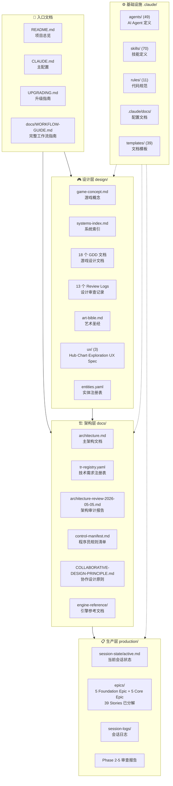
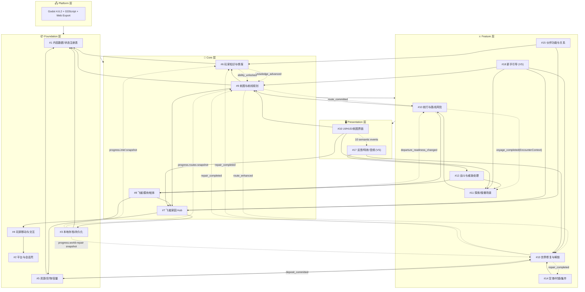
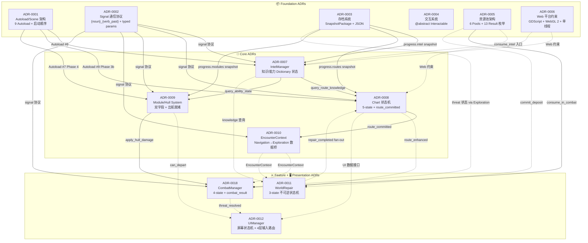
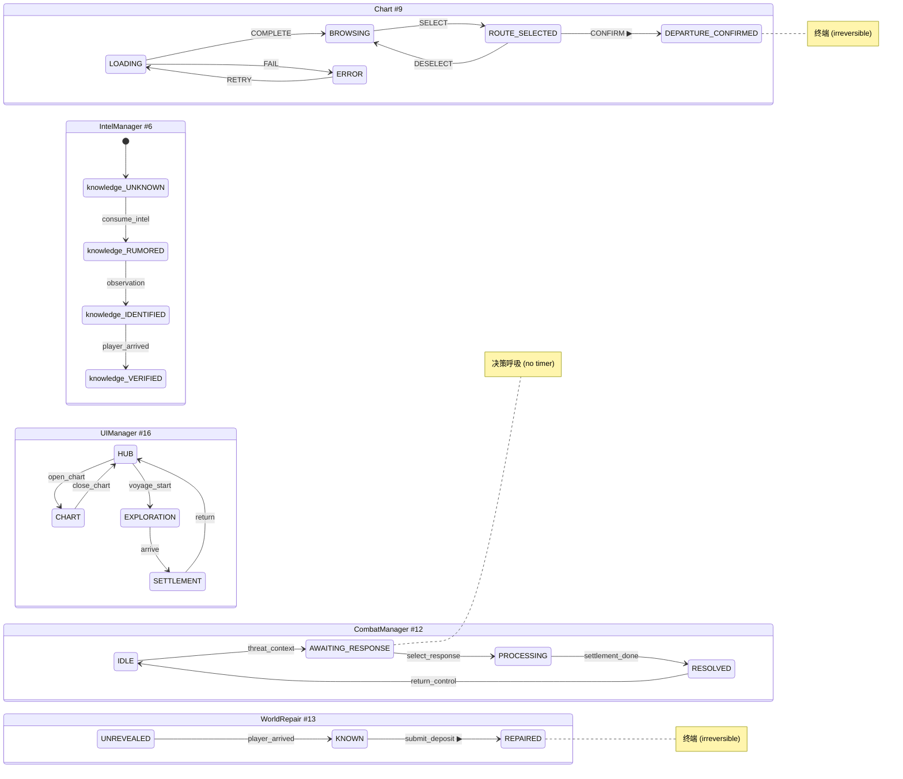
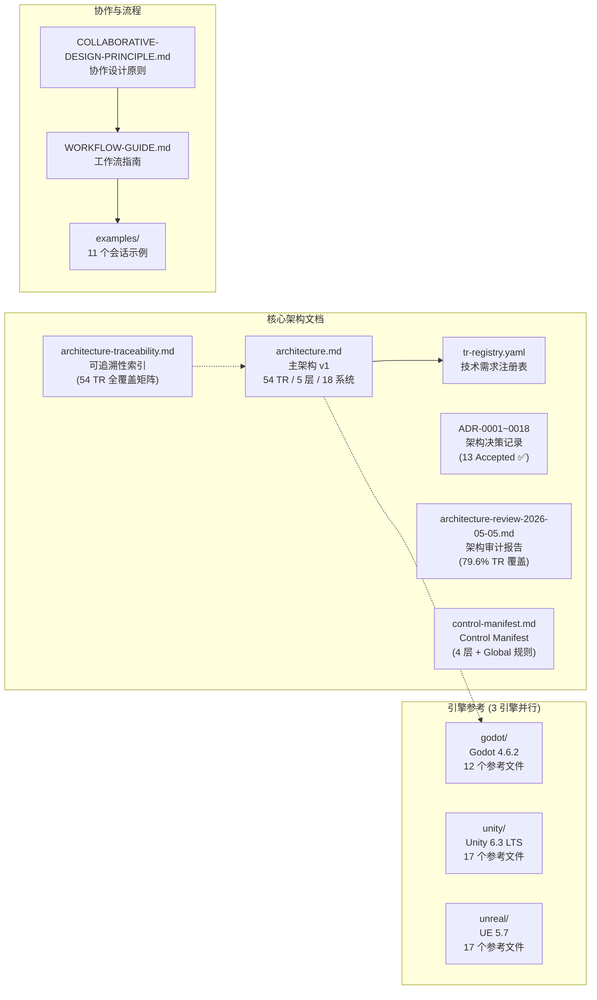
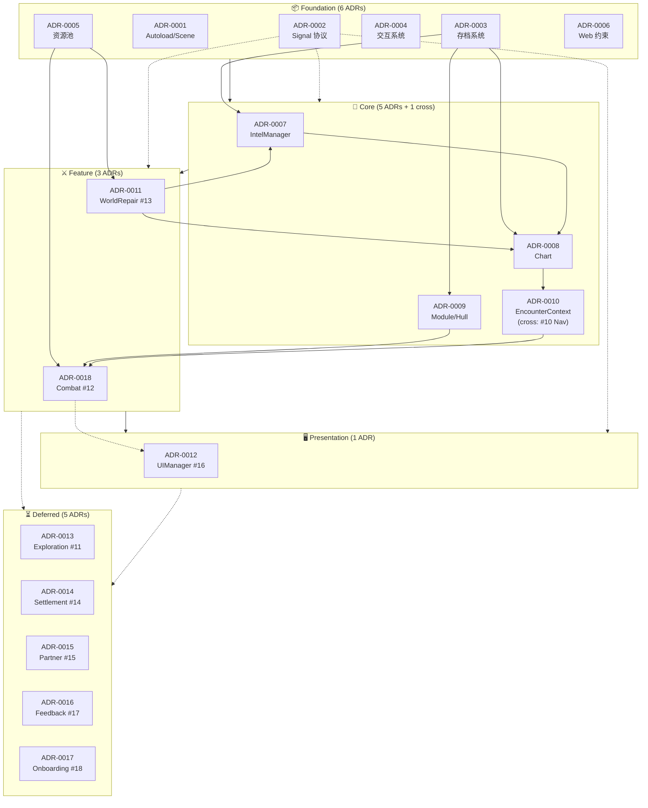
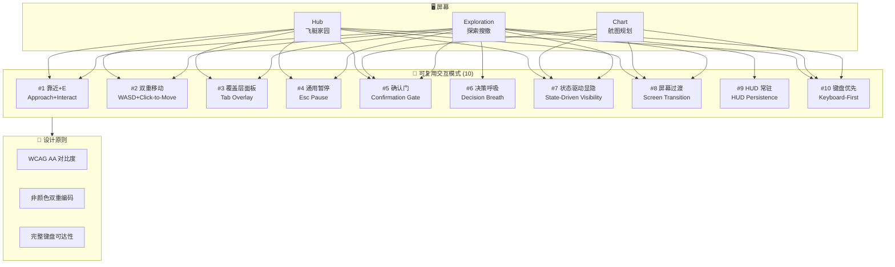
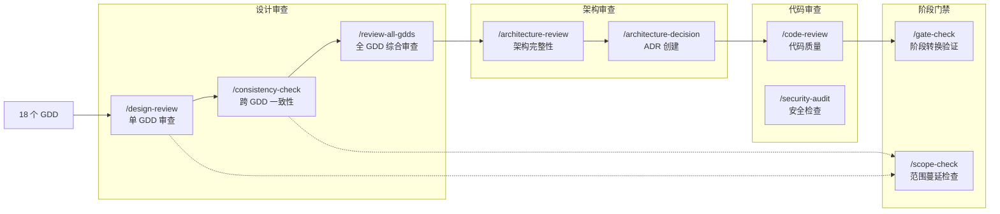
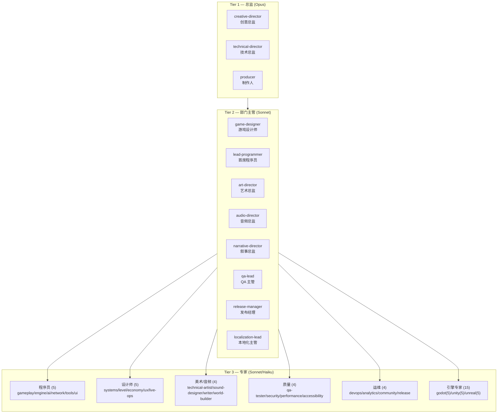
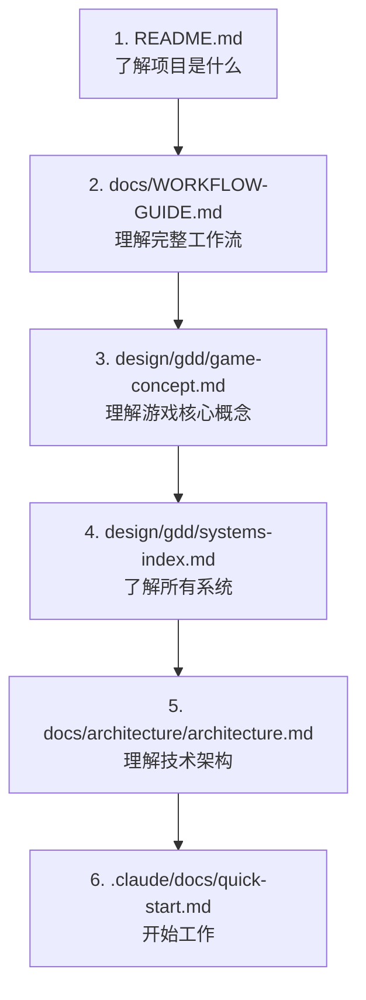

# 云海织航 — 文档索引

> **最后更新**: 2026-05-07
> **项目阶段**: Pre-Production — P3 进行中 (Foundation 层 5/5 Epic Story 分解完成)
> **引擎**: Godot 4.6.2 + GDScript (Web-first, 已正式配置)
> **ADR**: 13 Accepted (0001-0012 + 0018) · TR Registry: 54 条已注册 · Control Manifest: Active
> **Epic/Story**: Foundation 层 5/5 Epic 完成 (39 Stories: 22 Logic + 14 Integration + 2 UI)
> **文档总数**: ~355 个 .md 文件 + 10 个配置/数据文件

---

## 一、文档全景图



### 入口文档

| 文件 | 说明 |
|------|------|
| [README.md](../README.md) | 项目总览、Studio 层级、Slash 命令概览 |
| [CLAUDE.md](../CLAUDE.md) | 主配置 — 技术栈、目录结构、编码标准 |
| [UPGRADING.md](../UPGRADING.md) | 升级指南 |
| [docs/WORKFLOW-GUIDE.md](WORKFLOW-GUIDE.md) | 完整工作流指南 (1684 行) |
| [docs/COLLABORATIVE-DESIGN-PRINCIPLE.md](COLLABORATIVE-DESIGN-PRINCIPLE.md) | 协作设计原则 |

### 设计层快速入口

| 文件 | 说明 |
|------|------|
| [design/gdd/game-concept.md](../design/gdd/game-concept.md) | 游戏概念 — 核心幻想、MDA 分析 |
| [design/gdd/systems-index.md](../design/gdd/systems-index.md) | 系统索引 — 18 个系统的边界与约束 |
| [design/art/art-bible.md](../design/art/art-bible.md) | 艺术圣经 (2111 行) |
| [design/ux/hub.md](../design/ux/hub.md) | Hub UX Spec — 飞艇家园 (10 站点/4 房间/8 状态变体) |
| [design/ux/chart.md](../design/ux/chart.md) | Chart UX Spec — 航图航线规划 (5 状态/墨水扩散出航序列) |
| [design/ux/exploration.md](../design/ux/exploration.md) | Exploration UX Spec — 探索搜撤场景 (4 阶段/11 动画) |
| [design/registry/entities.yaml](../design/registry/entities.yaml) | 实体注册表 |

### 架构层快速入口

| 文件 | 说明 |
|------|------|
| [docs/architecture/architecture.md](architecture/architecture.md) | 主架构 — 54 TR / 5 层 / 18 系统 (TD+LP 双签收) |
| [docs/architecture/tr-registry.yaml](architecture/tr-registry.yaml) | 技术需求注册表 |
| [docs/engine-reference/godot/VERSION.md](engine-reference/godot/VERSION.md) | Godot 4.6.2 版本锁定 |

### 生产层快速入口

| 文件 | 说明 |
|------|------|
| [production/session-state/active.md](../production/session-state/active.md) | 当前会话状态 |
| [production/epics/index.md](../production/epics/index.md) | Epic/Story 索引 — Foundation 5/5 完成 (39 Stories) |
| [production/epics/content-registry/EPIC.md](../production/epics/content-registry/EPIC.md) | Epic #1: 内容注册表 (8 Stories) |
| [production/epics/platform-session-shell/EPIC.md](../production/epics/platform-session-shell/EPIC.md) | Epic #2: 平台会话壳 (7 Stories) |
| [production/epics/local-save-persistence/EPIC.md](../production/epics/local-save-persistence/EPIC.md) | Epic #3: 持久化 (8 Stories) |
| [production/epics/player-movement-interaction/EPIC.md](../production/epics/player-movement-interaction/EPIC.md) | Epic #4: 移动交互 (7 Stories) |
| [production/epics/resources-goods-capacity/EPIC.md](../production/epics/resources-goods-capacity/EPIC.md) | Epic #5: 资源货物容量 (9 Stories) |
| [production/session-logs/session-log.md](../production/session-logs/session-log.md) | 会话日志 |

---

## 二、游戏设计文档 (GDD) — 依赖关系图

> 18 个系统，5 层架构。实线箭头 = 运行时依赖，虚线 = 信号/事件订阅。



### GDD 文件清单

| # | 系统名 | 文件 | 层级 | 状态 |
|---|--------|------|------|------|
| 1 | 内容数据与状态注册表 | [content-data-state-registry.md](../design/gdd/content-data-state-registry.md) | Foundation | ✅ 已审查 |
| 2 | 平台与会话壳 | [platform-session-shell.md](../design/gdd/platform-session-shell.md) | Foundation | ✅ 已审查 |
| 3 | 本地存档与世界状态持久化 | [local-save-world-state-persistence.md](../design/gdd/local-save-world-state-persistence.md) | Foundation | ✅ 已审查 |
| 4 | 玩家移动与交互 | [player-movement-interaction.md](../design/gdd/player-movement-interaction.md) | Foundation | ✅ 已审查 |
| 5 | 资源、货物与容量 | [resources-goods-capacity.md](../design/gdd/resources-goods-capacity.md) | Foundation | ✅ 已审查 |
| 6 | 玩家知识与情报 | [player-knowledge-intel.md](../design/gdd/player-knowledge-intel.md) | Core | ✅ 已审查 |
| 7 | 飞艇家园 Hub | [airship-hub.md](../design/gdd/airship-hub.md) | Core | ✅ 已审查 |
| 8 | 飞艇模块与船体状态 | [airship-modules-hull-state.md](../design/gdd/airship-modules-hull-state.md) | Core | ✅ 已审查 |
| 9 | 航图与航线规划 | [chart-route-planning.md](../design/gdd/chart-route-planning.md) | Core | ✅ 已审查 |
| 10 | 航行与路线风险 | [navigation-route-risk.md](../design/gdd/navigation-route-risk.md) | Feature | ✅ 已审查 |
| 11 | 探索 / 搜撤场景 | [exploration-scavenge-scenario.md](../design/gdd/exploration-scavenge-scenario.md) | Feature | ✅ 已审查 |
| 12 | 战斗与威胁处理 | [combat-threat-handling.md](../design/gdd/combat-threat-handling.md) | Feature | ✅ 已审查 |
| 13 | 世界修复与解锁 | [world-repair-unlock.md](../design/gdd/world-repair-unlock.md) | Feature | ✅ 已审查 |
| 14 | 空港/村镇状态与集市交易 | [port-village-market.md](../design/gdd/port-village-market.md) | Feature | ✅ 已审查 |
| 15 | 伙伴功能与关系 | [partner-relationships.md](../design/gdd/partner-relationships.md) | Feature | ✅ 已审查 |
| 16 | UI / HUD / 航图界面 | [ui-hud-chart-interface.md](../design/gdd/ui-hud-chart-interface.md) | Presentation | ✅ 已审查 |
| 17 | 反馈、特效与音频语义 | *(Vertical Slice)* | Presentation | ⏳ VS |
| 18 | 新手引导与首轮闭环 | *(Vertical Slice)* | Feature | ⏳ VS |

### GDD 审查记录 (Review Logs)

| 系统 | Review Log |
|------|------------|
| #1 内容数据 | [review-log](../design/gdd/reviews/content-data-state-registry-review-log.md) |
| #2 平台会话壳 | [review-log](../design/gdd/reviews/platform-session-shell-review-log.md) |
| #3 本地存档 | [review-log](../design/gdd/reviews/local-save-world-state-persistence-review-log.md) |
| #4 移动交互 | [review-log](../design/gdd/reviews/player-movement-interaction-review-log.md) |
| #5 资源货物 | [review-log](../design/gdd/reviews/resources-goods-capacity-review-log.md) |
| #7 飞艇家园 | [review-log](../design/gdd/reviews/airship-hub-review-log.md) |
| #8 模块船体 | [review-log](../design/gdd/reviews/airship-modules-hull-state-review-log.md) |
| #9 航图规划 | [review-log](../design/gdd/reviews/chart-route-planning-review-log.md) |
| #11 探索搜撤 | [review-log](../design/gdd/reviews/exploration-scavenge-scenario-review-log.md) |
| #12 战斗威胁 | [review-log](../design/gdd/reviews/combat-threat-handling-review-log.md) |
| #13 世界修复 | [review-log](../design/gdd/reviews/world-repair-unlock-review-log.md) |
| #14 空港集市 | [review-log](../design/gdd/reviews/port-village-market-review-log.md) |
| 跨 GDD 审查 | [cross-review-2026-05-03](../design/gdd/gdd-cross-review-2026-05-03.md) |

> **VS** = Vertical Slice 阶段实现，MVP 不要求完整版本。

---

## 三、架构决策记录 (ADR) 全景

> **状态**: 12/12 ADRs 全部 **Accepted** ✅ (2026-05-05)
> **TR Registry**: 54 条技术需求已录入 `docs/architecture/tr-registry.yaml`
> **门禁检查**: Technical Setup → Pre-Production — CONCERNS (4/4 directors, 0 NOT READY) → 已进入 Pre-Production

### ADR 信号流与状态机架构



### ADR 状态机一览



### 架构文档结构



### ADR 层级依赖关系图



### 交互模式库全景



### 架构文档清单

> **全部 13 ADR 已于 2026-05-05 Accepted。** TR Registry 已填充 54 条记录。

| 文件 | 说明 |
|------|------|
| [architecture.md](architecture/architecture.md) | 主架构 — v1 签收 (TD+LP 双签收) |
| [tr-registry.yaml](architecture/tr-registry.yaml) | 54 条技术需求注册表 ✅ (2026-05-05 填充) |
| [registry/architecture.yaml](registry/architecture.yaml) | 架构注册表 — 状态所有权、接口契约、禁止模式 (12 ADR 注册) |
| | **Foundation ADRs (6) — 全部 Accepted ✅** |
| [architecture/adr-0001-autoload-scene-boot-order.md](architecture/adr-0001-autoload-scene-boot-order.md) | ADR-0001: Autoload/Scene 架构 — 9 Autoload + 9-Phase 启动链 |
| [architecture/adr-0002-signal-communication-protocol.md](architecture/adr-0002-signal-communication-protocol.md) | ADR-0002: Signal 通信协议 — typed params + sync emit + max depth 2 |
| [architecture/adr-0003-save-system-snapshot-json.md](architecture/adr-0003-save-system-snapshot-json.md) | ADR-0003: 存档系统 — SnapshotPackage + Canonical JSON |
| [architecture/adr-0004-interaction-handler-abstract.md](architecture/adr-0004-interaction-handler-abstract.md) | ADR-0004: 交互系统 — @abstract Interactable + Registry |
| [architecture/adr-0005-resource-pool-system.md](architecture/adr-0005-resource-pool-system.md) | ADR-0005: 资源池 — 6 Pools + 13 ResourceResult 枚举 |
| [architecture/adr-0006-web-platform-constraints.md](architecture/adr-0006-web-platform-constraints.md) | ADR-0006: Web 平台约束 — WebGL 2 + 单线程 + 无 C# |
| | **Core ADRs (6) — 全部 Accepted ✅** |
| [architecture/adr-0007-intel-knowledge-ability-system.md](architecture/adr-0007-intel-knowledge-ability-system.md) | ADR-0007: IntelManager — 知识/能力 Dictionary 状态 + 多路径解锁 |
| [architecture/adr-0008-chart-route-state-machine.md](architecture/adr-0008-chart-route-state-machine.md) | ADR-0008: Chart 状态机 — 5-state + route_committed 不可逆承诺 |
| [architecture/adr-0009-airship-module-hull-system.md](architecture/adr-0009-airship-module-hull-system.md) | ADR-0009: Module/Hull System — 双字段 + 出航就绪三维检查 |
| [architecture/adr-0010-encounter-context-type.md](architecture/adr-0010-encounter-context-type.md) | ADR-0010: EncounterContext — Navigation→Exploration 数据桥 |
| [architecture/adr-0011-world-repair-state-machine.md](architecture/adr-0011-world-repair-state-machine.md) | ADR-0011: WorldRepair — 3-state 不可逆 + 批量提交 + 6 下游 fan-out |
| [architecture/adr-0012-ui-input-routing-dual-focus.md](architecture/adr-0012-ui-input-routing-dual-focus.md) | ADR-0012: UIManager — 屏幕状态机 + 模态栈 + 4 层输入路由 |
| [architecture/adr-0018-combat-threat-resolution.md](architecture/adr-0018-combat-threat-resolution.md) | ADR-0018: Combat/Threat — 4 态状态机 + resolve_threat + combat_result 契约 |
| [COLLABORATIVE-DESIGN-PRINCIPLE.md](COLLABORATIVE-DESIGN-PRINCIPLE.md) | 协作设计原则 |
| [WORKFLOW-GUIDE.md](WORKFLOW-GUIDE.md) | 完整工作流指南 (1684 行) |
| [examples/](examples/) | 11 个会话流程示例 |
| [architecture/architecture-review-2026-05-05.md](architecture/architecture-review-2026-05-05.md) | 架构审计报告 — 65.4% TR 覆盖 (34/52), 0 冲突, 0 废弃 API |
| [architecture/control-manifest.md](architecture/control-manifest.md) | Control Manifest — 程序员规则清单 (4 层 + Global) |
| [design/accessibility-requirements.md](../design/accessibility-requirements.md) | 无障碍需求 — Accessibility Tier 承诺 |

### 引擎参考文档 (当前使用: Godot)

| 文件 | 说明 |
|------|------|
| [VERSION.md](engine-reference/godot/VERSION.md) | 版本锁定: Godot 4.6.2 |
| [breaking-changes.md](engine-reference/godot/breaking-changes.md) | Godot 4.4→4.6 破坏性变更 |
| [current-best-practices.md](engine-reference/godot/current-best-practices.md) | 当前最佳实践 |
| [deprecated-apis.md](engine-reference/godot/deprecated-apis.md) | 废弃 API |
| [modules/animation.md](engine-reference/godot/modules/animation.md) | 动画参考 |
| [modules/audio.md](engine-reference/godot/modules/audio.md) | 音频参考 |
| [modules/input.md](engine-reference/godot/modules/input.md) | 输入参考 |
| [modules/navigation.md](engine-reference/godot/modules/navigation.md) | 导航参考 (⚠️ NavigationServer2D 4.5+) |
| [modules/networking.md](engine-reference/godot/modules/networking.md) | 网络参考 |
| [modules/physics.md](engine-reference/godot/modules/physics.md) | 物理参考 |
| [modules/rendering.md](engine-reference/godot/modules/rendering.md) | 渲染参考 (WebGL 2 约束) |
| [modules/ui.md](engine-reference/godot/modules/ui.md) | UI 参考 (🔴 Dual-focus 4.6) |

---

## 四、Epic/Story 生产框架

> **Foundation 层 5/5 Epic 完成** — 2026-05-07
> **39 个 Story**: 22 Logic + 14 Integration + 2 UI

### 层级分解状态

```
Foundation (5 Epic / 39 Stories)        Core (5 Epic / 待分解)
━━━━━━━━━━━━━━━━━━━━━━━━━━━━━        ━━━━━━━━━━━━━━━━━━━━━━━━━━
#1 content-registry          8        #6  intel-knowledge
#2 platform-session-shell    7        #7  airship-hub
#3 local-save-persistence    8        #8  modules-hull-state
#4 player-movement-interaction  7     #9  chart-route-planning
#5 resources-goods-capacity  9        #10 navigation-route-risk
━━━━━━━━━━━━━━━━━━━━━━━━━━━━━
Total: 39 Stories
(22 Logic + 14 Integration + 2 UI)
```

### Foundation 层 5 个 Epic 详解

| Epic | System # | Stories | 职责概括 | Autoload |
|------|----------|---------|---------|----------|
| [content-registry](../production/epics/content-registry/EPIC.md) | #1 | 8 | 内容数据与状态注册表——所有 gameplay 值的唯一权威源，定义资源/货物/mass_class/supply_class Schema | Registry (#1) |
| [platform-session-shell](../production/epics/platform-session-shell/EPIC.md) | #2 | 7 | 平台与会话壳——Web 生命周期归一化、AudioContext 激活门、BFCache 恢复、Input Gate | SessionShell (#2) |
| [local-save-persistence](../production/epics/local-save-persistence/EPIC.md) | #3 | 8 | 本地存档与持久化——SnapshotPackage + Canonical JSON + SHA-256 + 版本迁移 | Persistence (#3) |
| [player-movement-interaction](../production/epics/player-movement-interaction/EPIC.md) | #4 | 7 | 玩家移动与交互——WASD+Click-to-Move、焦点仲裁、Use Gate、@abstract Interactable | InteractionRegistry (#4) |
| [resources-goods-capacity](../production/epics/resources-goods-capacity/EPIC.md) | #5 | 9 | 资源/货物/容量——6 池架构、双容量制、7 种原子操作、重量追踪、信号契约 | ResourcesManager (#5) |

### Story 层级依赖关系

```
                    ┌─────────────────────────────────┐
                    │         Core Layer (#6-#10)       │
                    │    (依赖所有 Foundation Story)     │
                    └─────────────────────────────────┘
                                    ▲
        ┌───────────┬───────────────┼───────────────┬───────────┐
        │           │               │               │           │
   ┌────────┐ ┌────────┐    ┌────────────┐   ┌────────┐ ┌────────┐
   │  #1    │ │  #2    │    │     #3     │   │  #4    │ │  #5    │
   │Registry│ │Session │    │ Persistence│   │Movement│ │Resources│
   │  8 st. │ │Shell   │    │   8 st.    │   │  7 st. │ │  9 st.  │
   └───┬────┘ └───┬────┘    └─────┬──────┘   └───┬────┘ └───┬────┘
       │          │               │               │          │
       ▼          ▼               ▼               ▼          ▼
   All Epics   #4 Input       #5 Snapshot      #5 Use       #3 Save
   need IDs    Gate needs     needs JSON       (Storage/    (resources
   from Reg    Shell signals  from #3          Pickup/      snapshot)
                                          Cargo)
```

### Story 类型与质量门

| Story Type | Required Evidence | Gate Level | 来源 Epic 示例 |
|------------|------------------|------------|-------------|
| **Logic** | 自动化单元测试 (tests/unit/) | BLOCKING | stack_merge, capacity, atomic ops |
| **Integration** | 集成测试或 playtest 文档 | BLOCKING | signal contract, persistence, specialized ops |
| **UI** | Manual walkthrough doc | ADVISORY | item grid sorting, cargo UI |
| **Visual/Feel** | Screenshot + lead sign-off | ADVISORY | capacity bar animation |
| **Config/Data** | Smoke check pass | ADVISORY | supply_class defaults |

---

## 五、审查与质量门禁流程



### 已完成审查记录

| 日期 | 审查 | 结果 | 报告 |
|------|------|------|------|
| 2026-04-30 | `/consistency-check` 跨 GDD 一致性 | 通过 | [cross-review-2026-04-30](../design/gdd/gdd-cross-review-2026-04-30-consistency.md) |
| 2026-05-03 | `/review-all-gdds` Phase 2 — 跨 GDD 一致性 | 5 BLOCKING/CRITICAL 已修复 | [phase2-report](../production/session-state/phase2-cross-gdd-consistency-report.md) |
| 2026-05-03 | `/review-all-gdds` Phase 3 — 游戏设计整体审查 | 通过 | [phase3-report](../production/session-state/phase3-game-design-holism-review.md) |
| 2026-05-04 | `/review-all-gdds` Phase 4 — 跨系统场景走查 | 通过 | [phase4-report](../production/session-state/phase4-cross-system-scenario-walkthrough.md) |
| 2026-05-04 | `/review-all-gdds` Phase 5 — 最终裁决 | PASS WITH NOTES | [phase5-report](../production/session-state/phase5-final-verdict.md) |
| 2026-05-04 | `/create-architecture` — 主架构 | TD+LP 双签收 | [architecture.md](architecture/architecture.md) |
| 2026-05-05 | `/gate-check technical-setup` — Technical Setup→Pre-Production | CONCERNS — 4 阻塞项已清除 | 本文档第三节 |
| 2026-05-05 | ADR 批量 Acceptance — 12/12 Accepted | 通过 | 全部 12 ADR Status→Accepted |
| 2026-05-05 | TR Registry 填充 — 54 TR 条目 | 通过 | [tr-registry.yaml](architecture/tr-registry.yaml) |
| 2026-05-05 | 技术偏好配置 — naming/budget/forbidden/specialists | 通过 | [technical-preferences.md](../.claude/docs/technical-preferences.md) |
| 2026-05-05 | `/architecture-review` — 架构完整性审计 | CONCERNS (65.4% TR coverage, Combat #12 gap) | [architecture-review-2026-05-05](architecture/architecture-review-2026-05-05.md) |
| 2026-05-05 | `/ux-design` — Hub, Chart, Exploration 三份 UX Spec | 通过 | [Hub](../design/ux/hub.md), [Chart](../design/ux/chart.md), [Exploration](../design/ux/exploration.md) |
| 2026-05-05 | `/test-setup` + CI/CD — 测试框架 + GitHub Actions | 通过 | [tests/unit/](../tests/unit/), [.github/workflows/](../.github/workflows/) |
| 2026-05-05 | `/create-control-manifest` — 程序员规则清单 | 通过 | [control-manifest.md](architecture/control-manifest.md) |
| 2026-05-05 | `/gate-check technical-setup` — 最终门禁 | CONCERNS (4/4 directors CONCERNS, 0 NOT READY) | [active.md](../production/session-state/active.md) |

---

### 架构就绪状态 — Gate Check 全景

```
┌──────────────────────────────────────────────────────────────────────────────┐
│                    TECHNICAL SETUP → PRE-PRODUCTION                           │
│                   Gate Check: CONCERNS → PASS (Pre-Production)                │
│                                                                              │
│  ┌──────────────────────────────────────────────────────────────────────┐   │
│  │                      DIRECTOR PANEL                                    │   │
│  │  ┌──────────────────┐ ┌──────────────────┐ ┌──────────────────┐       │   │
│  │  │ Creative Director│ │Technical Director│ │    Producer      │       │   │
│  │  │   CONCERNS (4)   │ │  CONCERNS (7)    │ │  CONCERNS (8)    │       │   │
│  │  └──────────────────┘ └──────────────────┘ └──────────────────┘       │   │
│  │  ┌──────────────────┐                                                 │   │
│  │  │  Art Director    │  NO "NOT READY" — 0 hard blockers                │   │
│  │  │  CONCERNS (4)    │                                                 │   │
│  │  └──────────────────┘                                                 │   │
│  └──────────────────────────────────────────────────────────────────────┘   │
│                                                                              │
│  ┌──────────────────────────────────────────────────────────────────────┐   │
│  │                      RESOLVED BLOCKERS (2026-05-05)                    │   │
│  │                                                                        │   │
│  │  ✅ ADR Acceptance:   11/12 Proposed → 12/12 Accepted                  │   │
│  │  ✅ TR Registry:      0 entries → 54 TRs populated                     │   │
│  │  ✅ Engine Config:    [CHOOSE] → Godot 4.6.2 + GDScript                │   │
│  │  ✅ Tech Preferences: [TO BE CONFIGURED] → fully populated             │   │
│  └──────────────────────────────────────────────────────────────────────┘   │
│                                                                              │
│  ┌──────────────────────────────────────────────────────────────────────┐   │
│  │                   PRE-PRODUCTION KICK-OFF ITEMS                         │   │
│  │                                                                        │   │
│  │  ✅ P1: /test-setup (gdUnit4)     ✅ P2: /architecture-review            │   │
│  │  ✅ P1: accessibility-requirements    ✅ P2: /ux-design (Hub,Chart,Exp) │   │
│  │  ✅ P1: /create-control-manifest      ✅ P2: CI/CD workflow              │   │
│  └──────────────────────────────────────────────────────────────────────┘   │
└──────────────────────────────────────────────────────────────────────────────┘
```

### 制品就绪矩阵

```
                     ADP     GDD     ADR     TR     TECH    ART     TEST    UX
                     ██      ██      ██     ██     ██      ██      ██     ██
ARCHITECTURE.md      ██      ██      ██     ██     ██      ██      ██     ██
CLAUDE.md            ██      --      --     --      ██      --      --     --
ADR (x12)            ██      ██      ██     ██     ██      ░░      --     --
TR REGISTRY          ██      ██      ██     ██     ██      --      --     --
TECH PREFS           ██      --      ██     --      ██      --      --     --
ART BIBLE            --      ██      --     --      --      ██      --     --
ENGINE REFS          --      --      --     --      ██      --      --     --
TEST FRAMEWORK       --      --      --     --      --      --      ██     --
UX SPECS             --      --      --     --      --      --      --     ██

                     ██ = Complete    ░░ = Missing    -- = Not applicable
```

### 门禁留下的 Concerns（Pre-Production 期间跟踪）

| # | Concern | 严重度 | 状态 |
|---|---------|--------|------|
| 1 | Combat #12 零 ADR 覆盖 | 🔴 HIGH | ✅ ADR-0018 已创建 (2026-05-05) |
| 2 | 缺少 interaction-patterns.md | 🟡 MEDIUM | ✅ 已创建 — 10 个交互模式 |
| 3 | 缺少 architecture-traceability.md | 🟡 MEDIUM | ✅ 已创建 — 54 TR 全覆盖矩阵 |
| 4 | 6 个延期 ADR 无时间表 | 🟡 MEDIUM | 对应系统 Production 前完成 |
| 5 | Dual-focus + Web 生命周期未测试 | 🟡 MEDIUM | Sprint 1 Spike |
| 6 | 仅 1 个示例测试 | 🟡 LOW | 随实现同步编写 |
| 7 | 无视觉参考/Mood Board | 🟡 LOW | 概念美术开始前整理 |
| 8 | UX Specs 未交叉引用 Art Bible | 🟡 LOW | 早期 Pre-Production 轻量对齐 |

---

## 六、Studio 基础设施

### Agent 体系 (49 个)



### Skill 体系 (70 个) — 按工作流阶段


### 完整 Skill 分类

| 类别 | 技能 | 数量 |
|------|------|------|
| **入门引导** | `/start` `/help` `/project-stage-detect` `/setup-engine` `/adopt` `/onboard` | 6 |
| **创意构思** | `/brainstorm` `/map-systems` | 2 |
| **设计创作** | `/design-system` `/quick-design` `/ux-design` `/art-bible` `/reverse-document` | 5 |
| **设计审查** | `/design-review` `/ux-review` `/consistency-check` `/review-all-gdds` | 4 |
| **架构** | `/create-architecture` `/architecture-decision` `/architecture-review` `/create-control-manifest` | 4 |
| **规划** | `/create-epics` `/create-stories` `/sprint-plan` `/sprint-status` `/estimate` | 5 |
| **实现** | `/dev-story` `/prototype` `/story-readiness` `/story-done` | 4 |
| **代码质量** | `/code-review` `/security-audit` `/scope-check` `/tech-debt` `/simplify` | 5 |
| **测试** | `/qa-plan` `/smoke-check` `/soak-test` `/regression-suite` `/test-flakiness` `/test-evidence-review` `/playtest-report` `/test-setup` `/test-helpers` | 9 |
| **性能** | `/perf-profile` `/asset-audit` `/content-audit` | 3 |
| **平衡** | `/balance-check` `/propagate-design-change` | 2 |
| **发布** | `/gate-check` `/launch-checklist` `/release-checklist` `/changelog` `/patch-notes` `/day-one-patch` `/hotfix` | 7 |
| **回顾** | `/milestone-review` `/retrospective` | 2 |
| **本地化** | `/localize` | 1 |
| **Bug** | `/bug-report` `/bug-triage` | 2 |
| **团队** | `/team-audio` `/team-combat` `/team-level` `/team-live-ops` `/team-narrative` `/team-polish` `/team-qa` `/team-release` `/team-ui` | 9 |

---

## 七、规范与模板

### 路径规则 (11 个)

[`.claude/rules/`](../.claude/rules/) 目录下的代码规范，按文件类型自动激活：

| 规则文件 | 适用范围 |
|----------|----------|
| [ai-code.md](../.claude/rules/ai-code.md) | AI 行为树/状态机代码 |
| [data-files.md](../.claude/rules/data-files.md) | 数据文件 |
| [design-docs.md](../.claude/rules/design-docs.md) | 设计文档 (8 个必需节) |
| [engine-code.md](../.claude/rules/engine-code.md) | 引擎代码 |
| [gameplay-code.md](../.claude/rules/gameplay-code.md) | 游戏玩法代码 |
| [narrative.md](../.claude/rules/narrative.md) | 叙事文本 |
| [network-code.md](../.claude/rules/network-code.md) | 网络代码 |
| [prototype-code.md](../.claude/rules/prototype-code.md) | 原型代码 (宽松标准) |
| [shader-code.md](../.claude/rules/shader-code.md) | Shader 代码 |
| [test-standards.md](../.claude/rules/test-standards.md) | 测试标准 |
| [ui-code.md](../.claude/rules/ui-code.md) | UI 代码 |

### 核心配置文档

| 文件 | 说明 |
|------|------|
| [.claude/settings.json](../.claude/settings.json) | 项目设置 (权限/Hooks) |
| [.claude/docs/agent-roster.md](../.claude/docs/agent-roster.md) | Agent 完整名册 |
| [.claude/docs/agent-coordination-map.md](../.claude/docs/agent-coordination-map.md) | Agent 协调委托关系图 |
| [.claude/docs/coordination-rules.md](../.claude/docs/coordination-rules.md) | Agent 协调规则 |
| [.claude/docs/directory-structure.md](../.claude/docs/directory-structure.md) | 目录结构 |
| [.claude/docs/technical-preferences.md](../.claude/docs/technical-preferences.md) | 技术偏好 ✅ (2026-05-05 完整配置) |
| [.claude/docs/coding-standards.md](../.claude/docs/coding-standards.md) | 编码标准 |
| [.claude/docs/context-management.md](../.claude/docs/context-management.md) | 上下文管理策略 |
| [.claude/docs/review-workflow.md](../.claude/docs/review-workflow.md) | 审查工作流 |
| [.claude/docs/skills-reference.md](../.claude/docs/skills-reference.md) | Skill 参考 |
| [.claude/docs/director-gates.md](../.claude/docs/director-gates.md) | 总监门禁模式 |
| [.claude/docs/quick-start.md](../.claude/docs/quick-start.md) | 快速入门 |
| [.claude/docs/hooks-reference.md](../.claude/docs/hooks-reference.md) | Hooks 参考 |
| [.claude/docs/rules-reference.md](../.claude/docs/rules-reference.md) | 规则参考 |
| [.claude/docs/setup-requirements.md](../.claude/docs/setup-requirements.md) | 安装要求 |
| [.claude/agent-memory/lead-programmer/MEMORY.md](../.claude/agent-memory/lead-programmer/MEMORY.md) | Lead Programmer Agent 记忆 |

---

## 八、文档阅读路线图

### 新成员入门路径



### 按角色推荐阅读

| 角色 | 必读文档 | 选读 |
|------|----------|------|
| **新成员** | [README](../README.md) → [WORKFLOW-GUIDE](WORKFLOW-GUIDE.md) → [game-concept](../design/gdd/game-concept.md) | [examples/](examples/) |
| **游戏设计师** | [game-concept](../design/gdd/game-concept.md) → [systems-index](../design/gdd/systems-index.md) → [全部 GDD](../design/gdd/) | [reviews/](../design/gdd/reviews/) |
| **程序员** | [architecture](architecture/architecture.md) → [coding-standards](../.claude/docs/coding-standards.md) → [engine-reference/godot/](engine-reference/godot/) | [rules/](../.claude/rules/) |
| **美术** | [art-bible](../design/art/art-bible.md) → [game-concept](../design/gdd/game-concept.md) | [rendering](engine-reference/godot/modules/rendering.md) |
| **音频** | [game-concept](../design/gdd/game-concept.md) → GDD #17 (VFX/Audio) | [audio](engine-reference/godot/modules/audio.md) |
| **QA** | [全部 GDD](../design/gdd/) → [test-standards](../.claude/rules/test-standards.md) → [coding-standards](../.claude/docs/coding-standards.md) | [reviews/](../design/gdd/reviews/) |
| **制作人** | [WORKFLOW-GUIDE](WORKFLOW-GUIDE.md) → [architecture](architecture/architecture.md) → sprint 相关 | [session-logs/](../production/session-logs/) |

---

## 九、统计概览

```
文档分布 (按目录)

  design/          ████████████████░░░░  35 文件  (GDD + 审查 + 艺术)
  docs/            ████████████████████████████████  63 文件  (架构 + 引擎参考 + 示例)
  production/      ██████████░░░░░░░░░░  50+ 文件  (Epics/Stories + 会话状态 + 日志)
  .claude/         ██████████████████████████████████████████████████  123 文件  (Agent + Skill + 规则 + 模板)
  CCGS Framework/  ██████████████████████████████████████  85 文件  (测试框架)
  .github/         █░░░░░░░░░░░░░░░░░░░   3 文件  (Issue/PR 模板)
  src/             █░░░░░░░░░░░░░░░░░░░   1 文件  (占位)

  📊 总计: ~355 个 Markdown 文档 + 10 个配置/数据文件
  🏗️ ADR: 13/13 Accepted | TR: 54 条注册 | Control Manifest: Active
  📋 Epic/Story: Foundation 层 5/5 Epic 完成 (39 Stories) | Core 层 5/5 Epic 就绪 (待分解)
  ✅ Pre-Production P3 进行中 — Foundation 层 Epic/Story 框架完成，Core 层待分解
```

---

## 十、待创建文档

> 更新于 2026-05-05 — Pre-Production P2 完成。

### 已在 Technical Setup 完成 ✅

- [x] **12 个 Foundation + Core ADR** — `docs/architecture/adr-0001~0012` — 全部 Accepted
- [x] **TR Registry** — `docs/architecture/tr-registry.yaml` — 54 条全部录入
- [x] **引擎正式配置** — `CLAUDE.md` — Godot 4.6.2 + GDScript
- [x] **技术偏好完整配置** — `.claude/docs/technical-preferences.md` — 命名规范/性能预算/禁止模式/专家路由
- [x] **门禁检查** — Technical Setup → Pre-Production — CONCERNS 已记录

### 已在 Pre-Production P1-P2 完成 ✅

- [x] **Control Manifest** — `docs/architecture/control-manifest.md` (P1)
- [x] **Architecture Review Report** — `docs/architecture/architecture-review-2026-05-05.md` (P2)
- [x] **Accessibility Requirements** — `design/accessibility-requirements.md` (P1)
- [x] **UX Specs (×3)** — `design/ux/hub.md`, `chart.md`, `exploration.md` (P2)
- [x] **Test Framework** — `tests/unit/` + `tests/integration/` (P1)
- [x] **CI/CD Workflow** — `.github/workflows/tests.yml` (P1)

### Pre-Production 进行中

- [x] **ADR-0018** (Combat/Threat System) — ✅ 已创建 (2026-05-05)
- [x] **Interaction Patterns Library** — `design/ux/interaction-patterns.md` ✅ 已创建 (10 个模式)
- [x] **Architecture Traceability Index** — `docs/architecture/architecture-traceability.md` ✅ 已创建 (54 TR 全覆盖矩阵)
- [x] **Foundation 层 Epics + Stories** — `production/epics/` — 5/5 Epic 完成 (39 Stories: 22 Logic + 14 Integration + 2 UI)
- [ ] **Core 层 Story 分解** — `production/epics/` — 5 个 Epic (#6-#10) 待分解
- [ ] **ADR-0013~0017** (Feature 层): Exploration, Settlement, Partner, Feedback, Onboarding — 对应系统进入 Production 前完成
- [ ] **Sprint Plan** — 首个开发 Sprint 计划
- [ ] **P3 原型** — Core Loop 可玩原型 + Vertical Slice 范围定义

---

> **提示**: 本文档使用 Mermaid 图表。在 VS Code 中安装 "Markdown Preview Mermaid Support" 插件，
> 或在 GitHub 上直接查看以渲染图表。也可使用 `npx mermaid-cli` 生成静态图片。
