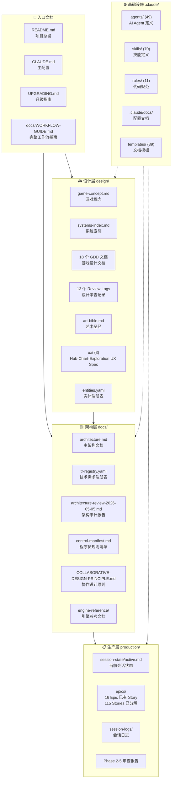
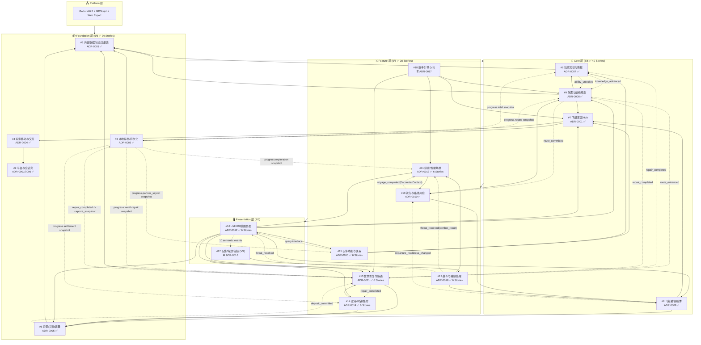
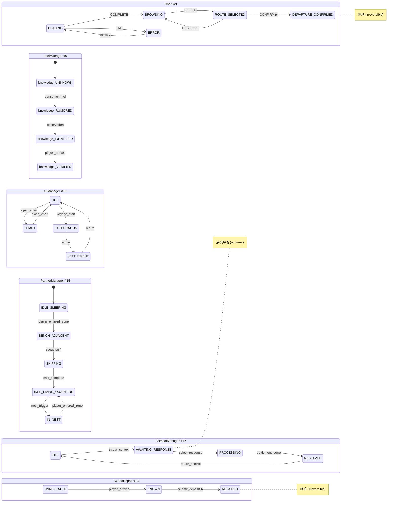
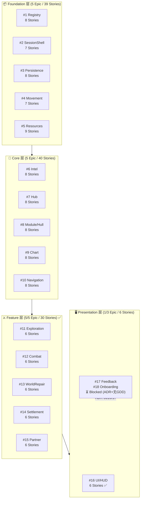
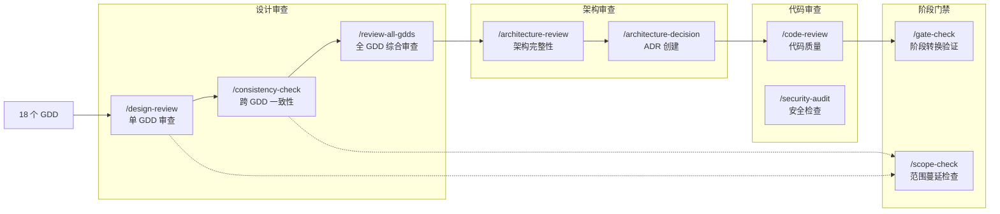
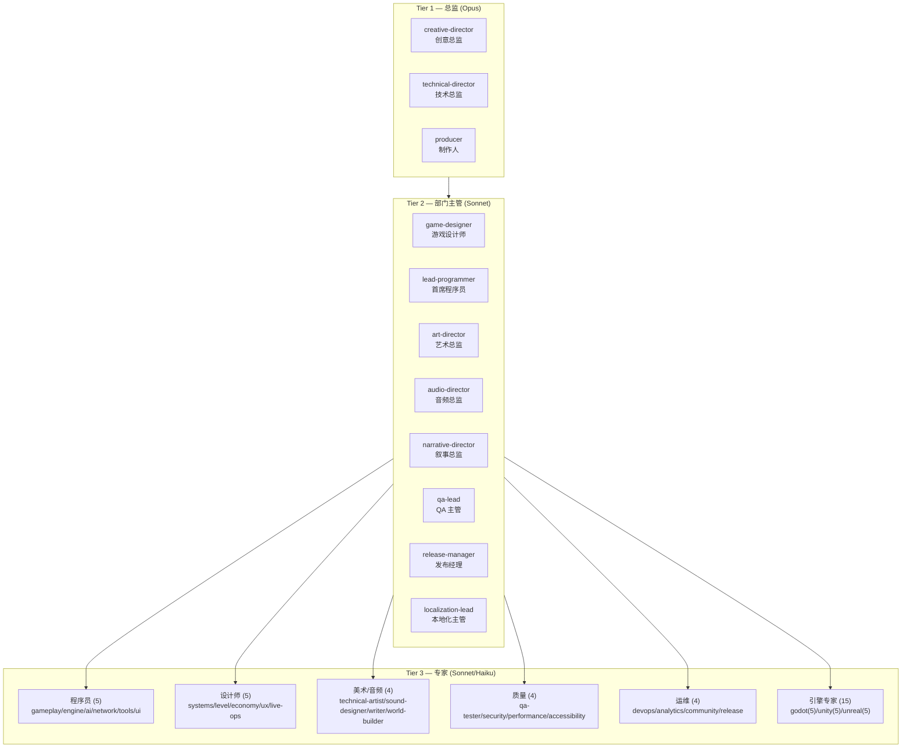
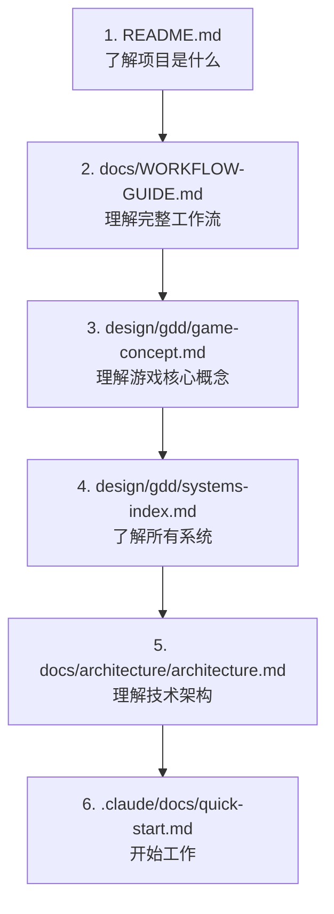

# 云海织航 — 文档索引

> **最后更新**: 2026-05-08
> **项目阶段**: Pre-Production — P3 进行中 (Foundation 5/5 + Core 5/5 + Feature 5/5 + Presentation 1/3 Epic Story 框架完成)
> **引擎**: Godot 4.6.2 + GDScript (Web-first, 已正式配置)
> **ADR**: 16 Accepted (0001-0015 + 0018) + 2 Deferred (0016-0017) · TR Registry: 54 条已注册 · Control Manifest: Active
> **Epic/Story**: 16/18 Epic 完成 — 115 Stories (59 Logic + 53 Integration + 2 UI + 1 Config)
> **文档总数**: ~360 个 .md 文件 + 10 个配置/数据文件

---

## 一、文档全景图



### 入口文档

| 文件 | 说明 |
|------|------|
| [README.md](../README.md) | 项目总览、Studio 层级、Slash 命令概览 |
| [CLAUDE.md](../CLAUDE.md) | 主配置 — 技术栈、目录结构、编码标准 |
| [UPGRADING.md](../UPGRADING.md) | 升级指南 |
| [docs/WORKFLOW-GUIDE.md](WORKFLOW-GUIDE.md) | 完整工作流指南 (1684 行) |
| [docs/COLLABORATIVE-DESIGN-PRINCIPLE.md](COLLABORATIVE-DESIGN-PRINCIPLE.md) | 协作设计原则 |

### 设计层快速入口

| 文件 | 说明 |
|------|------|
| [design/gdd/game-concept.md](../design/gdd/game-concept.md) | 游戏概念 — 核心幻想、MDA 分析 |
| [design/gdd/systems-index.md](../design/gdd/systems-index.md) | 系统索引 — 18 个系统的边界与约束 |
| [design/art/art-bible.md](../design/art/art-bible.md) | 艺术圣经 (2111 行) |
| [design/ux/hub.md](../design/ux/hub.md) | Hub UX Spec — 飞艇家园 (10 站点/4 房间/8 状态变体) |
| [design/ux/chart.md](../design/ux/chart.md) | Chart UX Spec — 航图航线规划 (5 状态/墨水扩散出航序列) |
| [design/ux/exploration.md](../design/ux/exploration.md) | Exploration UX Spec — 探索搜撤场景 (4 阶段/11 动画) |
| [design/registry/entities.yaml](../design/registry/entities.yaml) | 实体注册表 |

### 架构层快速入口

| 文件 | 说明 |
|------|------|
| [docs/architecture/architecture.md](architecture/architecture.md) | 主架构 — 54 TR / 5 层 / 18 系统 (TD+LP 双签收) |
| [docs/architecture/tr-registry.yaml](architecture/tr-registry.yaml) | 技术需求注册表 |
| [docs/architecture/architecture-traceability.md](architecture/architecture-traceability.md) | 可追溯性索引 — 54 TR 全覆盖矩阵 (100%) |
| [docs/engine-reference/godot/VERSION.md](engine-reference/godot/VERSION.md) | Godot 4.6.2 版本锁定 |

### 生产层快速入口

| 文件 | 说明 |
|------|------|
| [production/session-state/active.md](../production/session-state/active.md) | 当前会话状态 |
| [production/epics/index.md](../production/epics/index.md) | Epic/Story 索引 — 16/18 Epic 完成 (115 Stories) |
| **Foundation 层 (5 Epic / 39 Stories)** | |
| [production/epics/content-registry/EPIC.md](../production/epics/content-registry/EPIC.md) | Epic #1: 内容注册表 (8 Stories) |
| [production/epics/platform-session-shell/EPIC.md](../production/epics/platform-session-shell/EPIC.md) | Epic #2: 平台会话壳 (7 Stories) |
| [production/epics/local-save-persistence/EPIC.md](../production/epics/local-save-persistence/EPIC.md) | Epic #3: 持久化 (8 Stories) |
| [production/epics/player-movement-interaction/EPIC.md](../production/epics/player-movement-interaction/EPIC.md) | Epic #4: 移动交互 (7 Stories) |
| [production/epics/resources-goods-capacity/EPIC.md](../production/epics/resources-goods-capacity/EPIC.md) | Epic #5: 资源货物容量 (9 Stories) |
| **Core 层 (5 Epic / 40 Stories)** | |
| [production/epics/intel-knowledge/EPIC.md](../production/epics/intel-knowledge/EPIC.md) | Epic #6: 情报知识 (8 Stories) |
| [production/epics/airship-hub/EPIC.md](../production/epics/airship-hub/EPIC.md) | Epic #7: 飞艇家园 (8 Stories) |
| [production/epics/modules-hull-state/EPIC.md](../production/epics/modules-hull-state/EPIC.md) | Epic #8: 模块船体 (8 Stories) |
| [production/epics/chart-route-planning/EPIC.md](../production/epics/chart-route-planning/EPIC.md) | Epic #9: 航图规划 (8 Stories) |
| [production/epics/navigation-route-risk/EPIC.md](../production/epics/navigation-route-risk/EPIC.md) | Epic #10: 航行路线风险 (8 Stories) |
| **Feature 层 (5 Epic / 30 Stories)** | |
| [production/epics/exploration-scavenge/EPIC.md](../production/epics/exploration-scavenge/EPIC.md) | Epic #11: 探索搜撤 (6 Stories) |
| [production/epics/combat-threat/EPIC.md](../production/epics/combat-threat/EPIC.md) | Epic #12: 战斗威胁处理 (6 Stories) |
| [production/epics/world-repair/EPIC.md](../production/epics/world-repair/EPIC.md) | Epic #13: 世界修复解锁 (6 Stories) |
| [production/epics/settlement-market/EPIC.md](../production/epics/settlement-market/EPIC.md) | Epic #14: 空港集市交易 (6 Stories) |
| [production/epics/partner-relationships/EPIC.md](../production/epics/partner-relationships/EPIC.md) | Epic #15: 伙伴功能与关系 (6 Stories) |
| **Presentation 层 (1 Epic / 6 Stories)** | |
| [production/epics/ui-hud-interface/EPIC.md](../production/epics/ui-hud-interface/EPIC.md) | Epic #16: UI/HUD/航图界面 (6 Stories) |
| [production/session-logs/session-log.md](../production/session-logs/session-log.md) | 会话日志 |

---

## 二、游戏设计文档 (GDD) — 依赖关系图

> 18 个系统，5 层架构。实线箭头 = 运行时依赖，虚线 = 信号/事件订阅。
> Feature 层 6/6 ADR 全部 Accepted，5/5 Epic 全部 Story 分解完成（共 30 Stories）。



### GDD 文件清单

| # | 系统名 | 文件 | 层级 | ADR | 状态 |
|---|--------|------|------|-----|------|
| 1 | 内容数据与状态注册表 | [content-data-state-registry.md](../design/gdd/content-data-state-registry.md) | Foundation | ADR-0001 | ✅ 已审查 |
| 2 | 平台与会话壳 | [platform-session-shell.md](../design/gdd/platform-session-shell.md) | Foundation | ADR-0001/0006 | ✅ 已审查 |
| 3 | 本地存档与世界状态持久化 | [local-save-world-state-persistence.md](../design/gdd/local-save-world-state-persistence.md) | Foundation | ADR-0003 | ✅ 已审查 |
| 4 | 玩家移动与交互 | [player-movement-interaction.md](../design/gdd/player-movement-interaction.md) | Foundation | ADR-0004 | ✅ 已审查 |
| 5 | 资源、货物与容量 | [resources-goods-capacity.md](../design/gdd/resources-goods-capacity.md) | Foundation | ADR-0005 | ✅ 已审查 |
| 6 | 玩家知识与情报 | [player-knowledge-intel.md](../design/gdd/player-knowledge-intel.md) | Core | ADR-0007 | ✅ 已审查 |
| 7 | 飞艇家园 Hub | [airship-hub.md](../design/gdd/airship-hub.md) | Core | ADR-0001 | ✅ 已审查 |
| 8 | 飞艇模块与船体状态 | [airship-modules-hull-state.md](../design/gdd/airship-modules-hull-state.md) | Core | ADR-0009 | ✅ 已审查 |
| 9 | 航图与航线规划 | [chart-route-planning.md](../design/gdd/chart-route-planning.md) | Core | ADR-0008 | ✅ 已审查 |
| 10 | 航行与路线风险 | [navigation-route-risk.md](../design/gdd/navigation-route-risk.md) | Feature | ADR-0010 | ✅ 已审查 |
| 11 | 探索 / 搜撤场景 | [exploration-scavenge-scenario.md](../design/gdd/exploration-scavenge-scenario.md) | Feature | ADR-0013 | ✅ 已审查 |
| 12 | 战斗与威胁处理 | [combat-threat-handling.md](../design/gdd/combat-threat-handling.md) | Feature | ADR-0018 | ✅ 已审查 |
| 13 | 世界修复与解锁 | [world-repair-unlock.md](../design/gdd/world-repair-unlock.md) | Feature | ADR-0011 | ✅ 已审查 |
| 14 | 空港/村镇状态与集市交易 | [port-village-market.md](../design/gdd/port-village-market.md) | Feature | ADR-0014 | ✅ 已审查 |
| 15 | 伙伴功能与关系 | [partner-relationships.md](../design/gdd/partner-relationships.md) | Feature | ADR-0015 | ✅ 已审查 |
| 16 | UI / HUD / 航图界面 | [ui-hud-chart-interface.md](../design/gdd/ui-hud-chart-interface.md) | Presentation | ADR-0012 | ✅ 已审查 |
| 17 | 反馈、特效与音频语义 | *(Vertical Slice)* | Presentation | ADR-0016 | ⏳ VS |
| 18 | 新手引导与首轮闭环 | *(Vertical Slice)* | Feature | ADR-0017 | ⏳ VS |

### GDD 审查记录 (Review Logs)

| 系统 | Review Log |
|------|------------|
| #1 内容数据 | [review-log](../design/gdd/reviews/content-data-state-registry-review-log.md) |
| #2 平台会话壳 | [review-log](../design/gdd/reviews/platform-session-shell-review-log.md) |
| #3 本地存档 | [review-log](../design/gdd/reviews/local-save-world-state-persistence-review-log.md) |
| #4 移动交互 | [review-log](../design/gdd/reviews/player-movement-interaction-review-log.md) |
| #5 资源货物 | [review-log](../design/gdd/reviews/resources-goods-capacity-review-log.md) |
| #7 飞艇家园 | [review-log](../design/gdd/reviews/airship-hub-review-log.md) |
| #8 模块船体 | [review-log](../design/gdd/reviews/airship-modules-hull-state-review-log.md) |
| #9 航图规划 | [review-log](../design/gdd/reviews/chart-route-planning-review-log.md) |
| #11 探索搜撤 | [review-log](../design/gdd/reviews/exploration-scavenge-scenario-review-log.md) |
| #12 战斗威胁 | [review-log](../design/gdd/reviews/combat-threat-handling-review-log.md) |
| #13 世界修复 | [review-log](../design/gdd/reviews/world-repair-unlock-review-log.md) |
| #14 空港集市 | [review-log](../design/gdd/reviews/port-village-market-review-log.md) |
| 跨 GDD 审查 | [cross-review-2026-05-03](../design/gdd/gdd-cross-review-2026-05-03.md) |

> **VS** = Vertical Slice 阶段实现，MVP 不要求完整版本。

---

## 三、架构决策记录 (ADR) 全景

> **状态**: 16 ADRs Accepted ✅ + 2 Deferred ⏳ (2026-05-08)
> **TR Registry**: 54 条技术需求已录入 `docs/architecture/tr-registry.yaml`
> **TR 覆盖率**: 100% — 54/54 TRs 有完整 ADR 覆盖
> **门禁检查**: Technical Setup → Pre-Production — CONCERNS (4/4 directors, 0 NOT READY) → 已进入 Pre-Production

### ADR 层级依赖关系图


### ADR 状态机一览



### 架构文档清单

> **16 ADR Accepted + 2 Deferred — 全部 54 TR 已覆盖 (100%)**

| 文件 | 说明 |
|------|------|
| [architecture.md](architecture/architecture.md) | 主架构 — v1 签收 (TD+LP 双签收) |
| [architecture-traceability.md](architecture/architecture-traceability.md) | 可追溯性索引 — 54 TR 全覆盖矩阵 (100%) |
| [tr-registry.yaml](architecture/tr-registry.yaml) | 54 条技术需求注册表 |
| [registry/architecture.yaml](registry/architecture.yaml) | 架构注册表 — 状态所有权、接口契约、禁止模式 (16 ADR 注册) |
| | **Foundation ADRs (6) — 全部 Accepted ✅** |
| [adr-0001-autoload-scene-boot-order.md](architecture/adr-0001-autoload-scene-boot-order.md) | ADR-0001: Autoload/Scene 架构 — 9 Autoload + 9-Phase 启动链 |
| [adr-0002-signal-communication-protocol.md](architecture/adr-0002-signal-communication-protocol.md) | ADR-0002: Signal 通信协议 — typed params + sync emit + max depth 2 |
| [adr-0003-save-system-snapshot-json.md](architecture/adr-0003-save-system-snapshot-json.md) | ADR-0003: 存档系统 — SnapshotPackage + Canonical JSON |
| [adr-0004-interaction-handler-abstract.md](architecture/adr-0004-interaction-handler-abstract.md) | ADR-0004: 交互系统 — @abstract Interactable + Registry |
| [adr-0005-resource-pool-system.md](architecture/adr-0005-resource-pool-system.md) | ADR-0005: 资源池 — 6 Pools + 13 ResourceResult 枚举 |
| [adr-0006-web-platform-constraints.md](architecture/adr-0006-web-platform-constraints.md) | ADR-0006: Web 平台约束 — WebGL 2 + 单线程 + 无 C# |
| | **Core ADRs (6) — 全部 Accepted ✅** |
| [adr-0007-intel-knowledge-ability-system.md](architecture/adr-0007-intel-knowledge-ability-system.md) | ADR-0007: IntelManager — 知识/能力 Dictionary 状态 + 多路径解锁 |
| [adr-0008-chart-route-state-machine.md](architecture/adr-0008-chart-route-state-machine.md) | ADR-0008: Chart 状态机 — 5-state + route_committed 不可逆承诺 |
| [adr-0009-airship-module-hull-system.md](architecture/adr-0009-airship-module-hull-system.md) | ADR-0009: Module/Hull System — 双字段 + 出航就绪三维检查 |
| [adr-0010-encounter-context-type.md](architecture/adr-0010-encounter-context-type.md) | ADR-0010: EncounterContext — Navigation→Exploration 数据桥 |
| [adr-0011-world-repair-state-machine.md](architecture/adr-0011-world-repair-state-machine.md) | ADR-0011: WorldRepair — 3-state 不可逆 + 批量提交 + 6 下游 fan-out |
| [adr-0012-ui-input-routing-dual-focus.md](architecture/adr-0012-ui-input-routing-dual-focus.md) | ADR-0012: UIManager — 屏幕状态机 + 模态栈 + 4 层输入路由 + dual-focus |
| | **Feature ADRs (4) — 全部 Accepted ✅** |
| [adr-0013-exploration-scavenge-system.md](architecture/adr-0013-exploration-scavenge-system.md) | ADR-0013: Exploration — 4 阶段状态机 + EncounterContext 消费 + scout η 效率 |
| [adr-0014-settlement-market-system.md](architecture/adr-0014-settlement-market-system.md) | ADR-0014: Settlement/Market — 3 层状态机 + repair 驱动解锁 + F.1 价格公式 |
| [adr-0015-partner-relationships-system.md](architecture/adr-0015-partner-relationships-system.md) | ADR-0015: Partner — 6 态猫状态机 + R15 6 硬禁止 + scout_sniff 6 步算法 + F.1 置信度截断 |
| [adr-0018-combat-threat-resolution.md](architecture/adr-0018-combat-threat-resolution.md) | ADR-0018: Combat/Threat — 4 态状态机 + resolve_threat + combat_result 契约 |
| | **Deferred ADRs (2) — ⏳ Production 阶段编写** |
| ADR-0016 | #17 Feedback/VFX/Audio — MEDIUM priority, Before VFX/Audio implementation |
| ADR-0017 | #18 Onboarding/First Loop — LOW priority, Vertical Slice phase |

---

## 四、Epic/Story 生产框架

> **Foundation 5/5 + Core 5/5 + Feature 5/5 + Presentation 1/3 — 16 个 Epic 全部 Story 分解完成**
> **115 个 Story**: 59 Logic + 53 Integration + 2 UI + 1 Config
> **2026-05-08**

### 层级分解全景



### 各层 Story 统计

| Layer | Epic 数 | Story 数 | Logic | Integration | UI | Config |
|-------|---------|----------|-------|-------------|-----|--------|
| Foundation | 5/5 | 39 | 22 | 14 | 2 | 1 |
| Core | 5/5 | 40 | 25 | 15 | — | — |
| Feature | 5/5 | 30 | 15 | 15 | — | — |
| Presentation | 1/3 | 6 | 3 | 3 | — | — |
| **合计** | **16/18** | **115** | **65** | **47** | **2** | **1** |

### Foundation 层 5 个 Epic 详解

| Epic | System # | Stories | 职责概括 | Autoload |
|------|----------|---------|---------|----------|
| [content-registry](../production/epics/content-registry/EPIC.md) | #1 | 8 | 内容数据与状态注册表——所有 gameplay 值的唯一权威源，定义资源/货物/mass_class/supply_class Schema | Registry (#1) |
| [platform-session-shell](../production/epics/platform-session-shell/EPIC.md) | #2 | 7 | 平台与会话壳——Web 生命周期归一化、AudioContext 激活门、BFCache 恢复、Input Gate | SessionShell (#2) |
| [local-save-persistence](../production/epics/local-save-persistence/EPIC.md) | #3 | 8 | 本地存档与持久化——SnapshotPackage + Canonical JSON + SHA-256 + 版本迁移 | Persistence (#3) |
| [player-movement-interaction](../production/epics/player-movement-interaction/EPIC.md) | #4 | 7 | 玩家移动与交互——WASD+Click-to-Move、焦点仲裁、Use Gate、@abstract Interactable | InteractionRegistry (#4) |
| [resources-goods-capacity](../production/epics/resources-goods-capacity/EPIC.md) | #5 | 9 | 资源/货物/容量——6 池架构、双容量制、7 种原子操作、重量追踪、信号契约 | ResourcesManager (#5) |

### Core 层 5 个 Epic 详解

| Epic | System # | Stories | 职责概括 | Autoload |
|------|----------|---------|---------|----------|
| [intel-knowledge](../production/epics/intel-knowledge/EPIC.md) | #6 | 8 | 玩家知识与情报——4 态知识状态机、能力解锁 3 路径、knowledge_advanced/ability_unlocked 信号 | IntelManager (#6) |
| [airship-hub](../production/epics/airship-hub/EPIC.md) | #7 | 8 | 飞艇家园 Hub——10 站点 + 4 房间、玩家存在状态、站点间 WASD 移动、交互契约 | HubManager (#7) |
| [modules-hull-state](../production/epics/modules-hull-state/EPIC.md) | #8 | 8 | 飞艇模块与船体——双字段、2 槽位 + 船体 4 波段、eta_effective 乘数、出航就绪三维检查 | ModuleHullManager (#8) |
| [chart-route-planning](../production/epics/chart-route-planning/EPIC.md) | #9 | 8 | 航图与航线规划——5 态状态机、route_committed 不可逆承诺、知识门控航线可见性、墨水扩散出航动画 | ChartManager (#9) |
| [navigation-route-risk](../production/epics/navigation-route-risk/EPIC.md) | #10 | 8 | 航行与路线风险——6 态 Voyage FSM、5 公式、12 遭遇类型、EncounterContext 9-field 合约 | NavigationManager (#10) |

### Feature 层 5 个 Epic 详解

| Epic | System # | Stories | 职责概括 | Autoload |
|------|----------|---------|---------|----------|
| [exploration-scavenge](../production/epics/exploration-scavenge/EPIC.md) | #11 | 6 | 探索/搜撤——4 阶段状态机、6 搜索点、2 intel 点、scout η 威胁预览、撤离 λ 保护 | ExplorationManager (#11) |
| [combat-threat](../production/epics/combat-threat/EPIC.md) | #12 | 6 | 战斗与威胁处理——4 态微状态机、3 种响应、C4 10 步结算序列、combat_result 6-field 契约 | CombatManager (#12) |
| [world-repair](../production/epics/world-repair/EPIC.md) | #13 | 6 | 世界修复与解锁——3 态状态机、deposit_validation 5 种 violation、repair_completed 6 路 fan-out | WorldRepair (#13) |
| [settlement-market](../production/epics/settlement-market/EPIC.md) | #14 | 6 | 空港/集市交易——3 层状态机、repair 驱动摊位解锁、F.1 价格公式、validate_purchase 4 种拒绝 | SettlementManager (#14) |
| [partner-relationships](../production/epics/partner-relationships/EPIC.md) | #15 | 6 | 伙伴功能与关系——6 态猫状态机、R15 6 硬禁止、scout_sniff 6 步算法、F.1 置信度截断 66、命名+小窝两套状态机 | PartnerManager (#15) |

### Presentation 层 1 个 Epic 详解

| Epic | System # | Stories | 职责概括 | Autoload |
|------|----------|---------|---------|----------|
| [ui-hud-interface](../production/epics/ui-hud-interface/EPIC.md) | #16 | 6 | UI/HUD/航图界面——12 屏管理、11 态屏幕状态机、单槽模态栈+S7 战斗覆盖、4 层输入路由、Godot 4.6 dual-focus 同步、信号驱动脏标记 HUD 更新、10 个 ui_* 语义事件 | UIManager (#16) |

### 阻塞状态 (Presentation)

| Epic | System # | 阻塞原因 | Priority |
|------|----------|---------|----------|
| feedback-fx-audio | #17 | ADR-0016 deferred + 无 GDD (Vertical Slice) | 🟡 MEDIUM |
| onboarding-first-loop | #18 | ADR-0017 deferred + 无 GDD (Vertical Slice) | 🟢 LOW |

### Story 类型与质量门

| Story Type | Required Evidence | Gate Level | 数量 |
|------------|------------------|------------|------|
| **Logic** | 自动化单元测试 (tests/unit/) | BLOCKING | 65 |
| **Integration** | 集成测试或 playtest 文档 | BLOCKING | 47 |
| **UI** | Manual walkthrough doc | ADVISORY | 2 |
| **Config/Data** | Smoke check pass | ADVISORY | 1 |
| **Visual/Feel** | Screenshot + lead sign-off | ADVISORY | — |

---

## 五、审查与质量门禁流程



### 已完成审查记录

| 日期 | 审查 | 结果 | 报告 |
|------|------|------|------|
| 2026-04-30 | `/consistency-check` 跨 GDD 一致性 | 通过 | [cross-review-2026-04-30](../design/gdd/gdd-cross-review-2026-04-30-consistency.md) |
| 2026-05-03 | `/review-all-gdds` Phase 2 — 跨 GDD 一致性 | 5 BLOCKING/CRITICAL 已修复 | [phase2-report](../production/session-state/phase2-cross-gdd-consistency-report.md) |
| 2026-05-03 | `/review-all-gdds` Phase 3 — 游戏设计整体审查 | 通过 | [phase3-report](../production/session-state/phase3-game-design-holism-review.md) |
| 2026-05-04 | `/review-all-gdds` Phase 4 — 跨系统场景走查 | 通过 | [phase4-report](../production/session-state/phase4-cross-system-scenario-walkthrough.md) |
| 2026-05-04 | `/review-all-gdds` Phase 5 — 最终裁决 | PASS WITH NOTES | [phase5-report](../production/session-state/phase5-final-verdict.md) |
| 2026-05-04 | `/create-architecture` — 主架构 | TD+LP 双签收 | [architecture.md](architecture/architecture.md) |
| 2026-05-05 | `/gate-check technical-setup` — Technical Setup→Pre-Production | CONCERNS — 4 阻塞项已清除 | 本文档第三节 |
| 2026-05-05 | ADR 批量 Acceptance — 12/12 Accepted | 通过 | 全部 12 ADR Status→Accepted |
| 2026-05-05 | TR Registry 填充 — 54 TR 条目 | 通过 | [tr-registry.yaml](architecture/tr-registry.yaml) |
| 2026-05-05 | `/architecture-review` — 架构完整性审计 | CONCERNS (65.4% TR coverage, Combat #12 gap) | [architecture-review-2026-05-05](architecture/architecture-review-2026-05-05.md) |
| 2026-05-05 | `/ux-design` — Hub, Chart, Exploration 三份 UX Spec | 通过 | [Hub](../design/ux/hub.md), [Chart](../design/ux/chart.md), [Exploration](../design/ux/exploration.md) |
| 2026-05-07 | Foundation + Core 层 Epic/Story 分解 — 10 个 Epic (79 Stories) | 通过 | [active.md](../production/session-state/active.md) |
| 2026-05-07 | Feature 层 — #12 combat-threat (6) + #13 world-repair (6) | 通过 | [active.md](../production/session-state/active.md) |
| 2026-05-08 | ADR-0013 Exploration + 6 Stories (#11) | 通过 | [active.md](../production/session-state/active.md) |
| 2026-05-08 | ADR-0014 Settlement/Market + 6 Stories (#14) | 通过 | [active.md](../production/session-state/active.md) |
| 2026-05-08 | ADR-0015 Partner/Relationships + 6 Stories (#15) | 通过 | [active.md](../production/session-state/active.md) |
| 2026-05-08 | #16 UI/HUD 6 Stories (3 Logic + 3 Integration) | 通过 | [active.md](../production/session-state/active.md) |

---

### 架构就绪状态 — Gate Check 全景

```
┌──────────────────────────────────────────────────────────────────────────────┐
│                    TECHNICAL SETUP → PRE-PRODUCTION                           │
│                   Gate Check: CONCERNS → PASS (Pre-Production)                │
│                                                                              │
│  ┌──────────────────────────────────────────────────────────────────────┐   │
│  │                      DIRECTOR PANEL                                    │   │
│  │  ┌──────────────────┐ ┌──────────────────┐ ┌──────────────────┐       │   │
│  │  │ Creative Director│ │Technical Director│ │    Producer      │       │   │
│  │  │   CONCERNS (4)   │ │  CONCERNS (7)    │ │  CONCERNS (8)    │       │   │
│  │  └──────────────────┘ └──────────────────┘ └──────────────────┘       │   │
│  │  ┌──────────────────┐                                                 │   │
│  │  │  Art Director    │  NO "NOT READY" — 0 hard blockers                │   │
│  │  │  CONCERNS (4)    │                                                 │   │
│  │  └──────────────────┘                                                 │   │
│  └──────────────────────────────────────────────────────────────────────┘   │
│                                                                              │
│  ┌──────────────────────────────────────────────────────────────────────┐   │
│  │                      RESOLVED BLOCKERS (2026-05-05)                    │   │
│  │                                                                        │   │
│  │  ✅ ADR Acceptance:   12 Proposed → 16 Accepted + 2 Deferred          │   │
│  │  ✅ TR Registry:      0 entries → 54 TRs populated                     │   │
│  │  ✅ TR Coverage:      65.4% → 100% (54/54 TRs)                        │   │
│  │  ✅ Engine Config:    [CHOOSE] → Godot 4.6.2 + GDScript                │   │
│  │  ✅ Tech Preferences: [TO BE CONFIGURED] → fully populated             │   │
│  └──────────────────────────────────────────────────────────────────────┘   │
│                                                                              │
│  ┌──────────────────────────────────────────────────────────────────────┐   │
│  │                   PRE-PRODUCTION P3 PROGRESS                            │   │
│  │                                                                        │   │
│  │  ✅ Foundation 5/5 Epics (39 Stories)  ✅ Core 5/5 Epics (40 Stories) │   │
│  │  ✅ Feature 5/5 Epics (30 Stories)      ✅ Presentation 1/3 (6 Stories)│   │
│  │  📊 Total: 115 Stories — 65 Logic + 47 Integration + 2 UI + 1 Config  │   │
│  └──────────────────────────────────────────────────────────────────────┘   │
└──────────────────────────────────────────────────────────────────────────────┘
```

### 制品就绪矩阵

```
                     ADP     GDD     ADR     TR     TECH    ART     TEST    UX
                     ██      ██      ██     ██     ██      ██      ██     ██
ARCHITECTURE.md      ██      ██      ██     ██     ██      ██      ██     ██
CLAUDE.md            ██      --      --     --      ██      --      --     --
ADR (x16)            ██      ██      ██     ██     ██      ░░      --     --
TR REGISTRY          ██      ██      ██     ██     ██      --      --     --
TECH PREFS           ██      --      ██     --      ██      --      --     --
ART BIBLE            --      ██      --     --      --      ██      --     --
ENGINE REFS          --      --      --     --      ██      --      --     --
TEST FRAMEWORK       --      --      --     --      --      --      ██     --
UX SPECS             --      --      --     --      --      --      --     ██

                     ██ = Complete    ░░ = Missing    -- = Not applicable
```

### 门禁留下的 Concerns（Pre-Production 期间跟踪）

| # | Concern | 严重度 | 状态 |
|---|---------|--------|------|
| 1 | Combat #12 零 ADR 覆盖 | 🔴 HIGH | ✅ ADR-0018 + 6 Stories 完成 (2026-05-07) |
| 2 | 缺少 interaction-patterns.md | 🟡 MEDIUM | ✅ 已创建 — 10 个交互模式 |
| 3 | 缺少 architecture-traceability.md | 🟡 MEDIUM | ✅ 已创建 — 54 TR 全覆盖矩阵 (100%) |
| 4 | 4 个延期 ADR 无时间表 | 🟡 MEDIUM | ✅ ADR-0013/14/15 已清除; 0016-0017 Production 前完成 |
| 5 | Dual-focus + Web 生命周期未测试 | 🟡 MEDIUM | Sprint 1 Spike |
| 6 | 仅 1 个示例测试 | 🟡 LOW | 随实现同步编写 |
| 7 | 无视觉参考/Mood Board | 🟡 LOW | 概念美术开始前整理 |
| 8 | UX Specs 未交叉引用 Art Bible | 🟡 LOW | 早期 Pre-Production 轻量对齐 |

---

## 六、Studio 基础设施

### Agent 体系 (49 个)



### Skill 体系 (70 个) — 按工作流阶段


---

## 七、规范与模板

### 路径规则 (11 个)

[`.claude/rules/`](../.claude/rules/) 目录下的代码规范，按文件类型自动激活：

| 规则文件 | 适用范围 |
|----------|----------|
| [ai-code.md](../.claude/rules/ai-code.md) | AI 行为树/状态机代码 |
| [data-files.md](../.claude/rules/data-files.md) | 数据文件 |
| [design-docs.md](../.claude/rules/design-docs.md) | 设计文档 (8 个必需节) |
| [engine-code.md](../.claude/rules/engine-code.md) | 引擎代码 |
| [gameplay-code.md](../.claude/rules/gameplay-code.md) | 游戏玩法代码 |
| [narrative.md](../.claude/rules/narrative.md) | 叙事文本 |
| [network-code.md](../.claude/rules/network-code.md) | 网络代码 |
| [prototype-code.md](../.claude/rules/prototype-code.md) | 原型代码 (宽松标准) |
| [shader-code.md](../.claude/rules/shader-code.md) | Shader 代码 |
| [test-standards.md](../.claude/rules/test-standards.md) | 测试标准 |
| [ui-code.md](../.claude/rules/ui-code.md) | UI 代码 |

### 核心配置文档

| 文件 | 说明 |
|------|------|
| [.claude/settings.json](../.claude/settings.json) | 项目设置 (权限/Hooks) |
| [.claude/docs/agent-roster.md](../.claude/docs/agent-roster.md) | Agent 完整名册 |
| [.claude/docs/agent-coordination-map.md](../.claude/docs/agent-coordination-map.md) | Agent 协调委托关系图 |
| [.claude/docs/coordination-rules.md](../.claude/docs/coordination-rules.md) | Agent 协调规则 |
| [.claude/docs/directory-structure.md](../.claude/docs/directory-structure.md) | 目录结构 |
| [.claude/docs/technical-preferences.md](../.claude/docs/technical-preferences.md) | 技术偏好 ✅ |
| [.claude/docs/coding-standards.md](../.claude/docs/coding-standards.md) | 编码标准 |
| [.claude/docs/context-management.md](../.claude/docs/context-management.md) | 上下文管理策略 |

---

## 八、文档阅读路线图

### 新成员入门路径



### 按角色推荐阅读

| 角色 | 必读文档 | 选读 |
|------|----------|------|
| **新成员** | [README](../README.md) → [WORKFLOW-GUIDE](WORKFLOW-GUIDE.md) → [game-concept](../design/gdd/game-concept.md) | [examples/](examples/) |
| **游戏设计师** | [game-concept](../design/gdd/game-concept.md) → [systems-index](../design/gdd/systems-index.md) → [全部 GDD](../design/gdd/) | [reviews/](../design/gdd/reviews/) |
| **程序员** | [architecture](architecture/architecture.md) → [coding-standards](../.claude/docs/coding-standards.md) → [engine-reference/godot/](engine-reference/godot/) | [rules/](../.claude/rules/) |
| **美术** | [art-bible](../design/art/art-bible.md) → [game-concept](../design/gdd/game-concept.md) | [rendering](engine-reference/godot/modules/rendering.md) |
| **音频** | [game-concept](../design/gdd/game-concept.md) → GDD #17 (VFX/Audio) | [audio](engine-reference/godot/modules/audio.md) |
| **QA** | [全部 GDD](../design/gdd/) → [test-standards](../.claude/rules/test-standards.md) → [coding-standards](../.claude/docs/coding-standards.md) | [reviews/](../design/gdd/reviews/) |
| **制作人** | [WORKFLOW-GUIDE](WORKFLOW-GUIDE.md) → [architecture](architecture/architecture.md) → sprint 相关 | [session-logs/](../production/session-logs/) |

---

## 九、统计概览

```
文档分布 (按目录)

  design/          ████████████████░░░░  35 文件  (GDD + 审查 + 艺术)
  docs/            ████████████████████████████████  65 文件  (架构 + ADR + 引擎参考 + 示例)
  production/      ████████████████░░░░  130+ 文件  (Epics/Stories + 会话状态 + 日志)
  .claude/         ██████████████████████████████████████████████████  123 文件  (Agent + Skill + 规则 + 模板)
  .github/         █░░░░░░░░░░░░░░░░░░░   3 文件  (Issue/PR 模板)
  src/             █░░░░░░░░░░░░░░░░░░░   1 文件  (占位)

  📊 总计: ~360 个 Markdown 文档 + 10 个配置/数据文件
  🏗️ ADR: 16 Accepted + 2 Deferred | TR: 54 条注册 | Control Manifest: Active | TR 覆盖率: 100%
  📋 Epic/Story: 16/18 Epic 完成 (115 Stories) | Feature 层 5/5 ✅ | Presentation 层 1/3
  ✅ Pre-Production P3 进行中 — Foundation + Core + Feature 全部完成, Presentation 1/3
```

---

## 十、待创建文档

> 更新于 2026-05-08 — Pre-Production P3 进行中。

### 已全部完成 ✅

- [x] **16 个 ADR** (Foundation 6 + Core 6 + Feature 4) — 全部 Accepted
- [x] **TR Registry** — `docs/architecture/tr-registry.yaml` — 54 条全部录入
- [x] **TR 覆盖率 100%** — 54/54 TRs 有完整 ADR 覆盖
- [x] **引擎正式配置** — `CLAUDE.md` — Godot 4.6.2 + GDScript
- [x] **Control Manifest** — `docs/architecture/control-manifest.md`
- [x] **Architecture Traceability Index** — `docs/architecture/architecture-traceability.md`
- [x] **Architecture Review Report** — `docs/architecture/architecture-review-2026-05-05.md`
- [x] **Accessibility Requirements** — `design/accessibility-requirements.md`
- [x] **UX Specs (×3)** — `design/ux/hub.md`, `chart.md`, `exploration.md`
- [x] **Interaction Patterns Library** — `design/ux/interaction-patterns.md`
- [x] **Test Framework** — `tests/unit/` + `tests/integration/` (gdUnit4)
- [x] **CI/CD Workflow** — `.github/workflows/tests.yml`
- [x] **Foundation 层 Epic/Story 分解** — 5/5 Epic (39 Stories)
- [x] **Core 层 Epic/Story 分解** — 5/5 Epic (40 Stories)
- [x] **Feature 层 Epic/Story 分解** — 5/5 Epic (30 Stories): #11/#12/#13/#14/#15
- [x] **Presentation 层 #16 UI/HUD** — 1/3 Epic (6 Stories)

### 仍待完成

- [ ] **ADR-0016** (#17 Feedback/VFX/Audio) — MEDIUM priority, 需先创建 GDD
- [ ] **ADR-0017** (#18 Onboarding/First Loop) — LOW priority, 需先创建 GDD
- [ ] **#17 feedback-fx-audio Epic/Story 分解** — Vertical Slice 阶段
- [ ] **#18 onboarding-first-loop Epic/Story 分解** — Vertical Slice 阶段
- [ ] **Sprint Plan** — 首个开发 Sprint 计划
- [ ] **P3 原型** — Core Loop 可玩原型 + Vertical Slice 范围定义

---

> **提示**: 本文档使用 Mermaid 图表。在 VS Code 中安装 "Markdown Preview Mermaid Support" 插件，
> 或在 GitHub 上直接查看以渲染图表。也可使用 `npx mermaid-cli` 生成静态图片。
