# 云海织航 — 文档索引

> **最后更新**: 2026-05-22
> **项目阶段**: Polish — Production → Polish PASS WITH CONDITIONS | Sprint 003 domain-backed playable slice 已通过 | #18 Onboarding complete | Polish Story 001 runtime hardening complete | Polish Story 002 exploration semantics complete | Polish Story 003 authored content slice complete
> **引擎**: Godot 4.6.2 .NET / C# (Desktop-first per ADR-0019; Web-first 已弃用)
> **ADR**: 19 Accepted (0001-0019) · TR Registry: 54 条已注册 · Control Manifest: Active
> **Epic/Story**: 18/18 Epic 完成 — 125 Stories | Complete: #1 #2 #3 #4 #5 #6 #7 #8 #9 #10 #11 #12 #13 #14 #15 #16 #17 #18 | Polish Entry: #18 smoke/perf PASS
> **源代码**: Godot 4.6.2 .NET/C# 主线实现 (src 35 个 C# 源文件 + 121 个 C# test runner: unit 59 / integration 61 / parity 1)；GDScript P3 原型保留为迁移参考

---

## 一、文档全景图

```mermaid
graph TB
    subgraph 入口["🚀 入口文档"]
        README["README.md<br/>项目总览"]
        CLAUDE["CLAUDE.md<br/>主配置"]
        UPGRADING["UPGRADING.md<br/>升级指南"]
        WORKFLOW["docs/WORKFLOW-GUIDE.md<br/>完整工作流指南"]
    end

    subgraph 设计["🎮 设计层 design/"]
        CONCEPT["game-concept.md<br/>游戏概念"]
        SYSIDX["systems-index.md<br/>系统索引"]
        GDD["18 个 GDD 文档<br/>游戏设计文档"]
        REVIEWS["15 个 Review Logs<br/>设计审查记录"]
        ART["art-bible.md<br/>艺术圣经"]
        UX["ux/ (3)<br/>Hub·Chart·Exploration UX Spec"]
        REGISTRY["entities.yaml<br/>实体注册表"]
    end

    subgraph 架构["🏗️ 架构层 docs/"]
        ARCH["architecture.md<br/>主架构文档"]
        TR["tr-registry.yaml<br/>技术需求注册表"]
        ADRREV["architecture-review-2026-05-05.md<br/>架构审计报告"]
        CM["control-manifest.md<br/>程序员规则清单"]
        COLLAB["COLLABORATIVE-DESIGN-PRINCIPLE.md<br/>协作设计原则"]
        ENGINE["engine-reference/<br/>引擎参考文档"]
    end

    subgraph 生产["📋 生产层 production/"]
        ACTIVE["session-state/active.md<br/>当前会话状态"]
        EPICS["epics/<br/>18 Epic 已有 Story<br/>125 Stories 已分解"]
        SPRINT3["sprints/sprint-003-domain-backed-playable-slice.md<br/>当前 Production 恢复冲刺"]
        LOGS["session-logs/<br/>会话日志"]
        PHASES["Phase 2-5 审查报告"]
    end

    subgraph 源代码["💻 源代码层 src/"]
        CORE["core/ (9 C#)<br/>Registry·Persistence·Interact<br/>Resources·Intel·Chart·Combat·Boot"]
        FEATURE["feature/ (3)<br/>Exploration·WorldRepair·Partner"]
        PRESENTATION["presentation/ (2)<br/>UIManager·FeedbackManager"]
        TEST["tests/<br/>121 C# runners<br/>FoundationParity 70/70<br/>Registry/Persistence/Session/Movement/Hub PASS<br/>Resources Story 001-009 PASS<br/>Intel Story 001-008 PASS<br/>Modules/Hull Story 001-008 PASS<br/>Chart Story 001-008 PASS<br/>Navigation Story 001-008 PASS<br/>Exploration Story 001-006 PASS<br/>Combat Story 001-006 PASS<br/>WorldRepair Story 001-006 PASS<br/>Partner Story 001-006 PASS<br/>UI/HUD Story 001-006 PASS<br/>Feedback Story 001-005 PASS<br/>Onboarding Story 001-005 PASS"]
    end

    subgraph 基础设施["⚙️ 基础设施 .claude/"]
        AGENTS["agents/ (49)<br/>AI Agent 定义"]
        SKILLS["skills/ (70)<br/>技能定义"]
        RULES["rules/ (11)<br/>代码规范"]
        DOCS[".claude/docs/<br/>配置文档"]
        TEMPLATES["templates/ (39)<br/>文档模板"]
    end

    入口 --> 设计
    入口 --> 架构
    设计 --> 架构
    架构 --> 生产
    架构 --> 源代码
    生产 --> 源代码
    基础设施 -.-> 设计
    基础设施 -.-> 架构
    基础设施 -.-> 生产
    基础设施 -.-> 源代码
```

### 入口文档

| 文件 | 说明 |
|------|------|
| [README.md](../README.md) | 项目总览、Studio 层级、Slash 命令概览 |
| [CLAUDE.md](../CLAUDE.md) | 主配置 — 技术栈、目录结构、编码标准 |
| [UPGRADING.md](../UPGRADING.md) | 升级指南 |
| [docs/WORKFLOW-GUIDE.md](WORKFLOW-GUIDE.md) | 完整工作流指南 (1684 行) |
| [docs/COLLABORATIVE-DESIGN-PRINCIPLE.md](COLLABORATIVE-DESIGN-PRINCIPLE.md) | 协作设计原则 |

### 设计层快速入口

| 文件 | 说明 |
|------|------|
| [design/gdd/game-concept.md](../design/gdd/game-concept.md) | 游戏概念 — 核心幻想、MDA 分析 |
| [design/gdd/systems-index.md](../design/gdd/systems-index.md) | 系统索引 — 18 个系统的边界与约束 |
| [design/art/art-bible.md](../design/art/art-bible.md) | 艺术圣经 (2111 行) |
| [design/ux/hub.md](../design/ux/hub.md) | Hub UX Spec — 飞艇家园 (10 站点/4 房间/8 状态变体) |
| [design/ux/chart.md](../design/ux/chart.md) | Chart UX Spec — 航图航线规划 (5 状态/墨水扩散出航序列) |
| [design/ux/exploration.md](../design/ux/exploration.md) | Exploration UX Spec — 探索搜撤场景 (4 阶段/11 动画) |
| [design/registry/entities.yaml](../design/registry/entities.yaml) | 实体注册表 |

### 架构层快速入口

| 文件 | 说明 |
|------|------|
| [docs/architecture/architecture.md](architecture/architecture.md) | 主架构 — 54 TR / 5 层 / 18 系统 (TD+LP 双签收) |
| [docs/architecture/tr-registry.yaml](architecture/tr-registry.yaml) | 技术需求注册表 |
| [docs/architecture/architecture-traceability.md](architecture/architecture-traceability.md) | 可追溯性索引 — 54 TR 全覆盖矩阵 (100%) |
| [docs/engine-reference/godot/VERSION.md](engine-reference/godot/VERSION.md) | Godot 4.6.2 版本锁定 |

### 生产层快速入口

| 文件 | 说明 |
|------|------|
| [production/session-state/active.md](../production/session-state/active.md) | 当前会话状态 |
| [production/epics/index.md](../production/epics/index.md) | Epic/Story 索引 — 18/18 Epic 完成 (125 Stories)；#1-#18 已完成 |
| [production/epics/onboarding-first-loop/EPIC.md](../production/epics/onboarding-first-loop/EPIC.md) | Epic #18 Onboarding / First Loop — 5/5 Polish entry Stories Complete |
| [production/polish-backlog/story-polish-001-navigation-exploration-runtime-hardening.md](../production/polish-backlog/story-polish-001-navigation-exploration-runtime-hardening.md) | Polish Story 001 — Navigation / Exploration runtime hardening Complete |
| [production/qa/evidence/polish-001-navigation-exploration-runtime-hardening-evidence.md](../production/qa/evidence/polish-001-navigation-exploration-runtime-hardening-evidence.md) | Polish Story 001 evidence — NavigationManager EncounterContext + ExplorationManager runtime search/threat contract + windowed visual capture PASS |
| [production/qa/evidence/polish-001-windowed-session-shell-hub-probe.png](../production/qa/evidence/polish-001-windowed-session-shell-hub-probe.png) | Polish Story 001 windowed screenshot evidence |
| [production/polish-backlog/story-polish-002-richer-exploration-scene-semantics.md](../production/polish-backlog/story-polish-002-richer-exploration-scene-semantics.md) | Polish Story 002 — Richer Exploration scene semantics Complete |
| [production/qa/evidence/polish-002-richer-exploration-scene-semantics-evidence.md](../production/qa/evidence/polish-002-richer-exploration-scene-semantics-evidence.md) | Polish Story 002 evidence — dynamic Exploration route/search/threat/extraction semantics PASS |
| [production/qa/evidence/polish-002-exploration-semantics-probe.png](../production/qa/evidence/polish-002-exploration-semantics-probe.png) | Polish Story 002 windowed Exploration semantics screenshot evidence |
| [production/polish-backlog/story-polish-003-authored-route-search-content-slice.md](../production/polish-backlog/story-polish-003-authored-route-search-content-slice.md) | Polish Story 003 — Authored route/search content slice Complete |
| [production/qa/evidence/polish-003-authored-route-search-content-evidence.md](../production/qa/evidence/polish-003-authored-route-search-content-evidence.md) | Polish Story 003 evidence — authored content version/status + search display names PASS |
| [production/qa/evidence/polish-003-authored-content-exploration-probe.png](../production/qa/evidence/polish-003-authored-content-exploration-probe.png) | Polish Story 003 windowed authored content screenshot evidence |
| [production/sprints/sprint-003-domain-backed-playable-slice.md](../production/sprints/sprint-003-domain-backed-playable-slice.md) | Sprint 003 Production recovery — PVS3-001..PVS3-007 完成，支撑 Production → Polish PASS WITH CONDITIONS |
| [production/sprints/sprint-003-runtime-adapter-boundary.md](../production/sprints/sprint-003-runtime-adapter-boundary.md) | Sprint 003 PVS3-001 — Godot-to-C# runtime adapter 边界、权威状态矩阵、PVS3-002A C# 迁移记录 |
| [production/gate-checks/gate-check-production-to-polish-2026-05-17-sprint-003-pass.md](../production/gate-checks/gate-check-production-to-polish-2026-05-17-sprint-003-pass.md) | 最新 Production → Polish recheck：PASS WITH CONDITIONS，已进入 Polish |
| [production/gate-checks/gate-check-production-to-polish-2026-05-17-domain-recheck.md](../production/gate-checks/gate-check-production-to-polish-2026-05-17-domain-recheck.md) | 历史 recheck：FAIL，已由 Sprint 003 解除 |
| [production/qa/qa-plan-sprint-003-domain-backed-playable-slice-2026-05-17.md](../production/qa/qa-plan-sprint-003-domain-backed-playable-slice-2026-05-17.md) | Sprint 003 QA Plan — domain-backed playable slice 验证入口、自动/人工证据要求 |
| [production/qa/evidence/sprint-003-domain-backed-playable-smoke-evidence-2026-05-17.md](../production/qa/evidence/sprint-003-domain-backed-playable-smoke-evidence-2026-05-17.md) | Sprint 003 PVS3-006 自动 smoke evidence：domain-backed route、canonical Persistence、灰盒表现 PASS；不等于 Polish PASS |
| [production/playtests/playtest-checklist-sprint-003-domain-backed-playable-slice-2026-05-17.md](../production/playtests/playtest-checklist-sprint-003-domain-backed-playable-slice-2026-05-17.md) | Sprint 003 PVS3-007 人工 playtest checklist — EXECUTED PASS |
| [production/qa/qa-signoff-sprint-003-domain-backed-playable-slice-2026-05-17.md](../production/qa/qa-signoff-sprint-003-domain-backed-playable-slice-2026-05-17.md) | Sprint 003 QA sign-off — APPROVED WITH CONDITIONS，下一步 gate recheck |
| [production/qa/qa-signoff-sprint-002-playable-vertical-slice-recovery-2026-05-17.md](../production/qa/qa-signoff-sprint-002-playable-vertical-slice-recovery-2026-05-17.md) | Sprint 002 QA sign-off：灰盒恢复通过，但不批准进入 Polish |
| **Foundation 层 (5 Epic / 39 Stories)** | |
| [production/epics/content-registry/EPIC.md](../production/epics/content-registry/EPIC.md) | Epic #1: 内容注册表 (8/8 Stories **Complete** — Epic 已关闭) |
| [production/epics/platform-session-shell/EPIC.md](../production/epics/platform-session-shell/EPIC.md) | Epic #2: 平台会话壳 (7 Stories) |
| [production/epics/local-save-persistence/EPIC.md](../production/epics/local-save-persistence/EPIC.md) | Epic #3: 持久化 (8/8 Stories **Complete** — Epic 已关闭) |
| [production/epics/player-movement-interaction/EPIC.md](../production/epics/player-movement-interaction/EPIC.md) | Epic #4: 移动交互 (7/7 Stories **Complete**) |
| [production/epics/resources-goods-capacity/EPIC.md](../production/epics/resources-goods-capacity/EPIC.md) | Epic #5: 资源货物容量 (9/9 Stories **Complete** — contract approved; BUG-005 fixed, richer runtime UI remains downstream) |
| **Core 层 (5 Epic / 40 Stories)** | |
| [production/epics/intel-knowledge/EPIC.md](../production/epics/intel-knowledge/EPIC.md) | Epic #6: 情报知识 (8/8 Stories **Complete** — 2026-05-13，解锁 #9) |
| [production/epics/airship-hub/EPIC.md](../production/epics/airship-hub/EPIC.md) | Epic #7: 飞艇家园 (8/8 Stories **Complete** — 2026-05-12 复审通过) |
| [production/epics/modules-hull-state/EPIC.md](../production/epics/modules-hull-state/EPIC.md) | Epic #8: 模块船体 (8/8 Stories **Complete** — 2026-05-13 复审通过，36/36 PASS) |
| [production/epics/chart-route-planning/EPIC.md](../production/epics/chart-route-planning/EPIC.md) | Epic #9: 航图规划 (8/8 Stories **Complete** — 2026-05-13 复审通过，273/273 PASS) |
| [production/epics/navigation-route-risk/EPIC.md](../production/epics/navigation-route-risk/EPIC.md) | Epic #10: 航行路线风险 (8/8 Stories **Complete** — 2026-05-13 复审通过，281/281 PASS) |
| **Feature 层 (5 Epic / 30 Stories)** | |
| [production/epics/exploration-scavenge/EPIC.md](../production/epics/exploration-scavenge/EPIC.md) | Epic #11: 探索搜撤 (6/6 Stories **Complete** — 2026-05-14 复审通过，287/287 PASS) |
| [production/epics/combat-threat/EPIC.md](../production/epics/combat-threat/EPIC.md) | Epic #12: 战斗威胁处理 (6/6 Stories **Complete** — 2026-05-14，37/37 grouped PASS) |
| [production/epics/world-repair/EPIC.md](../production/epics/world-repair/EPIC.md) | Epic #13: 世界修复解锁 (6 Stories) |
| [production/epics/settlement-market/EPIC.md](../production/epics/settlement-market/EPIC.md) | Epic #14: 空港集市交易 (6/6 Stories **Complete** — 2026-05-14，31/31 PASS) |
| [production/epics/partner-relationships/EPIC.md](../production/epics/partner-relationships/EPIC.md) | Epic #15: 伙伴功能与关系 (6/6 Stories **Complete** — 2026-05-14 复审通过，119/119 PASS) |
| **Presentation 层 (3 Epic / 16 Stories)** | |
| [production/epics/ui-hud-interface/EPIC.md](../production/epics/ui-hud-interface/EPIC.md) | Epic #16: UI/HUD/航图界面 (6/6 Stories **Complete** — Story 001-006 PASS) |
| [production/epics/feedback-fx-audio/EPIC.md](../production/epics/feedback-fx-audio/EPIC.md) | Epic #17: 反馈/特效/音频语义 (5/5 Stories **Complete** — Story 001-005 PASS) |
| [production/epics/onboarding-first-loop/EPIC.md](../production/epics/onboarding-first-loop/EPIC.md) | Epic #18: 新手引导与首轮闭环 (5/5 Stories **Complete** — Story 001-005 PASS) |
| [production/session-logs/session-log.md](../production/session-logs/session-log.md) | 会话日志 |

---

## 二、游戏设计文档 (GDD) — 依赖关系图

> 18 个系统，5 层架构。实线箭头 = 运行时依赖，虚线 = 信号/事件订阅。
> Feature/Presentation 主线 ADR 全部 Accepted；#17 first Polish feedback slice complete；#18 first-loop onboarding slice complete。

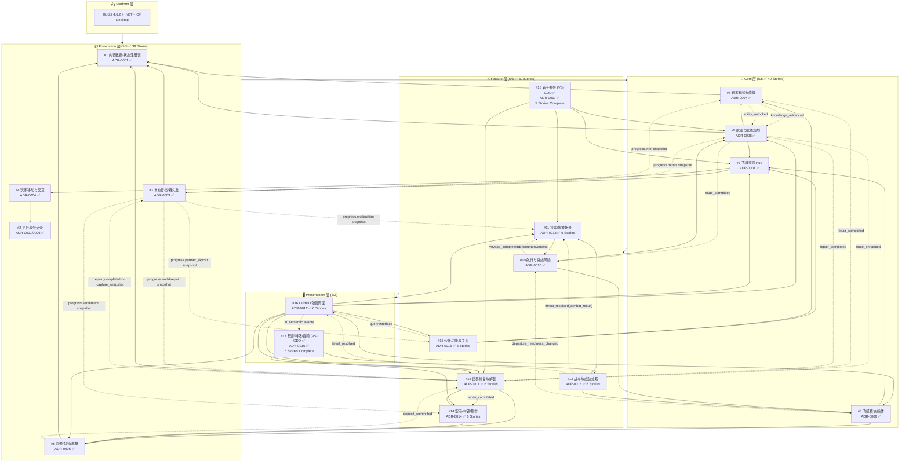

### GDD 文件清单

| # | 系统名 | 文件 | 层级 | ADR | 状态 |
|---|--------|------|------|-----|------|
| 1 | 内容数据与状态注册表 | [content-data-state-registry.md](../design/gdd/content-data-state-registry.md) | Foundation | ADR-0001 | ✅ 已审查 |
| 2 | 平台与会话壳 | [platform-session-shell.md](../design/gdd/platform-session-shell.md) | Foundation | ADR-0001/0006 | ✅ 已审查 |
| 3 | 本地存档与世界状态持久化 | [local-save-world-state-persistence.md](../design/gdd/local-save-world-state-persistence.md) | Foundation | ADR-0003 | ✅ 已审查 |
| 4 | 玩家移动与交互 | [player-movement-interaction.md](../design/gdd/player-movement-interaction.md) | Foundation | ADR-0004 | ✅ 已审查 |
| 5 | 资源、货物与容量 | [resources-goods-capacity.md](../design/gdd/resources-goods-capacity.md) | Foundation | ADR-0005 | ✅ 已审查 |
| 6 | 玩家知识与情报 | [player-knowledge-intel.md](../design/gdd/player-knowledge-intel.md) | Core | ADR-0007 | ✅ 已审查 |
| 7 | 飞艇家园 Hub | [airship-hub.md](../design/gdd/airship-hub.md) | Core | ADR-0001 | ✅ 已审查 |
| 8 | 飞艇模块与船体状态 | [airship-modules-hull-state.md](../design/gdd/airship-modules-hull-state.md) | Core | ADR-0009 | ✅ 已审查 |
| 9 | 航图与航线规划 | [chart-route-planning.md](../design/gdd/chart-route-planning.md) | Core | ADR-0008 | ✅ 已审查 |
| 10 | 航行与路线风险 | [navigation-route-risk.md](../design/gdd/navigation-route-risk.md) | Feature | ADR-0010 | ✅ 已审查 |
| 11 | 探索 / 搜撤场景 | [exploration-scavenge-scenario.md](../design/gdd/exploration-scavenge-scenario.md) | Feature | ADR-0013 | ✅ 已审查 |
| 12 | 战斗与威胁处理 | [combat-threat-handling.md](../design/gdd/combat-threat-handling.md) | Feature | ADR-0018 | ✅ 已审查 |
| 13 | 世界修复与解锁 | [world-repair-unlock.md](../design/gdd/world-repair-unlock.md) | Feature | ADR-0011 | ✅ 已审查 |
| 14 | 空港/村镇状态与集市交易 | [port-village-market.md](../design/gdd/port-village-market.md) | Feature | ADR-0014 | ✅ 已审查 |
| 15 | 伙伴功能与关系 | [partner-relationships.md](../design/gdd/partner-relationships.md) | Feature | ADR-0015 | ✅ 已审查 |
| 16 | UI / HUD / 航图界面 | [ui-hud-chart-interface.md](../design/gdd/ui-hud-chart-interface.md) | Presentation | ADR-0012 | ✅ 已审查 |
| 17 | 反馈、特效与音频语义 | [feedback-fx-audio.md](../design/gdd/feedback-fx-audio.md) | Presentation | ADR-0016 | ✅ GDD / ✅ ADR |
| 18 | 新手引导与首轮闭环 | [onboarding-first-loop.md](../design/gdd/onboarding-first-loop.md) | Feature | ADR-0017 | ✅ GDD / ✅ ADR |

### GDD 审查记录 (Review Logs)

| 系统 | Review Log |
|------|------------|
| #1 内容数据 | [review-log](../design/gdd/reviews/content-data-state-registry-review-log.md) |
| #2 平台会话壳 | [review-log](../design/gdd/reviews/platform-session-shell-review-log.md) |
| #3 本地存档 | [review-log](../design/gdd/reviews/local-save-world-state-persistence-review-log.md) |
| #4 移动交互 | [review-log](../design/gdd/reviews/player-movement-interaction-review-log.md) |
| #5 资源货物 | [review-log](../design/gdd/reviews/resources-goods-capacity-review-log.md) |
| #6 玩家知识 | [review-log](../design/gdd/reviews/player-knowledge-intel-review-log.md) |
| #7 飞艇家园 | [review-log](../design/gdd/reviews/airship-hub-review-log.md) |
| #8 模块船体 | [review-log](../design/gdd/reviews/airship-modules-hull-state-review-log.md) |
| #9 航图规划 | [review-log](../design/gdd/reviews/chart-route-planning-review-log.md) |
| #11 探索搜撤 | [review-log](../design/gdd/reviews/exploration-scavenge-scenario-review-log.md) |
| #12 战斗威胁 | [review-log](../design/gdd/reviews/combat-threat-handling-review-log.md) |
| #13 世界修复 | [review-log](../design/gdd/reviews/world-repair-unlock-review-log.md) |
| #14 空港集市 | [review-log](../design/gdd/reviews/port-village-market-review-log.md) |
| #17 反馈音画 | [review-log](../design/gdd/reviews/feedback-fx-audio-review-log.md) |
| #18 新手引导 | [review-log](../design/gdd/reviews/onboarding-first-loop-review-log.md) |
| 跨 GDD 审查 | [cross-review-2026-05-03](../design/gdd/gdd-cross-review-2026-05-03.md) |

> **VS** = Vertical Slice 阶段实现，MVP 不要求完整版本。

---

## 三、架构决策记录 (ADR) 全景

> **状态**: 19 ADRs Accepted ✅ (2026-05-15)
> **TR Registry**: 54 条技术需求已录入 `docs/architecture/tr-registry.yaml`
> **TR 覆盖率**: 100% — 54/54 TRs 有完整 ADR 覆盖
> **门禁检查**: Technical Setup → Pre-Production — CONCERNS (4/4 directors, 0 NOT READY) → 已进入 Pre-Production

### ADR 层级依赖关系图

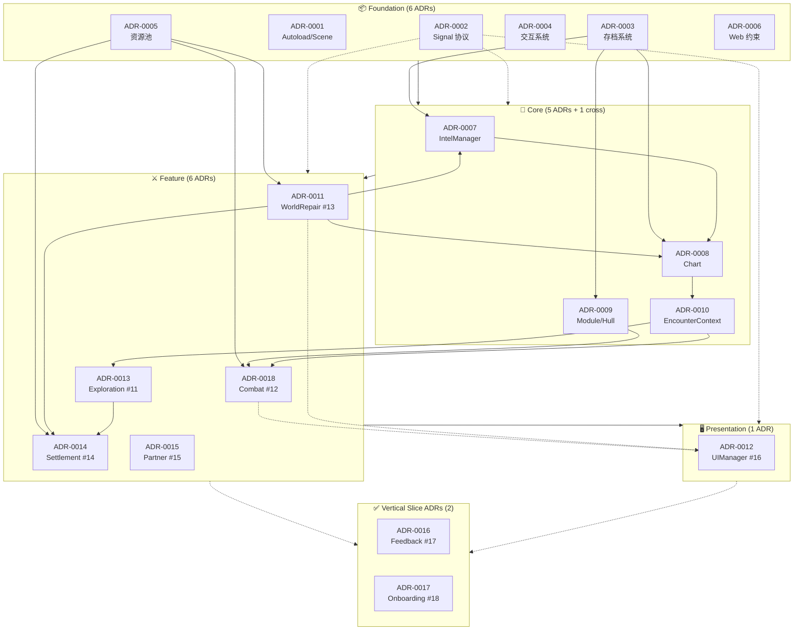

### ADR 状态机一览

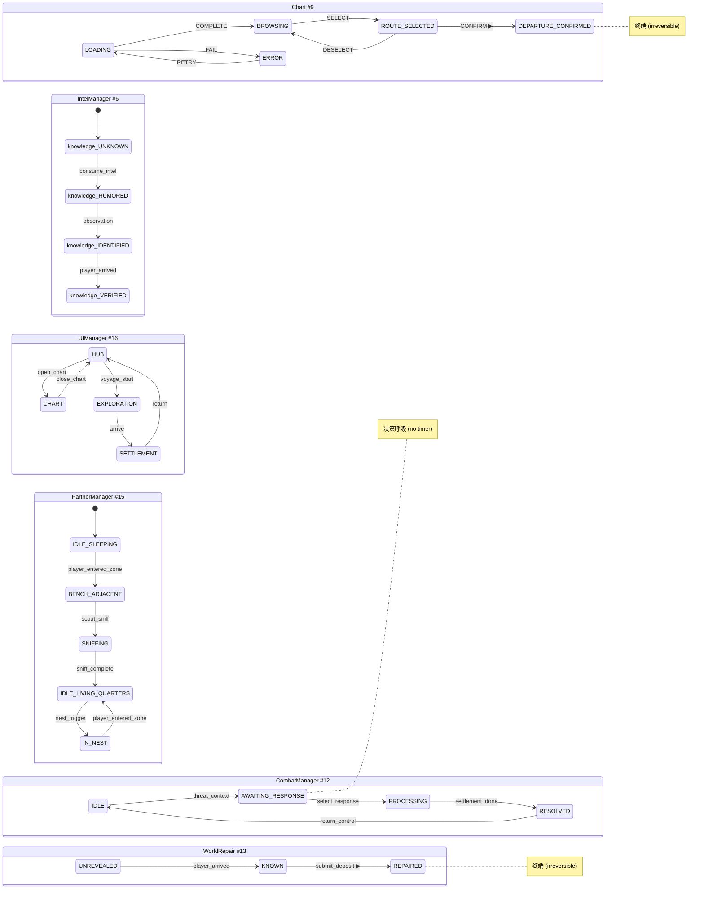

### 架构文档清单

> **19 ADR Accepted — 全部 54 TR 已覆盖路径 (100%)**

| 文件 | 说明 |
|------|------|
| [architecture.md](architecture/architecture.md) | 主架构 — v1 签收 (TD+LP 双签收) |
| [architecture-traceability.md](architecture/architecture-traceability.md) | 可追溯性索引 — 54 TR 全覆盖矩阵 (100%) |
| [tr-registry.yaml](architecture/tr-registry.yaml) | 54 条技术需求注册表 |
| [registry/architecture.yaml](registry/architecture.yaml) | 架构注册表 — 状态所有权、接口契约、禁止模式（含 ADR-0016/0017 stance） |
| | **Foundation ADRs (6) — 全部 Accepted ✅** |
| [adr-0001-autoload-scene-boot-order.md](architecture/adr-0001-autoload-scene-boot-order.md) | ADR-0001: Autoload/Scene 架构 — 9 Autoload + 9-Phase 启动链 |
| [adr-0002-signal-communication-protocol.md](architecture/adr-0002-signal-communication-protocol.md) | ADR-0002: Signal 通信协议 — typed params + sync emit + max depth 2 |
| [adr-0003-save-system-snapshot-json.md](architecture/adr-0003-save-system-snapshot-json.md) | ADR-0003: 存档系统 — SnapshotPackage + Canonical JSON |
| [adr-0004-interaction-handler-abstract.md](architecture/adr-0004-interaction-handler-abstract.md) | ADR-0004: 交互系统 — @abstract Interactable + Registry |
| [adr-0005-resource-pool-system.md](architecture/adr-0005-resource-pool-system.md) | ADR-0005: 资源池 — 6 Pools + 13 ResourceResult 枚举 |
| [adr-0006-web-platform-constraints.md](architecture/adr-0006-web-platform-constraints.md) | ADR-0006: Web 平台约束 — WebGL 2 + 单线程 + 无 C# |
| | **Core ADRs (6) — 全部 Accepted ✅** |
| [adr-0007-intel-knowledge-ability-system.md](architecture/adr-0007-intel-knowledge-ability-system.md) | ADR-0007: IntelManager — 知识/能力 Dictionary 状态 + 多路径解锁 |
| [adr-0008-chart-route-state-machine.md](architecture/adr-0008-chart-route-state-machine.md) | ADR-0008: Chart 状态机 — 5-state + route_committed 不可逆承诺 |
| [adr-0009-airship-module-hull-system.md](architecture/adr-0009-airship-module-hull-system.md) | ADR-0009: Module/Hull System — 双字段 + 出航就绪三维检查 |
| [adr-0010-encounter-context-type.md](architecture/adr-0010-encounter-context-type.md) | ADR-0010: EncounterContext — Navigation→Exploration 数据桥 |
| [adr-0011-world-repair-state-machine.md](architecture/adr-0011-world-repair-state-machine.md) | ADR-0011: WorldRepair — 3-state 不可逆 + 批量提交 + 6 下游 fan-out |
| [adr-0012-ui-input-routing-dual-focus.md](architecture/adr-0012-ui-input-routing-dual-focus.md) | ADR-0012: UIManager — 屏幕状态机 + 模态栈 + 4 层输入路由 + dual-focus |
| | **Feature ADRs (4) — 全部 Accepted ✅** |
| [adr-0013-exploration-scavenge-system.md](architecture/adr-0013-exploration-scavenge-system.md) | ADR-0013: Exploration — 4 阶段状态机 + EncounterContext 消费 + scout η 效率 |
| [adr-0014-settlement-market-system.md](architecture/adr-0014-settlement-market-system.md) | ADR-0014: Settlement/Market — 3 层状态机 + repair 驱动解锁 + F.1 价格公式 |
| [adr-0015-partner-relationships-system.md](architecture/adr-0015-partner-relationships-system.md) | ADR-0015: Partner — 6 态猫状态机 + R15 6 硬禁止 + scout_sniff 6 步算法 + F.1 置信度截断 |
| [adr-0018-combat-threat-resolution.md](architecture/adr-0018-combat-threat-resolution.md) | ADR-0018: Combat/Threat — 4 态状态机 + resolve_threat + combat_result 契约 |
| | **Vertical Slice ADRs (2) — Accepted ✅** |
| [adr-0016-feedback-vfx-audio-semantics.md](architecture/adr-0016-feedback-vfx-audio-semantics.md) | ADR-0016: #17 Feedback/VFX/Audio — implemented for first Polish feedback slice |
| [adr-0017-onboarding-first-loop.md](architecture/adr-0017-onboarding-first-loop.md) | ADR-0017: #18 Onboarding/First Loop — use before Vertical Slice onboarding implementation |

---

## 四、Epic/Story 生产框架

> **Foundation 5/5 + Core 5/5 + Feature 5/5 + Presentation 3/3 — 18 个 Epic 全部 Story 完成；#1-#18 Complete**
> **125 个 Story**: 67 Logic + 53 Integration + 4 UI + 1 Config
> **2026-05-22**

### 层级分解全景

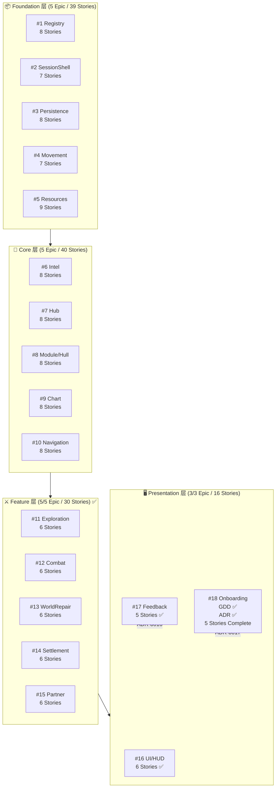

### 各层 Story 统计

| Layer | Epic 数 | Story 数 | Logic | Integration | UI | Config |
|-------|---------|----------|-------|-------------|-----|--------|
| Foundation | 5/5 | 39 | 22 | 14 | 2 | 1 |
| Core | 5/5 | 40 | 25 | 15 | — | — |
| Feature | 5/5 | 30 | 15 | 15 | — | — |
| Presentation | 3/3 | 16 | 5 | 9 | 2 | — |
| **合计** | **18/18** | **125** | **67** | **53** | **4** | **1** |

### Foundation 层 5 个 Epic 详解

| Epic | System # | Stories | 职责概括 | Autoload |
|------|----------|---------|---------|----------|
| [content-registry](../production/epics/content-registry/EPIC.md) | #1 | 8 | 内容数据与状态注册表——所有 gameplay 值的唯一权威源，定义资源/货物/mass_class/supply_class Schema | Registry (#1) |
| [platform-session-shell](../production/epics/platform-session-shell/EPIC.md) | #2 | 7 | 平台与会话壳——Web 生命周期归一化、AudioContext 激活门、BFCache 恢复、Input Gate | SessionShell (#2) |
| [local-save-persistence](../production/epics/local-save-persistence/EPIC.md) | #3 | 8 | 本地存档与持久化——SnapshotPackage + Canonical JSON + SHA-256 + 版本迁移 | Persistence (#3) |
| [player-movement-interaction](../production/epics/player-movement-interaction/EPIC.md) | #4 | 7 | 玩家移动与交互——WASD+Click-to-Move、焦点仲裁、Use Gate、@abstract Interactable | InteractionRegistry (#4) |
| [resources-goods-capacity](../production/epics/resources-goods-capacity/EPIC.md) | #5 | 9 | 资源/货物/容量——6 池架构、双容量制、7 种原子操作、重量追踪、信号契约 | ResourcesManager (#5) |

### Core 层 5 个 Epic 详解

| Epic | System # | Stories | 职责概括 | Autoload |
|------|----------|---------|---------|----------|
| [intel-knowledge](../production/epics/intel-knowledge/EPIC.md) | #6 | 8 | 玩家知识与情报——4 态知识状态机、能力解锁 3 路径、knowledge_advanced/ability_unlocked 信号 | IntelManager (#6) |
| [airship-hub](../production/epics/airship-hub/EPIC.md) | #7 | 8 | 飞艇家园 Hub——10 站点 + 4 房间、玩家存在状态、站点间 WASD 移动、交互契约；2026-05-12 复审 38/38 PASS | HubManager (#7) |
| [modules-hull-state](../production/epics/modules-hull-state/EPIC.md) | #8 | 8 | 飞艇模块与船体——双字段、2 槽位 + 船体 4 波段、eta_effective 乘数、出航就绪三维检查；2026-05-13 复审 36/36 PASS | ModuleHullManager (#8) |
| [chart-route-planning](../production/epics/chart-route-planning/EPIC.md) | #9 | 8 | 航图与航线规划——5 态状态机、route_committed 不可逆承诺、知识门控航线可见性、墨水扩散出航动画 | ChartManager (#9) |
| [navigation-route-risk](../production/epics/navigation-route-risk/EPIC.md) | #10 | 8 | 航行与路线风险——6 态 Voyage FSM、5 公式、12 遭遇类型、EncounterContext 9-field 合约；2026-05-13 复审 281/281 PASS | NavigationManager (#10) |

### Feature 层 5 个 Epic 详解

| Epic | System # | Stories | 职责概括 | Autoload |
|------|----------|---------|---------|----------|
| [exploration-scavenge](../production/epics/exploration-scavenge/EPIC.md) | #11 | 6 | 探索/搜撤——4 阶段状态机、6 搜索点、2 intel 点、scout η 威胁预览、撤离 λ 保护；2026-05-14 复审 287/287 PASS | ExplorationManager (#11) |
| [combat-threat](../production/epics/combat-threat/EPIC.md) | #12 | 6 | 战斗与威胁处理——4 态微状态机、3 种响应、C4 10 步结算序列、combat_result 6-field 契约、Registry threat config；2026-05-14 完成 37/37 grouped PASS | CombatManager (#12) |
| [world-repair](../production/epics/world-repair/EPIC.md) | #13 | 6 | 世界修复与解锁——3 态状态机、deposit_validation 5 种 violation、repair_completed 6 路 fan-out；2026-05-13 完成 91/91 PASS | WorldRepair (#13) |
| [settlement-market](../production/epics/settlement-market/EPIC.md) | #14 | 6 | 空港/集市交易——3 层状态机、repair 驱动摊位解锁、F.1 价格公式、validate_purchase 4 种拒绝；2026-05-14 完成 31/31 PASS | SettlementManager (#14) |
| [partner-relationships](../production/epics/partner-relationships/EPIC.md) | #15 | 6 | 伙伴功能与关系——6 态猫状态机、R15 6 硬禁止、scout_sniff 6 步算法、F.1 置信度截断 66、命名+小窝两套状态机；2026-05-14 复审 119/119 PASS | PartnerManager (#15) |

### Presentation 层 2 个 Epic 详解

| Epic | System # | Stories | 职责概括 | Autoload |
|------|----------|---------|---------|----------|
| [ui-hud-interface](../production/epics/ui-hud-interface/EPIC.md) | #16 | 6 | UI/HUD/航图界面——12 屏管理、11 态屏幕状态机、单槽模态栈+S7 战斗覆盖、4 层输入路由、Godot 4.6 dual-focus 同步、信号驱动脏标记 HUD 更新、10 个 ui_* 语义事件；Story 001-006 完成 | UIManager (#16) |
| [feedback-fx-audio](../production/epics/feedback-fx-audio/EPIC.md) | #17 | 5 | 反馈/特效/音频语义——FeedbackRequest 路由、UI/Session/Persistence 事件桥接、缺失资产与字幕 fallback、focus-safe overlay、smoke/perf/diagnostic 回归；Story 001-005 完成 | FeedbackManager (#17) |

### Polish Entry 状态 (Presentation)

| Epic | System # | 阻塞原因 | Priority |
|------|----------|---------|----------|
| onboarding-first-loop | #18 | ADR-0017 accepted + GDD approved + 5 stories Complete; Godot smoke/perf PASS | 🟢 LOW |

### Story 类型与质量门

| Story Type | Required Evidence | Gate Level | 数量 |
|------------|------------------|------------|------|
| **Logic** | 自动化单元测试 (tests/unit/) | BLOCKING | 66 |
| **Integration** | 集成测试或 playtest 文档 | BLOCKING | 50 |
| **UI** | Manual walkthrough doc | ADVISORY | 3 |
| **Config/Data** | Smoke check pass | ADVISORY | 1 |
| **Visual/Feel** | Screenshot + lead sign-off | ADVISORY | — |

---

## 五、C# 实现进度

> **当前状态**: Foundation #1/#2/#3/#4/#5 完成；Core #6 Intel、#7 Hub、#8 Modules/Hull、#9 Chart、#10 Navigation 完成；Feature #11 Exploration、#12 Combat、#13 WorldRepair、#14 Settlement、#15 Partner 完成；Presentation #16 UI/HUD、#17 Feedback、#18 Onboarding 完成；BUG-005 scene reachability 已修复；125 个 Story 已补齐 ADR-0019 / Manifest / C# test evidence readiness 元数据；旧 GDScript P3 原型保留为历史验证参考。
> **验证方式**: `dotnet build CloudWeaverVoyage.sln --no-restore -p:UseSharedCompilation=false` PASS；Epic #16 Story 001-006 runners PASS；Epic #17 Story 001-005 runners PASS；Epic #18 Story 001-005 runners PASS；FoundationParity 70/70 PASS；Chart/UI/Feedback/Onboarding smoke and accessibility checks PASS。

### Content Registry 完成项

| Story | 状态 | 实现 | 验证 |
|-------|------|------|------|
| [Story-001: ID Registry Core + Query Engine](../production/epics/content-registry/story-001-id-registry-core-query.md) | Done | `src/core/content/Registry.cs` — 稳定 ID、查询状态、确定性排序、分页上限、域隔离 | `tests/unit/registry/IdRegistryCoreTest.csproj` |
| [Story-002: Schema Validation](../production/epics/content-registry/story-002-schema-validation.md) | Done | `src/core/content/Registry.cs` — definition_validity U/K/R/S、受控词表、必填字段、运行时字段拒绝、只读边界 | `tests/unit/registry/IdRegistryCoreTest.csproj` — 11/11 PASS |
| [Story-003: Content Lifecycle](../production/epics/content-registry/story-003-content-lifecycle.md) | Done | `src/core/content/Registry.cs` — Draft/Active/Deprecated/Retired 生命周期、Retired ID 防复用、fantasy-critical 改义拦截、migration hint、emit-after-mutation 事件 | `tests/unit/registry/ContentLifecycleTest.csproj` — 6/6 PASS |
| [Story-004: Reference Integrity](../production/epics/content-registry/story-004-reference-integrity.md) | Done | `src/core/content/Registry.cs` — references 解析、Active 注册前引用门禁、生命周期引用错误、循环链诊断、AMBIGUOUS_QUERY | `tests/unit/registry/ReferenceIntegrityTest.csproj` — 7/7 PASS |
| [Story-005: Domain Loading & Decision UI Gating](../production/epics/content-registry/story-005-domain-loading-decision-gating.md) | Done | `src/core/content/Registry.cs` — 7 域加载状态、decision surface ready gate、domain_ready、snapshot isolation、VERSION_INCOMPATIBLE 边界诊断 | `tests/integration/registry/DomainLoadingTest.csproj` — 8/8 PASS |
| [Story-006: Diagnostic System](../production/epics/content-registry/story-006-diagnostic-system.md) | Done | `src/core/content/Registry.cs` — RegistryDiagnosticEvent、8 级 precedence、related_errors、severity/blocking_scope/suggested_action、稳定排序 | `tests/unit/registry/DiagnosticSystemTest.csproj` — 7/7 PASS |

### Intel / Knowledge 完成项

| Story | 状态 | 实现 | 验证 |
|-------|------|------|------|
| Story-001 Pattern Knowledge State Machine | Done | `src/core/intel/IntelManager.cs` — 规律 4 态状态机、观测事件累分、confirmed+ | `tests/unit/intel/pattern/PatternStateMachineTest.csproj` — 24/24 PASS |
| Story-002 Location Knowledge + Rumor System | Done | `src/core/intel/IntelManager.cs` — 地点 4 态知识、传闻来源、置信度分层、非降级保护 | `tests/unit/intel/location/LocationKnowledgeStateMachineTest.csproj` — 47/47 PASS |
| Story-003 Ability Multi-Path Unlock | Done | `src/core/intel/IntelManager.cs` — 多路径能力解锁、数据驱动条件求值 | `tests/unit/intel/ability/AbilityUnlockTest.csproj` — 23/23 PASS |
| Story-004 IntelConsumeResult Algorithm | Done | `src/core/intel/IntelManager.cs` — Intel 消费 5 条规则、消费后能力自洽检查 | `tests/unit/intel/consume/IntelConsumeAlgorithmTest.csproj` — 46/46 PASS |
| Story-005 Upstream Event Receivers | Done | `src/core/intel/IntelManager.cs` — navigation/repair/rumor/pattern/crew 事件接收与能力重评估 | `tests/unit/intel/events/EventReceiversTest.csproj` — 21/21 PASS |
| Story-006 Downstream Query Interface | Done | `src/core/intel/IntelManager.cs` — 地点、航线、规律、能力、日志查询接口 | `tests/unit/intel/query/QueryInterfaceTest.csproj` — 44/44 PASS |
| Story-007 Signal Contract + Non-Degradation | Done | `src/core/intel/IntelManager.cs` — 9 个信号、emit-after-mutation、非降级守卫 | `tests/integration/intel/signal/IntelSignalContractTest.csproj` — 39/39 PASS |
| Story-008 Persistence + MVP Bootstrap | Done | `src/core/intel/IntelManager.cs` — 7 字段持久化往返、MVP 起始状态、迁移警告、ClearAllState | `tests/integration/intel/persistence/IntelPersistenceIntegrationTest.csproj` — 43/43 PASS |

### Resources / Goods 完成项

| Epic | 状态 | 实现 | 验证 |
|------|------|------|------|
| Epic #5 Resources, Goods & Capacity | Done | `src/core/resources/ResourcesManager.cs` — 9 个 Story 合同：堆叠、双容量、货物拆包、重量质量、原子操作、池状态机、专用操作、信号重入守卫、持久化集成 | Story 001-009 全部 PASS；FoundationParity 70/70；资源测试 9 个 runner PASS |

### Modules / Hull 完成项

| Epic | 状态 | 实现 | 验证 |
|------|------|------|------|
| Epic #8 Modules & Hull State | Done + reviewed | `src/core/modules/ModuleHullManager.cs` — 8 个 Story 合同：双字段槽位状态机、两阶段 swap、船体 4 波段、出航适航门、货舱容积联动、信号契约、快照持久化、侦察解锁与战斗损伤接口 | Story 001-008 复审 PASS；`tests/unit/modules` + `tests/integration/modules` 8 个 runner，36/36 checks PASS |

### Chart / Route Planning 完成项

| Epic | 状态 | 实现 | 验证 |
|------|------|------|------|
| Epic #9 Chart / Route Planning | Done + reviewed | `src/core/chart/ChartManager.cs` — 8 个 Story 合同：5 态航图状态机、内容域门控、航线可见性/可选择性、两步出航确认、显示排序与筛选、快照持久化、UI 查询契约、外部状态变化响应、错误恢复与键盘导航 | Story 001-008 复审 PASS；Chart 8 个 runner，273/273 checks PASS |

### Navigation / Route Risk 完成项

| Epic | 状态 | 实现 | 验证 |
|------|------|------|------|
| Epic #10 Navigation / Route Risk | Done + reviewed | `src/core/navigation/NavigationManager.cs` — 8 个 Story 合同：6 态 Voyage FSM、预检 TOCTOU 防御、航行时长与检查间隔公式、侦察预览与隐藏标签揭示、伤害 max rule、动态船体波段、EncounterContext 9-field 合约、progress.voyage 快照和 38 个边缘案例 | Story 001-008 复审 PASS；Navigation 8 个 runner，281/281 checks PASS |

### Feature Layer 完成项

| Epic | 状态 | 实现 | 验证 |
|------|------|------|------|
| Epic #11 Exploration / Scavenge | Done + reviewed | `src/feature/ExplorationManager.cs` — 6 个 Story 合同：4 阶段探索 FSM、搜索/情报公式、威胁触发与侦察预览、EncounterContext 入场、撤离结算与状态变体、progress.exploration 持久化恢复 | Story 001-006 复审 PASS；Exploration 6 个 runner，287/287 checks PASS；Feature Layer sweep 30/30 projects PASS |
| Epic #12 Combat / Threat Resolution | Done | `src/core/combat/CombatManager.cs` — 6 个 Story 合同：4 态威胁 FSM、FIFO threat queue、3 响应 C4 结算、damage/module/knockback 公式、combat_result 信号、Registry threat config 与防御边界 | Story 001-006 PASS；Combat 6 个 runner，37/37 grouped checks PASS；FoundationParity 与 #5/#8/#11 回归 PASS |
| Epic #13 World Repair | Done | `src/features/world_repair/WorldRepair.cs` — 6 个 Story 合同：修复节点状态机、deposit validation、公式进度、信号链、持久化和防御边界 | Story 001-006 自动化证据 91/91 PASS |
| Epic #14 Settlement Market | Done | `src/core/settlement/SettlementManager.cs` — 6 个 Story 合同：定居点/摊位/NPC 三层状态机、repair 驱动解锁、购买验证/执行、信号集成、progress.settlement-market 持久化、防御边界 | Story 001-006 PASS；Settlement 6 个 runner，31/31 checks PASS |
| Epic #15 Partner & Relationships | Done + reviewed | `src/features/partner_relationships/PartnerManager.cs` — 6 个 Story 合同：猫 6 态存在性契约、scout_sniff 6 步算法、命名/小窝状态机、Hub/Intel 集成、progress.partner_skycat 持久化、R15 防御守卫 | Story 001-006 复审 PASS；Partner 6 个 runner，119/119 checks PASS |
| Epic #16 UI / HUD | In Progress | `src/presentation/UIManager.cs` — Story 001 屏幕 FSM、departure lock 全面板关闭、S1-S12 注册表、Hub→Chart→Voyage→Exploration→Settlement→Hub 逻辑闭环 | Story 001 20/20 PASS；Diagnostic UI 7/7 PASS；Chart UI contract 56/56 PASS；FoundationParity 70/70 PASS |

### Story Readiness 元数据收口

| 范围 | 状态 | 说明 |
|------|------|------|
| `production/epics/**/*.md` | 120/120 aligned | 所有 Story 已补齐 `Manifest Version: 2026-05-09`、ADR-0019 Implementation Contract、Type、Estimate、Test Evidence |
| Legacy platform wording | Cleared | Story 文本不再要求 Web/GDScript/ADR-0006 路径；实现入口按 Desktop Godot .NET/C# 翻译 |
| Story-004 Reference Integrity | Done | 引用完整性 Story 消费 Story-003 生命周期信息；Deprecated/Retired/Draft/Unloaded/Missing/Cycle/Ambiguous 查询路径均有 C# 单元证据 |

### C# 主线文件清单

| 层级 | 文件 | 职责 |
|------|------|------|
| **Core / Boot** | `src/core/boot/SessionBootChain.cs` | Phase 0→7 引导链 + ShellState / InputGate |
| **Core / Content** | `src/core/content/Registry.cs` | 内容注册表、查询、Schema 校验、Bootstrap 原型定义 |
| **Core / Persistence** | `src/core/persistence/Persistence.cs` | Staging→Verify→Promotion 存档管道 |
| **Core / Persistence** | `src/core/persistence/SnapshotPackage.cs` | SnapshotPackage 数据契约 |
| **Core / Interaction** | `src/core/interaction/InteractionRegistry.cs` | 交互焦点状态机 + Use Gate |
| **Core / Resources** | `src/core/resources/ResourcesManager.cs` | 6 资源池 + stack merge |
| **Core / Intel** | `src/core/intel/IntelManager.cs` | KnowledgeState / Rumor / Pattern 逻辑 |
| **Core / Chart** | `src/core/chart/ChartManager.cs` | ChartState / RouteSelectability / departure 确认 |
| **Core / Combat** | `src/core/combat/CombatManager.cs` | CombatState / threat queue / combat_result 结算 |
| **Feature** | `src/features/world_repair/WorldRepair.cs` | 修复状态机 + deposit / repair_completed |
| **Presentation** | `src/presentation/UIManager.cs` | 屏幕 FSM + 12-screen registry + departure lock + ModalStack + InputLayer |
| **Presentation** | `src/presentation/FeedbackManager.cs` | 语义反馈事件中心 |
| **Tests** | `tests/csharp/FoundationParity/Program.cs` | C# Foundation parity checks (70/70) |
| **Tests** | `tests/unit/registry/Program.cs` | Content Registry Story-001/002 acceptance checks |
| **Tests** | `tests/unit/registry/ContentLifecycleProgram.cs` | Content Registry Story-003 lifecycle acceptance checks |
| **Tests** | `tests/unit/registry/ReferenceIntegrityProgram.cs` | Content Registry Story-004 reference integrity acceptance checks |
| **Tests** | `tests/integration/registry/Program.cs` | Content Registry Story-005 domain loading integration checks |
| **Tests** | `tests/unit/registry/DiagnosticSystemProgram.cs` | Content Registry Story-006 diagnostic system acceptance checks |
| **Tests** | `tests/unit/ui-hud-interface/ScreenStateMachineProgram.cs` | Epic #16 Story 001 screen FSM acceptance checks (20/20 PASS) |

### 下一开发入口

| 优先级 | 下一步 | 说明 |
|--------|--------|------|
| P0 | Final art/audio treatment for onboarding/runtime hints | Polish Story 001-003 已完成 runtime authority、动态探索语义、authored route/search content slice 和 windowed evidence |
| P1 | Route/search content table scale-up | Story 003 已提供 authored MVP slice；后续可扩展到完整内容 authoring pipeline |

---

## 六、P3 架构原型 — 源代码架构

> **完成日期**: 2026-05-09 · **文件数**: 15 `.gd` + 1 `.tscn` + 7 test files + `project.godot`
> **9 个 Autoload** (Foundation 5 + Core 1 + Feature 1 + Presentation 2) · **39 个测试用例 + 49 verification checks** (Unit 21 + Integration 18 + Verification 49)
> **验证方式**: Godot 4.6.2 `--headless --script tests/p3_verification.gd` → 49/49 PASS

### 9 Autoload 依赖层次图

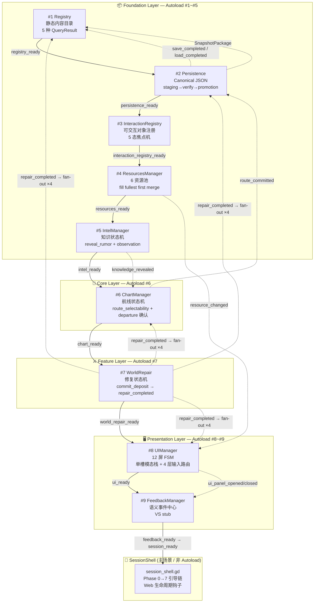

### SessionShell 引导链 (Phase 0→7)

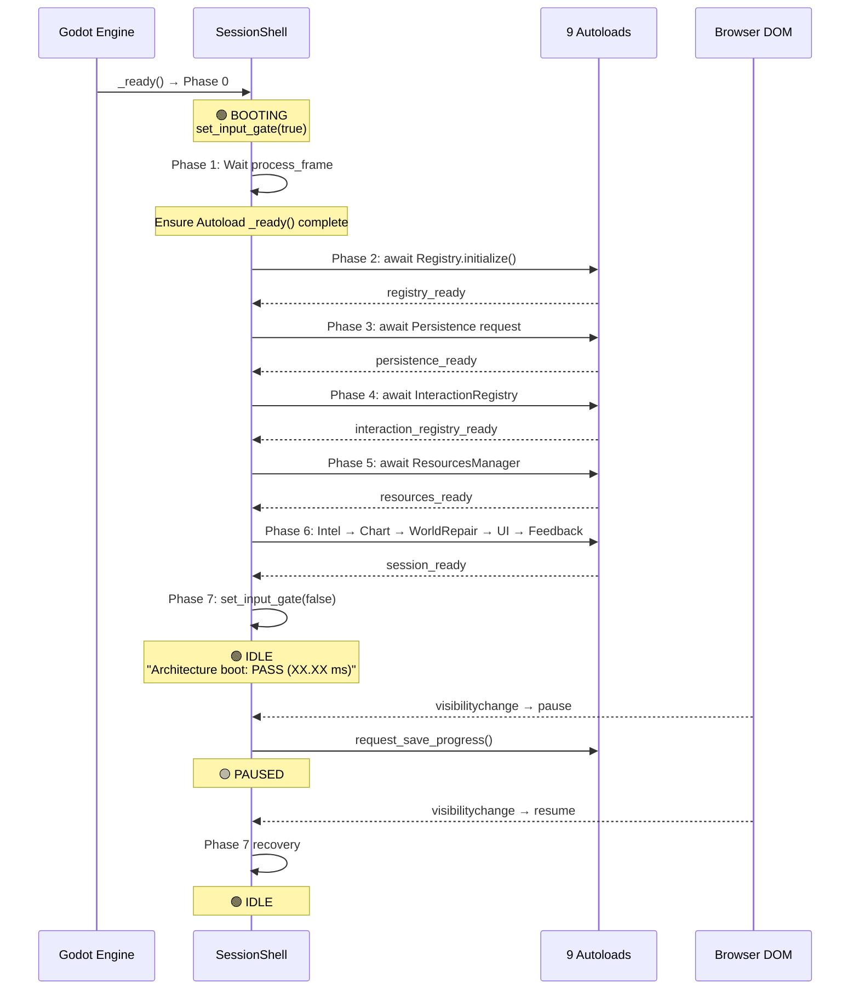

### Persistence 管道 (ADR-0003)

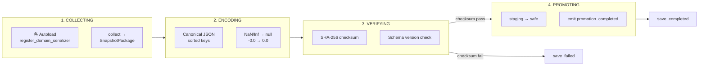

### 测试架构

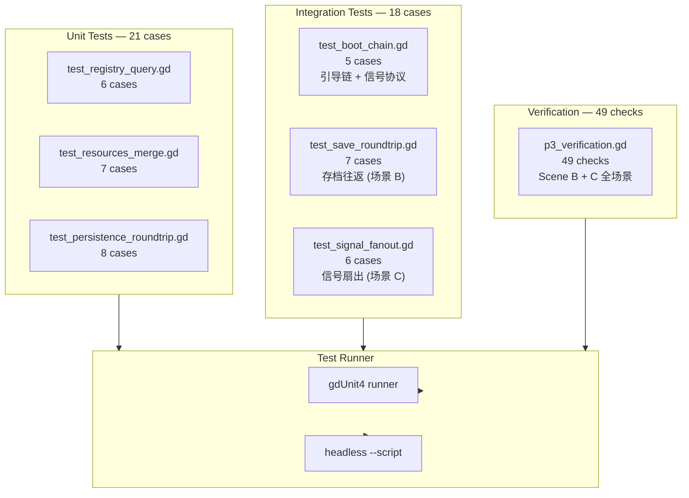

### 信号交互拓扑

跨系统信号流向全景 — 展示 9 个 Autoload + SessionShell 之间的所有信号契约。

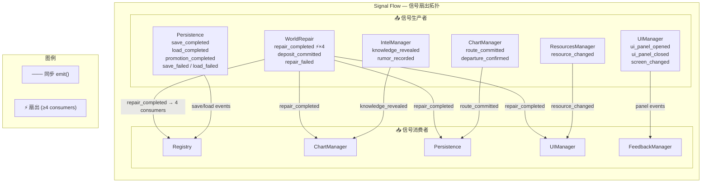

### WorldRepair 信号扇出详图

`repair_completed` 是项目中第一个 4 消费者扇出信号 — P3 场景 C 验证的核心。

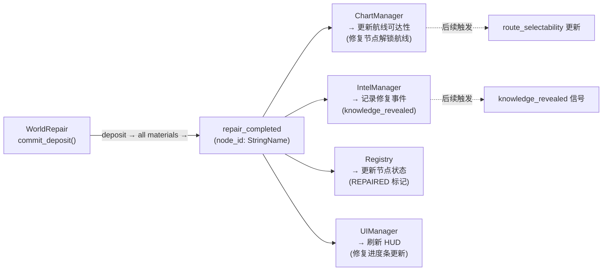

### 源代码文件清单

| 层级 | 文件 | 行数 | Autoload # | 职责 |
|------|------|------|------------|------|
| **Foundation** | `src/core/registry.gd` | ~100 | #1 | 静态内容目录 + 查询引擎 |
| | `src/core/registry_bootstrap.gd` | ~90 | — | 引导数据 (4 地点/2 航线/6 资源等) |
| | `src/core/persistence.gd` | ~150 | #2 | Canonical JSON + SHA-256 + staging→verify→promotion |
| | `src/core/snapshot_package.gd` | ~40 | — | RefCounted 数据类 (to_dict/from_dict) |
| | `src/core/interaction_registry.gd` | ~80 | #3 | 可交互对象注册 + 焦点状态机 |
| | `src/core/interactable.gd` | ~30 | — | @abstract 基类 (所有可交互对象) |
| | `src/core/resources_manager.gd` | ~120 | #4 | 6 资源池 + fill fullest first merge |
| | `src/core/intel_manager.gd` | ~100 | #5 | 知识状态机 + reveal_rumor |
| **Core** | `src/core/chart_manager.gd` | ~100 | #6 | 航线状态机 + route_selectability |
| **Feature** | `src/feature/world_repair.gd` | ~80 | #7 | 修复状态机 + commit_deposit |
| **Presentation** | `src/presentation/ui_manager.gd` | ~110 | #8 | 12 屏 FSM + 模态栈 + 4 层输入路由 |
| | `src/presentation/feedback_manager.gd` | ~60 | #9 | 语义事件中心 (VS stub) |
| **Shell** | `src/session_shell.gd` | ~120 | — | Phase 0→7 引导链 + Web 生命周期钩子 |
| | `src/session_shell.tscn` | 6 | — | 主场景文件 |
| **Config** | `project.godot` | ~80 | — | Godot 4.6.2 项目配置 (9 Autoload 声明) |
| **Tests** | `tests/unit/test_registry_query.gd` | 60 | — | 6 测试用例 |
| | `tests/unit/test_resources_merge.gd` | 67 | — | 7 测试用例 |
| | `tests/unit/test_persistence_roundtrip.gd` | 93 | — | 8 测试用例 |
| | `tests/integration/test_boot_chain.gd` | 66 | — | 5 测试用例 |
| | `tests/integration/test_save_roundtrip.gd` | ~200 | — | 场景 B — 存档往返集成测试 (7 用例) |
| | `tests/integration/test_signal_fanout.gd` | ~200 | — | 场景 C — 信号扇出集成测试 (6 用例) |
| | `tests/p3_verification.gd` | ~300 | — | P3 自包含验证脚本 (49 checks, SceneTree runner) |
| **Proto** | `prototypes/p3-architecture/README.md` | ~80 | — | 验证清单 + 运行说明 |

### 架构关键决策

| 决策 | 说明 |
|------|------|
| **9 Autoload 串行加载** | ADR-0001 顺序: Registry→Persistence→InteractionRegistry→Resources→Intel→Chart→WorldRepair→UIManager→FeedbackManager |
| **SessionShell 非 Autoload** | 作为主场景根节点，不注册 Autoload — Phase 0→7 中等待所有 Autoload ready 后发射 `session_ready` |
| **Canonical JSON** | 键递归排序 (bytewise ASCII)、NaN/Inf→null、-0.0→0.0 — 保证同一状态永远产生相同字节 |
| **ADR-0002 Signal 协议** | 全部信号使用 `{noun}_{verb_past}` (如 `repair_completed`, `route_committed`)，类型化参数，同步 `.emit()` |
| **Interactable @abstract** | 所有可交互对象继承 `Interactable`，实现 `handle_use()` 返回 `UseResult` 枚举 (ACCEPTED/REJECTED/BUSY) |
| **Web-first 约束** | Compatibility 渲染器、单线程 Web export、AudioContext 用户手势激活、`pagehide`/`visibilitychange` 最佳努力存档 |
| **Forbidden patterns** | 9 条禁止模式（见 control-manifest.md），包括 string_signal_connect、bare_dictionary_payload、hardcoded_value 等 |
| **Autoload pool ≤10MB** | 所有 Autoload 的内存总和不超过 10MB；主场景 ≤30MB；总堆 ≤200MB |

---

## 七、审查与质量门禁流程

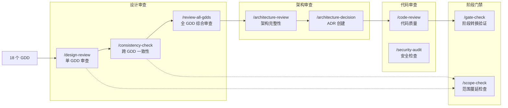

### 已完成审查记录

| 日期 | 审查 | 结果 | 报告 |
|------|------|------|------|
| 2026-04-30 | `/consistency-check` 跨 GDD 一致性 | 通过 | [cross-review-2026-04-30](../design/gdd/gdd-cross-review-2026-04-30-consistency.md) |
| 2026-05-03 | `/review-all-gdds` Phase 2 — 跨 GDD 一致性 | 5 BLOCKING/CRITICAL 已修复 | [phase2-report](../production/session-state/phase2-cross-gdd-consistency-report.md) |
| 2026-05-03 | `/review-all-gdds` Phase 3 — 游戏设计整体审查 | 通过 | [phase3-report](../production/session-state/phase3-game-design-holism-review.md) |
| 2026-05-04 | `/review-all-gdds` Phase 4 — 跨系统场景走查 | 通过 | [phase4-report](../production/session-state/phase4-cross-system-scenario-walkthrough.md) |
| 2026-05-04 | `/review-all-gdds` Phase 5 — 最终裁决 | PASS WITH NOTES | [phase5-report](../production/session-state/phase5-final-verdict.md) |
| 2026-05-04 | `/create-architecture` — 主架构 | TD+LP 双签收 | [architecture.md](architecture/architecture.md) |
| 2026-05-05 | `/gate-check technical-setup` — Technical Setup→Pre-Production | CONCERNS — 4 阻塞项已清除 | 本文档第三节 |
| 2026-05-09 | `/review-all-gdds` 重新验证 — 16 GDDs cross-review | PASS (0 blockers, 15 warnings) | [rerun-report](../design/gdd/gdd-cross-review-2026-05-08-rerun.md) |
| 2026-05-09 | **平台转向复审** — Web/GDScript 残余清理 | **CONCERNS** (0 blockers, 6 warnings 已修复) | [platform-pivot-review](../design/gdd/platform-pivot-review-2026-05-09.md) |
| 2026-05-05 | ADR 批量 Acceptance — 12/12 Accepted | 通过 | 全部 12 ADR Status→Accepted |
| 2026-05-05 | TR Registry 填充 — 54 TR 条目 | 通过 | [tr-registry.yaml](architecture/tr-registry.yaml) |
| 2026-05-05 | `/architecture-review` — 架构完整性审计 | CONCERNS (65.4% TR coverage, Combat #12 gap) | [architecture-review-2026-05-05](architecture/architecture-review-2026-05-05.md) |
| 2026-05-05 | `/ux-design` — Hub, Chart, Exploration 三份 UX Spec | 通过 | [Hub](../design/ux/hub.md), [Chart](../design/ux/chart.md), [Exploration](../design/ux/exploration.md) |
| 2026-05-07 | Foundation + Core 层 Epic/Story 分解 — 10 个 Epic (79 Stories) | 通过 | [active.md](../production/session-state/active.md) |
| 2026-05-07 | Feature 层 — #12 combat-threat (6) + #13 world-repair (6) | 通过 | [active.md](../production/session-state/active.md) |
| 2026-05-08 | ADR-0013 Exploration + 6 Stories (#11) | 通过 | [active.md](../production/session-state/active.md) |
| 2026-05-08 | ADR-0014 Settlement/Market + 6 Stories (#14) | 通过 | [active.md](../production/session-state/active.md) |
| 2026-05-08 | ADR-0015 Partner/Relationships + 6 Stories (#15) | 通过 | [active.md](../production/session-state/active.md) |
| 2026-05-08 | #16 UI/HUD 6 Stories (3 Logic + 3 Integration) | 通过 | [active.md](../production/session-state/active.md) |
| 2026-05-12 | Epic #7 Airship Hub Story 001-008 复审 + Hub runner 复跑 | 通过 (38/38 PASS) | [Epic #7](../production/epics/airship-hub/EPIC.md) |
| 2026-05-13 | Epic #8 Modules/Hull Story 001-008 复审 + module runner 复跑 | 通过 (36/36 PASS) | [Epic #8](../production/epics/modules-hull-state/EPIC.md) |
| 2026-05-13 | Epic #9 Chart Route Planning Story 001-008 复审 + chart runner 复跑 | 通过 (273/273 PASS) | [Epic #9](../production/epics/chart-route-planning/EPIC.md) |
| 2026-05-13 | Epic #10 Navigation Route Risk Story 001-008 复审 + navigation runner 复跑 | 通过 (281/281 PASS) | [Epic #10](../production/epics/navigation-route-risk/EPIC.md) |
| 2026-05-14 | Epic #11 Exploration Scavenge Story 001-006 复审 + exploration runner 复跑 | 通过 (287/287 PASS；全量 C# runner 97/97 PASS；`dotnet build CloudWeaverVoyage.sln --no-restore` PASS) | [Epic #11](../production/epics/exploration-scavenge/EPIC.md) |
| 2026-05-14 | Epic #12 Combat Threat Resolution Story 001-006 实现 + combat runner / #5/#8/#11 回归 | 通过 (37/37 grouped PASS；FoundationParity 70/70 PASS；#5/#8/#11 回归 PASS；`dotnet build CloudWeaverVoyage.sln --no-restore -p:UseSharedCompilation=false` PASS) | [Epic #12](../production/epics/combat-threat/EPIC.md) |
| 2026-05-14 | Epic #15 Partner Relationships Story 001-006 复审 + partner runner 复跑 | 通过 (119/119 PASS；全量 C# runner 97/97 PASS；`dotnet build CloudWeaverVoyage.sln --no-restore` PASS) | [Epic #15](../production/epics/partner-relationships/EPIC.md) |
| 2026-05-14 | Epic #14 Settlement Market closeout + #16 Story 001 UI/HUD convergence | 通过 (#14 31/31 PASS；#16 Story 001 20/20 PASS；Feature sweep 30/30 projects PASS；FoundationParity 70/70 PASS；`dotnet build CloudWeaverVoyage.sln --no-restore -p:UseSharedCompilation=false` PASS) | [Epic #16 Story 001](../production/epics/ui-hud-interface/story-001-screen-state-machine-flow.md) |

### 平台转向复审 — 修正文件总览 (2026-05-09)

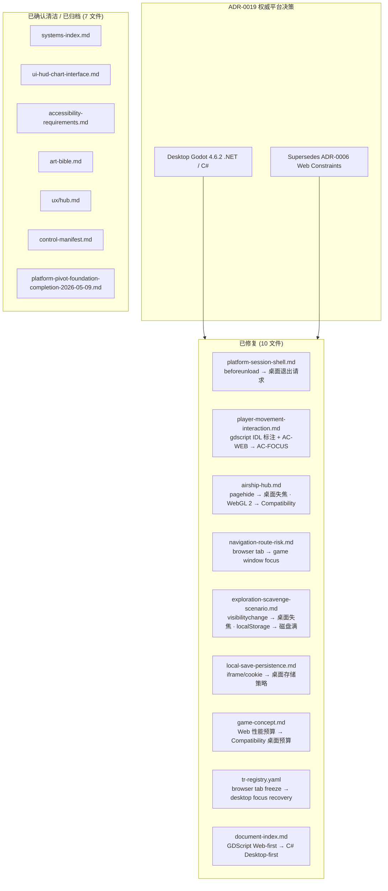

> **Verdict**: CONCERNS — 0 blockers, 6 WARNING 已修复, 4 NICE-TO-HAVE 已修复。
> 平台转向核心目标已达成。C# 实现者可从 GDD 和架构文档中无障碍理解桌面契约。
> 详见 [platform-pivot-review-2026-05-09.md](../design/gdd/platform-pivot-review-2026-05-09.md)

---

### 架构就绪状态 — Gate Check 全景

```
┌──────────────────────────────────────────────────────────────────────────────┐
│                    TECHNICAL SETUP → PRE-PRODUCTION                           │
│                   Gate Check: CONCERNS → PASS (Pre-Production)                │
│                                                                              │
│  ┌──────────────────────────────────────────────────────────────────────┐   │
│  │                      DIRECTOR PANEL                                    │   │
│  │  ┌──────────────────┐ ┌──────────────────┐ ┌──────────────────┐       │   │
│  │  │ Creative Director│ │Technical Director│ │    Producer      │       │   │
│  │  │   CONCERNS (4)   │ │  CONCERNS (7)    │ │  CONCERNS (8)    │       │   │
│  │  └──────────────────┘ └──────────────────┘ └──────────────────┘       │   │
│  │  ┌──────────────────┐                                                 │   │
│  │  │  Art Director    │  NO "NOT READY" — 0 hard blockers                │   │
│  │  │  CONCERNS (4)    │                                                 │   │
│  │  └──────────────────┘                                                 │   │
│  └──────────────────────────────────────────────────────────────────────┘   │
│                                                                              │
│  ┌──────────────────────────────────────────────────────────────────────┐   │
│  │                      RESOLVED BLOCKERS (2026-05-05)                    │   │
│  │                                                                        │   │
│  │  ✅ ADR Acceptance:   19 Accepted                                      │   │
│  │  ✅ TR Registry:      0 entries → 54 TRs populated                     │   │
│  │  ✅ TR Coverage:      65.4% → 100% (54/54 TRs)                        │   │
│  │  ✅ Engine Config:    [CHOOSE] → Godot 4.6.2 .NET + C# Desktop-first    │   │
│  │  ✅ Tech Preferences: [TO BE CONFIGURED] → fully populated             │   │
│  └──────────────────────────────────────────────────────────────────────┘   │
│                                                                              │
│  ┌──────────────────────────────────────────────────────────────────────┐   │
│  │                   PRE-PRODUCTION P3 PROGRESS                            │   │
│  │                                                                        │   │
│  │  ✅ Foundation 5/5 Epics (39 Stories)  ✅ Core 5/5 Epics (40 Stories) │   │
│  │  ✅ Feature 5/5 Epics (30 Stories)     ✅ Presentation 3/3 (16 Stories)│   │
│  │  📊 Total: 125 Stories — 67 Logic + 53 Integration + 4 UI + 1 Config  │   │
│  └──────────────────────────────────────────────────────────────────────┘   │
└──────────────────────────────────────────────────────────────────────────────┘
```

### 制品就绪矩阵

```
                     ADP     GDD     ADR     TR     TECH    ART     TEST    UX
                     ██      ██      ██     ██     ██      ██      ██     ██
ARCHITECTURE.md      ██      ██      ██     ██     ██      ██      ██     ██
CLAUDE.md            ██      --      --     --      ██      --      --     --
ADR (x16)            ██      ██      ██     ██     ██      ░░      --     --
TR REGISTRY          ██      ██      ██     ██     ██      --      --     --
TECH PREFS           ██      --      ██     --      ██      --      --     --
ART BIBLE            --      ██      --     --      --      ██      --     --
ENGINE REFS          --      --      --     --      ██      --      --     --
TEST FRAMEWORK       --      --      --     --      --      --      ██     --
UX SPECS             --      --      --     --      --      --      --     ██

                     ██ = Complete    ░░ = Missing    -- = Not applicable
```

### 门禁留下的 Concerns（Pre-Production 期间跟踪）

| # | Concern | 严重度 | 状态 |
|---|---------|--------|------|
| 1 | Combat #12 零 ADR 覆盖 | 🔴 HIGH | ✅ ADR-0018 + 6 Stories 完成 (2026-05-07) |
| 2 | 缺少 interaction-patterns.md | 🟡 MEDIUM | ✅ 已创建 — 10 个交互模式 |
| 3 | 缺少 architecture-traceability.md | 🟡 MEDIUM | ✅ 已创建 — 54 TR 全覆盖矩阵 (100%) |
| 4 | 4 个延期 ADR 无时间表 | 🟡 MEDIUM | ✅ ADR-0013/14/15 已清除; 0016-0017 Production 前完成 |
| 5 | Dual-focus + Web 生命周期未测试 | 🟡 MEDIUM | Sprint 1 Spike |
| 6 | 仅 1 个示例测试 | 🟡 LOW | 随实现同步编写 |
| 7 | 无视觉参考/Mood Board | 🟡 LOW | 概念美术开始前整理 |
| 8 | UX Specs 未交叉引用 Art Bible | 🟡 LOW | 早期 Pre-Production 轻量对齐 |

---

## 八、Studio 基础设施

### Agent 体系 (49 个)

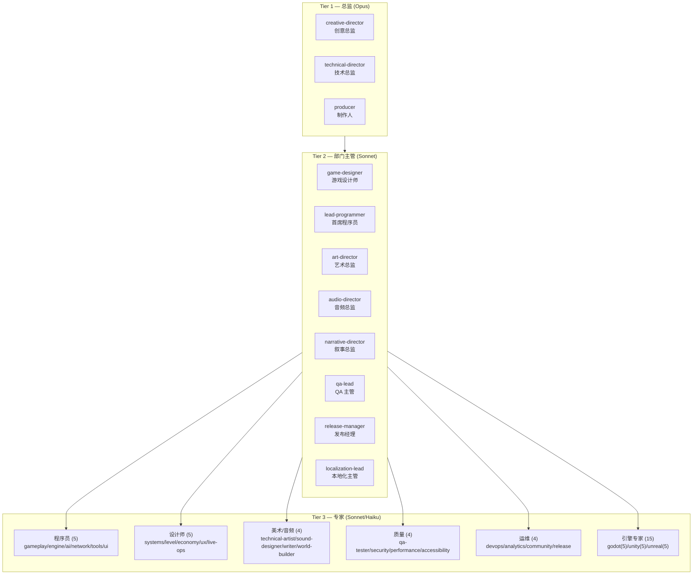

### Skill 体系 (70 个) — 按工作流阶段

```mermaid
graph LR
    subgraph 构思["💡 构思"]
        START["/start"]
        BRAINSTORM["/brainstorm"]
        MAP["/map-systems"]
    end

    subgraph 设计["📝 设计"]
        DSGN["/design-system"]
        QD["/quick-design"]
        UX["/ux-design"]
        ARTB["/art-bible"]
    end

    subgraph 审查["🔍 审查"]
        DR2["/design-review"]
        UX2["/ux-review"]
        CR2["/consistency-check"]
        AR2["/architecture-review"]
        RAG["/review-all-gdds"]
    end

    subgraph 架构["🏗️ 架构"]
        CA["/create-architecture"]
        AD["/architecture-decision"]
        CCM["/create-control-manifest"]
    end

    subgraph 规划["📋 规划"]
        CE["/create-epics"]
        CS["/create-stories"]
        SP["/sprint-plan"]
    end

    subgraph 实现["⚡ 实现"]
        DEV["/dev-story"]
        PROTOTYPE["/prototype"]
    end

    subgraph 质量["✅ 质量"]
        CR3["/code-review"]
        SA["/security-audit"]
        BC["/balance-check"]
        PP["/perf-profile"]
        TD2["/tech-debt"]
    end

    subgraph 发布["🚀 发布"]
        GC2["/gate-check"]
        SC2["/scope-check"]
        SMOKE["/smoke-check"]
        LC["/launch-checklist"]

    end

    构思 --> 设计
    设计 --> 审查
    审查 --> 架构
    架构 --> 规划
    规划 --> 实现
    实现 --> 质量
    质量 --> 发布
```

---

## 九、规范与模板

### 路径规则 (11 个)

[`.claude/rules/`](../.claude/rules/) 目录下的代码规范，按文件类型自动激活：

| 规则文件 | 适用范围 |
|----------|----------|
| [ai-code.md](../.claude/rules/ai-code.md) | AI 行为树/状态机代码 |
| [data-files.md](../.claude/rules/data-files.md) | 数据文件 |
| [design-docs.md](../.claude/rules/design-docs.md) | 设计文档 (8 个必需节) |
| [engine-code.md](../.claude/rules/engine-code.md) | 引擎代码 |
| [gameplay-code.md](../.claude/rules/gameplay-code.md) | 游戏玩法代码 |
| [narrative.md](../.claude/rules/narrative.md) | 叙事文本 |
| [network-code.md](../.claude/rules/network-code.md) | 网络代码 |
| [prototype-code.md](../.claude/rules/prototype-code.md) | 原型代码 (宽松标准) |
| [shader-code.md](../.claude/rules/shader-code.md) | Shader 代码 |
| [test-standards.md](../.claude/rules/test-standards.md) | 测试标准 |
| [ui-code.md](../.claude/rules/ui-code.md) | UI 代码 |

### 核心配置文档

| 文件 | 说明 |
|------|------|
| [.claude/settings.json](../.claude/settings.json) | 项目设置 (权限/Hooks) |
| [.claude/docs/agent-roster.md](../.claude/docs/agent-roster.md) | Agent 完整名册 |
| [.claude/docs/agent-coordination-map.md](../.claude/docs/agent-coordination-map.md) | Agent 协调委托关系图 |
| [.claude/docs/coordination-rules.md](../.claude/docs/coordination-rules.md) | Agent 协调规则 |
| [.claude/docs/directory-structure.md](../.claude/docs/directory-structure.md) | 目录结构 |
| [.claude/docs/technical-preferences.md](../.claude/docs/technical-preferences.md) | 技术偏好 ✅ |
| [.claude/docs/coding-standards.md](../.claude/docs/coding-standards.md) | 编码标准 |
| [.claude/docs/context-management.md](../.claude/docs/context-management.md) | 上下文管理策略 |

---

## 十、文档阅读路线图

### 新成员入门路径

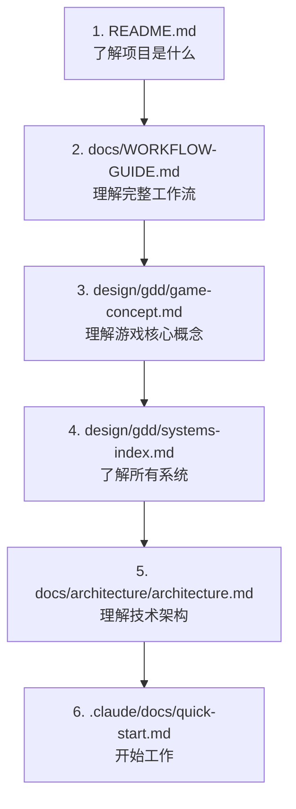

### 按角色推荐阅读

| 角色 | 必读文档 | 选读 |
|------|----------|------|
| **新成员** | [README](../README.md) → [WORKFLOW-GUIDE](WORKFLOW-GUIDE.md) → [game-concept](../design/gdd/game-concept.md) | [examples/](examples/) |
| **游戏设计师** | [game-concept](../design/gdd/game-concept.md) → [systems-index](../design/gdd/systems-index.md) → [全部 GDD](../design/gdd/) | [reviews/](../design/gdd/reviews/) |
| **程序员** | [architecture](architecture/architecture.md) → [coding-standards](../.claude/docs/coding-standards.md) → [engine-reference/godot/](engine-reference/godot/) | [rules/](../.claude/rules/) |
| **美术** | [art-bible](../design/art/art-bible.md) → [game-concept](../design/gdd/game-concept.md) | [rendering](engine-reference/godot/modules/rendering.md) |
| **音频** | [game-concept](../design/gdd/game-concept.md) → GDD #17 (VFX/Audio) | [audio](engine-reference/godot/modules/audio.md) |
| **QA** | [全部 GDD](../design/gdd/) → [test-standards](../.claude/rules/test-standards.md) → [coding-standards](../.claude/docs/coding-standards.md) | [reviews/](../design/gdd/reviews/) |
| **制作人** | [WORKFLOW-GUIDE](WORKFLOW-GUIDE.md) → [architecture](architecture/architecture.md) → sprint 相关 | [session-logs/](../production/session-logs/) |

---

## 十一、统计概览

```
文档分布 (按目录)

  design/          ████████████████░░░░  35 文件  (GDD + 审查 + 艺术)
  docs/            ████████████████████████████████  65 文件  (架构 + ADR + 引擎参考 + 示例)
  production/      ████████████████░░░░  130+ 文件  (Epics/Stories + 会话状态 + 日志)
  .claude/         ██████████████████████████████████████████████████  123 文件  (Agent + Skill + 规则 + 模板)
  .github/         █░░░░░░░░░░░░░░░░░░░   3 文件  (Issue/PR 模板)
  src/             ███████████████░░░░░  35 C# 文件  (Core + Feature + Presentation + Godot 节点脚本)
  tests/           ████████████████████  120 C# runner  (Unit 59 + Integration 60 + Parity 1)
  prototypes/      ██░░░░░░░░░░░░░░░░░░   1 文件  (P3 架构原型 README)

  📊 总计: ~384+ 个文档/源代码/测试文件 + 12 个配置/数据文件
  🏗️ ADR: 19 Accepted | TR: 54 条注册 | Control Manifest: Active | TR 覆盖路径: 100%
  📋 Epic/Story: 18/18 Epic 完成 (125 Stories) | #1/#2/#3/#4/#5/#6/#7/#8/#9/#10/#11/#12/#13/#14/#15/#16/#17/#18 Complete
  💻 源代码: Godot 4.6.2 .NET/C# 主线 (src 35 C# + 120 C# test runners)
  ✅ Polish — Production → Polish PASS WITH CONDITIONS | Sprint 003 domain-backed playable slice complete；#18 stories Complete；Polish Story 001 runtime hardening Complete；Polish Story 002 exploration semantics Complete；Polish Story 003 authored content slice Complete
```

---

## 十二、待创建文档

> 更新于 2026-05-22 — Production → Polish PASS WITH CONDITIONS；Sprint 003 PVS3-001..PVS3-007 完成；#18 Onboarding Story 001-005 完成。

### 已全部完成 ✅

- [x] **19 个 Accepted ADR** — ADR-0001 through ADR-0019 全部 Accepted
- [x] **TR Registry** — `docs/architecture/tr-registry.yaml` — 54 条全部录入
- [x] **TR 覆盖路径 100%** — 54/54 TRs 有 Accepted ADR 覆盖路径
- [x] **引擎正式配置** — `CLAUDE.md` — Godot 4.6.2 .NET + C# Desktop-first
- [x] **Control Manifest** — `docs/architecture/control-manifest.md`
- [x] **Architecture Traceability Index** — `docs/architecture/architecture-traceability.md`
- [x] **Architecture Review Report** — `docs/architecture/architecture-review-2026-05-05.md`
- [x] **Accessibility Requirements** — `design/accessibility-requirements.md`
- [x] **UX Specs (×3)** — `design/ux/hub.md`, `chart.md`, `exploration.md`
- [x] **Interaction Patterns Library** — `design/ux/interaction-patterns.md`
- [x] **Vertical Slice GDDs #17/#18** — `feedback-fx-audio.md`, `onboarding-first-loop.md` 已批准
- [x] **Test Framework** — `tests/unit/` + `tests/integration/` (gdUnit4)
- [x] **CI/CD Workflow** — `.github/workflows/tests.yml`
- [x] **Foundation 层 Epic/Story 分解** — 5/5 Epic (39 Stories)
- [x] **Core 层 Epic/Story 分解** — 5/5 Epic (40 Stories)
- [x] **Feature 层 Epic/Story 分解** — 5/5 Epic (30 Stories): #11/#12/#13/#14/#15
- [x] **Presentation 层 #16 UI/HUD** — Complete (6 Stories)
- [x] **Presentation 层 #17 Feedback/VFX/Audio** — Complete (5 Stories)
- [x] **P3 架构原型** — 9 Autoload + SessionShell Boot Chain + 39 Tests + 49 Verification Checks (2026-05-09)
- [x] **平台转向复审** — Web/GDScript 残余清理: 10 个文件修复, 0 blockers, CONCERNS verdict (2026-05-09)
- [x] **project.godot** — Godot 4.6.2 项目初始化 (9 Autoload 声明 / Compatibility 渲染器)
- [x] **源代码架构文档** — `docs/document-index.md` §五/§六 (C# Foundation 进度 + P3 原型架构)
- [x] **P3 全场景验证** — `tests/p3_verification.gd` 场景 A (122ms boot) + 场景 B (存档往返 16/16) + 场景 C (信号扇出 33/33) — 49/49 PASS
- [x] **Content Registry Story-001/002/003/004/005/006** — C# Registry ID/query + Schema Validation + Content Lifecycle + Reference Integrity + Domain Loading/Decision Gating + Diagnostic System；`IdRegistryCoreTest.csproj` 11/11 PASS；`ContentLifecycleTest.csproj` 6/6 PASS；`ReferenceIntegrityTest.csproj` 7/7 PASS；`DomainLoadingTest.csproj` 8/8 PASS；`DiagnosticSystemTest.csproj` 7/7 PASS
- [x] **Intel / Knowledge Epic #6** — 8/8 Story Complete；Pattern 24/24、Location 47/47、Ability 23/23、Consume 46/46、Events 21/21、Query 44/44、Signal 39/39、Persistence 43/43 PASS；#9 Chart Route Planning 已完成
- [x] **Resources / Goods Epic #5** — 9/9 Story Complete；Story 001-009 全部 PASS；#8 Modules/Hull 已解锁；BUG-005 scene reachability 已修复
- [x] **Modules / Hull Epic #8** — 8/8 Story Complete；Story 001-008 自动化证据 36/36 PASS；#10/#11/#12/#16 可消费模块、船体、货舱容量与损伤合同
- [x] **Chart / Route Planning Epic #9** — 8/8 Story Complete；Story 001-008 自动化证据 273/273 PASS；#10/#13/#15/#16/#18 可消费航图、航线、route_committed 与 UI 查询合同
- [x] **Navigation / Route Risk Epic #10** — 8/8 Story Complete；Story 001-008 自动化证据 281/281 PASS；#11/#17 可消费 EncounterContext、voyage_completed 与 navigation encounter 事件合同
- [x] **Combat / Threat Resolution Epic #12** — 6/6 Story Complete；Story 001-006 自动化证据 37/37 grouped PASS；#16 可消费 combat_result、威胁信号与 HUD 决策入口合同
- [x] **World Repair Epic #13** — 6/6 Story Complete；Story 001-006 自动化证据 91/91 PASS；#14/#16/#17 可消费 repair_completed、route enhancement、progress.world-repair 与 MVP feedback 合同
- [x] **Settlement / Market Epic #14** — 6/6 Story Complete；Story 001-006 自动化证据 31/31 PASS；#16 可消费 stall_opened、purchase_completed、purchase_failed 与 progress.settlement-market 合同
- [x] **UI / HUD Epic #16** — 6/6 Stories Complete；Screen FSM、Modal/Input、HUD lifecycle、Domain integration、Semantic events、Desktop/A11y regressions PASS
- [x] **Feedback / VFX / Audio Epic #17** — 5/5 Stories Complete；Feedback router 8/8、Semantic event wiring 6/6、Accessible fallbacks 7/7、Focus-safe visual cue 9/9、Smoke regression 6/6 PASS
- [x] **Epic #12 关键回归** — Combat 6 个 runner 37/37 grouped PASS；FoundationParity 70/70 PASS；#5/#8/#11 相关回归 PASS；`dotnet build CloudWeaverVoyage.sln --no-restore -p:UseSharedCompilation=false` PASS（5 个既有 warning，0 error）
- [x] **Story readiness metadata sweep** — 125 个 Story 已对齐 Manifest 2026-05-09、ADR-0019、C# evidence 路径

### 仍待完成

- [x] **ADR-0016** (#17 Feedback/VFX/Audio) — Accepted 2026-05-15
- [x] **ADR-0017** (#18 Onboarding/First Loop) — Accepted 2026-05-15
- [x] **#17 feedback-fx-audio Epic/Story 实现** — 5 Stories Complete
- [x] **#18 onboarding-first-loop Epic/Story 实现** — 5 Stories Complete
- [x] **Sprint Plan** — Sprint 001 Polish Stabilization 已创建并完成 Must/Should Have scope
- [x] **Sprint 002 Playable Vertical Slice Recovery** — 灰盒 Hub -> Chart -> Exploration -> Return 人工可玩闭环恢复通过
- [x] **Sprint 003 Domain-Backed Playable Slice** — C# domain managers / canonical persistence / 最低灰盒表现 / 自动 smoke evidence / 人工 QA sign-off 已完成；Production → Polish gate PASS WITH CONDITIONS

---

> **更新于 2026-05-22** — Production → Polish PASS WITH CONDITIONS 后，#18 Onboarding / First Loop 5 个 stories 已完成；fresh perf probe 已修复并通过；Polish Story 001 runtime hardening、Story 002 richer Exploration scene semantics 与 Story 003 authored route/search content slice 已完成。下一步进入 final art/audio treatment 或 route/search content scale-up 的普通 Polish backlog。

> **提示**: 本文档使用 Mermaid 图表。在 VS Code 中安装 "Markdown Preview Mermaid Support" 插件，
> 或在 GitHub 上直接查看以渲染图表。也可使用 `npx mermaid-cli` 生成静态图片。
