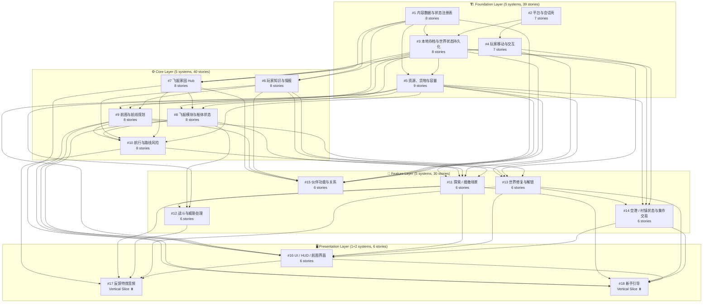

# 生产任务流程图 — 云海织航 MVP

> 生成日期: 2026-05-10 | 最后更新: 2026-05-10
> 基于: systems-index.md 依赖图 + 16 Epic 115 Story
> 用途: 可视化所有生产任务的依赖关系、并行机会、关键路径
> 当前状态: **Phase 0 完成 | Phase 1 Story-001 完成**

---

## 零、当前进度 (2026-05-10)

### Phase 0: 环境准备 — ✅ 完成

| 任务 | 状态 | 证据 |
|------|------|------|
| Godot 4.6.2 .NET 项目搭建 | ✅ | `project.godot` C# feature + `[dotnet]` 段 |
| C# Foundation 全量迁移 | ✅ | 9/9 Autoload + SessionBootChain → C# |
| dotnet build 验证 | ✅ | 0 errors, 3 warnings |
| FoundationParity 验证 | ✅ | **70/70 PASS** (从 20 扩展到 70) |
| content-registry Story-001 | ✅ | **10/10 AC PASS** |

### Phase 1 启动状态

| Epic | Story | 状态 | 测试 |
|------|-------|------|------|
| #1 Content Registry | 001 ID Registry Core + Query Engine | ✅ Done | 10/10 |
| #1 Content Registry | 002-008 | ⏳ Ready | — |
| #2 Session Shell | 001-007 | ⏳ Ready | — |
| #3-#16 其余 | 全部 Story | ⏳ Pending | — |

---

## 一、系统级依赖全景图 (Mermaid)



---

## 二、分阶段并行执行视图

### Phase A: 零依赖启动 (可同时开工)

```
Week 1-2 ─── 并行 ───
┌─────────────────────────────────────────────────────┐
│  #1 内容数据与状态注册表        ████████████████    │
│  #2 平台与会话壳                ████████████████    │
└─────────────────────────────────────────────────────┘
```

| Epic | Stories | 输入 | 输出 |
|------|---------|------|------|
| #1 Content Registry | 8 (6L+1I+1U) | 无 | 静态内容定义、ID schema、查询 API |
| #2 Session Shell | 7 (2L+3I+1U) | 无 | 桌面生命周期、输入入口、窗口管理 |

---

### Phase B: 依赖 #1+#2 完成后启动

```
Week 3-4 ─── 并行 ───
┌─────────────────────────────────────────────────────┐
│  #3 本地存档持久化    ████████████████  (需 #1+#2)  │
│  #4 玩家移动与交互    ████████████████  (需 #2)      │
└─────────────────────────────────────────────────────┘
```

| Epic | Stories | 等待 | 解锁 |
|------|---------|------|------|
| #3 Persistence | 8 (5L+3I) | #1, #2 | #5, #6, #7, #8, #9, #13, #14, #15 |
| #4 Movement | 7 (3L+4I) | #2 | #7, #11, #14 |

**关键路径节点**: #3 是瓶颈系统——15 个系统中的 8 个依赖它。

---

### Phase C: Foundation 完成后的大规模并行

```
Week 5-7 ─── 5 系统并行 ───
┌──────────────────────────────────────────────────────────┐
│  #5  资源货物容量      ████████████████  (需 #1+#3)      │
│  #6  玩家知识与情报    ████████████████  (需 #1+#3)      │
│  #7  飞艇家园 Hub      ████████████████  (需 #1+#3+#4)  │
│  #8  飞艇模块与船体    ████████████████  (需 #3+#5+#7)  │
│  #9  航图与航线规划    ████████████████  (需 #1+#3+#6)  │
└──────────────────────────────────────────────────────────┘
```

**注意**: #8 依赖 #7，所以 #8 在 #7 完成前不能启动。
**注意**: #9 依赖 #6，所以 #9 在 #6 完成前不能启动。

细化：

```
Week 5-6 ─── 并行 ───
  #5 资源货物       ████████████
  #6 玩家知识情报   ████████████
  #7 飞艇家园 Hub   ████████████

Week 7 ─── #5/#6/#7 完成后并行 ───
  #8 飞艇模块       ████████████  (等 #7)
  #9 航图航线       ████████████  (等 #6)
```

---

### Phase D: Feature 层 — 混合依赖

```
Week 8-10 ───
┌──────────────────────────────────────────────────────────┐
│  #10 航行路线风险    ████████████  (需 #5+#6+#7+#8+#9)  │
│  #13 世界修复       ████████████  (需 #3+#5+#6+#9)      │
│  #15 伙伴关系       ████████████  (需 #1+#3+#5+#6+#7+#9)│
└──────────────────────────────────────────────────────────┘
```

**#10, #13, #15 可以同时开工**（所有 Core 系统完成时，三者的依赖全部满足）。

```
一旦 #10 完成:
  #11 探索搜撤   ████████████  (需 #4+#5+#6+#8+#10)

一旦 #11 完成:
  #12 战斗威胁   ████████████  (需 #5+#8+#11)

一旦 #13 完成:
  #14 空港集市   ████████████  (需 #3+#4+#5+#13)
```

---

### Phase E: 呈现层

```
Week 11-12
  一旦 #11 + #13 + #14 完成:
    #16 UI/HUD   ████████████  (需 #5+#8+#9+#11+#13+#14)

  Vertical Slice (之后):
    #17 反馈音频 ⏸️  (ADR-0016 未创建)
    #18 新手引导 ⏸️  (ADR-0017 未创建)
```

---

## 三、Story 级并行矩阵

### Foundation 层 Story 依赖链

```
#1 Content Registry (8 stories)
  001 定义 Registry 数据模型       ─┬─ 002 实现内容域查询
                                    ├─ 003 实现 ID 验证
                                    └─ 004 内容热重载
  001-004 完成 → 005 实现 Schema 验证
              → 006 实现 content-gate 状态机
              → 007 Bootstrap 数据定义
              → 008 集成测试

#2 Session Shell (7 stories)
  001 Shell 状态机                  ─┬─ 002 窗口焦点/暂停
                                    ├─ 003 输入事件路由
                                    └─ 004 退出请求处理
  001-004 完成 → 005 启动画面
              → 006 主菜单 (继续/新游戏)
              → 007 集成测试
```

---

## 四、关键路径分析

```
关键路径 (最长依赖链):

  #1 内容注册表 (8 stories)
    → #6 玩家知识 (8 stories) 
      → #9 航图航线 (8 stories)
        → #10 航行风险 (8 stories)
          → #11 探索搜撤 (6 stories)
            → #12 战斗威胁 (6 stories)
              → #16 UI/HUD (6 stories)

路径长度: 8+8+8+8+6+6+6 = 50 stories
```

**注意**: 这不是说必须串行。大量 Story 可以在同一个系统内并行，上面的分析只画了系统间的最小依赖链。实际执行时大量 Story 可以并行。

---

## 五、Story 类型分布

| Layer | Logic | Integration | UI | Total |
|-------|-------|-------------|-----|-------|
| Foundation (#1-#5) | 22 | 14 | 2 | **39** |
| Core (#6-#10) | 25 | 15 | 0 | **40** |
| Feature (#11-#15) | 15 | 15 | 0 | **30** |
| Presentation (#16) | 3 | 3 | 0 | **6** |
| **Total** | **65** | **47** | **2** | **115** |

Logic 类 Story 通常彼此独立（可并行），Integration 类 Story 通常依赖其系统内的 Logic Story 先完成。

---

## 六、推荐执行顺序

### Sprint 1: Foundation Boot (目标: dotnet build + 基础 C# 管线跑通)

```
并行:
  ┌─ Epic #1: Content Registry (Story 001-004) ─ 8-10 天
  └─ Epic #2: Session Shell (Story 001-004)    ─ 6-8 天

完成后并行:
  ┌─ Epic #3: Persistence (Story 001-004)      ─ 8-10 天
  ├─ Epic #4: Movement (Story 001-003)         ─ 6-8 天
  ├─ Epic #1: 剩余 Story 005-008               ─ 4-6 天
  └─ Epic #2: 剩余 Story 005-007               ─ 4-6 天
```

### Sprint 2: Core Systems (目标: Hub→Chart→Navigation 闭环)

```
并行:
  ┌─ Epic #5: Resources (Story 001-006)        ─ 8-10 天
  ├─ Epic #6: Intel (Story 001-006)            ─ 8-10 天
  └─ Epic #7: Hub (Story 001-006)              ─ 8-10 天

#5+#6+#7 完成后并行:
  ┌─ Epic #8: Modules (Story 001-006)          ─ 8-10 天
  └─ Epic #9: Chart (Story 001-006)            ─ 8-10 天

#8+#9 完成后:
  └─ Epic #10: Navigation Risk (Story 001-006) ─ 8-10 天

同时进行:
  ├─ Epic #5: 剩余 Story 007-009
  ├─ Epic #6: 剩余 Story 007-008
  ├─ Epic #7: 剩余 Story 007-008
  ├─ Epic #8: 剩余 Story 007-008
  └─ Epic #9: 剩余 Story 007-008
```

### Sprint 3: Feature Systems (目标: 完整游戏循环可玩)

```
并行 (等 #9+#10 完成):
  ┌─ Epic #13: World Repair (Story 001-004)    ─ 6-8 天
  └─ Epic #15: Partner (Story 001-004)         ─ 6-8 天

#10 完成后:
  └─ Epic #11: Exploration (Story 001-004)     ─ 8-10 天

#11 完成后:
  └─ Epic #12: Combat (Story 001-004)          ─ 6-8 天

#13 完成后:
  └─ Epic #14: Settlement (Story 001-004)      ─ 6-8 天
```

### Sprint 4: Presentation & Polish

```
等 #11+#13+#14 完成:
  └─ Epic #16: UI/HUD (Story 001-006)          ─ 10-12 天

Vertical Slice (之后，需先创建 ADR-0016/0017):
  ├─ Epic #17: Feedback/Audio                   ─ 待定
  └─ Epic #18: Onboarding                      ─ 待定
```

---

## 七、并行度热力图

```
系统    │ 可并行启动的兄弟系统数 │ 等待链长度
════════╪═══════════════════════╪══════════
 #1     │ 1  (#2 同时)          │ 0 (零依赖)
 #2     │ 1  (#1 同时)          │ 0 (零依赖)
 #3     │ 1  (#4 同时)          │ 2 (#1+#2)
 #4     │ 1  (#3 同时)          │ 1 (#2)
 #5     │ 2  (#6+#7 同时)       │ 2 (#1+#3)
 #6     │ 2  (#5+#7 同时)       │ 2 (#1+#3)
 #7     │ 2  (#5+#6 同时)       │ 3 (#1+#3+#4)
 #8     │ 1  (#9 同时)          │ 4 (#5+#7)
 #9     │ 1  (#8 同时)          │ 3 (#6)
 #10    │ 2  (#13+#15 同时)     │ 7 (最长链至此)
 #11    │ 0                     │ 8
 #12    │ 0                     │ 9
 #13    │ 2  (#10+#15 同时)     │ 5
 #14    │ 0                     │ 6
 #15    │ 2  (#10+#13 同时)     │ 7
 #16    │ 0                     │ 10 (最长链)
```

---

## 八、风险提醒

1. **瓶颈系统 #1 (Content Registry)**: 所有其他系统都依赖其 ID/schema。如果 schema 设计出错，后续 14 个系统全部受影响。建议 Phase A 完成后做一次 schema freeze。
2. **瓶颈系统 #3 (Persistence)**: 8 个系统直接依赖它。如果序列化格式在后期变更，波及面极大。
3. **最长关键路径**: #1→#6→#9→#10→#11→#12→#16 = 50 stories。这条路径上的任何延迟都会推迟 MVP 交付。
4. **#17/#18 阻塞**: ADR-0016 和 ADR-0017 尚未创建。如果 Vertical Slice 阶段需要它们，需在 Sprint 3 结束前至少完成 ADR。
