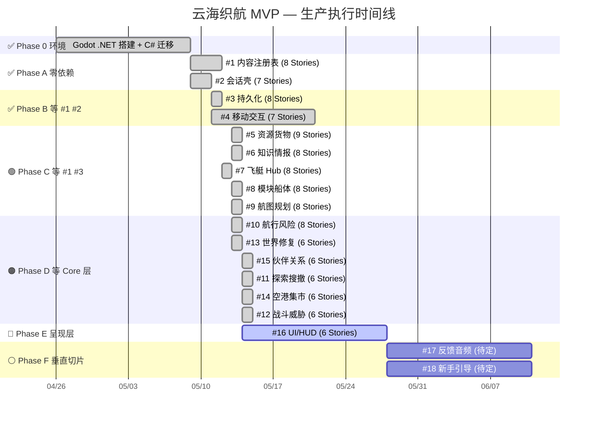
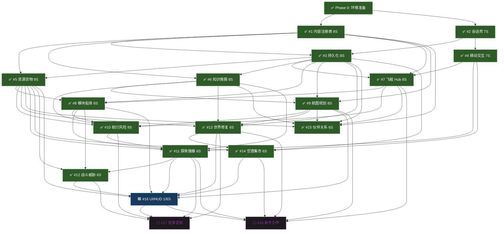
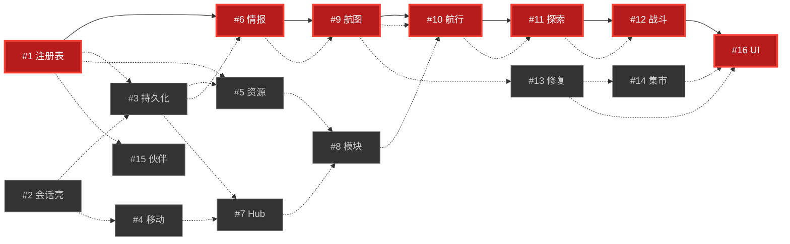

# 生产任务流程图 — 云海织航 MVP

> 生成日期: 2026-05-14 | 基于: systems-index.md + 16 Epic 115 Story
> 当前状态: **Phase 0 ✅ 完成 | Phase A ✅ 完成 | Phase B ✅ 完成 — #3/#4 全部完成；Phase C #5/#6/#7/#8/#9 完成；Phase D #10/#13/#11/#12/#14/#15 完成；Phase E #16 UI/HUD 已启动，Story 001 Complete；BUG-005 已修复**

---

## 一、生产执行时间线 (Gantt)

> 阅读方式: 每一行是一个 Epic，横向是时间。同一时间段内上下并排的 Epic **可以并行做**。
> 纵向箭头表示依赖：箭头起点的 Epic 完成后，箭头终点的 Epic 才能开始。



---

## 二、依赖解锁链 — 先做什么、后做什么

> 这是整张图最重要的部分。从上往下读：**完成上方所有节点 → 解锁下方节点**。
> 同一行内左右并排的节点 **可以并行开工**。



### 简化版：只看主线关卡

```
Phase 0 ✅ ──→ ┌─ #1 内容注册表 ─┬─→ #3 持久化 ─┬─→ #6 知识情报 ─→ #9 航图 ─→ #10 航行风险 ─→ #11 探索 ─→ #16 UI
               └─ #2 会话壳     ┘               ├─→ #5 资源货物 ─→ #8 模块 ──────────────┘
                                                └─→ #7 Hub ─────→ #8 模块

关键解读:
  #1 和 #2 可以同时做           ← 当前阶段
  #3 等 #1+#2 都完成后启动
#5 #6 #7 等 #1+#3 完成后可以三人并行（#7 已完成）
  #8 等 #7 完成后启动, 但仍需 #5 资源池；#9 等 #6 完成后启动
  #10 等 #5+#6+#7+#8+#9 全部完成后启动  ← 这是最大的汇合点
  #11 等 #10 完成后启动
  #16 等 #11+#12+#13+#14 完成后启动    ← 最终汇合点
```

---

## 三、分阶段执行详图

### 图例

| 符号 | 含义 |
|------|------|
| ═══ | 必须串行 (等上一段完成) |
| ─── | 可以并行 (同时开工) |
| ┌─ └─ | 并行组开始/结束 |
| ▶▶▶ | 完成后解锁下游 |

---

### Phase A 🔵 — 零依赖启动 (当前阶段)

```
Week 1-2
┌─ #1 内容注册表 ─────────────────────▶▶▶ 解锁 #3 #5 #6 #7 #9 #15
│   Story 001 ▸ 002 ▸ 003 ▸ 004 ▸ 005 ▸ 006 ▸ 007 ▸ 008
│   └─ 001-004 内部可并行 ─┘└─ 005-008 内部可并行 ─┘
│
└─ #2 会话壳 ─────────────────────────▶▶▶ 解锁 #3 #4
    Story 001 ▸ 002 ▸ 003 ▸ 004 ▸ 005 ▸ 006 ▸ 007
    └─ 001-004 内部可并行 ─┘└─ 005-007 内部可并行 ─┘

并行度: #1 和 #2 互不依赖, 8 人可同时推进
```

| Epic | Stories | 做完解锁 | 当前进度 |
|------|---------|----------|----------|
| #1 内容注册表 | 001-008 (8S) | #3, #5, #6, #7, #9, #15 | ✅ 001-008 完成 |
| #2 会话壳 | 001-007 (7S) | #3, #4 | ✅ 001-007 完成 |

---

### Phase B ✅ — Foundation 扩展 (等 #1 #2)

```
Week 3-4
┌─ #3 持久化 ─────────────────────────▶▶▶ 解锁 #5 #6 #7 #8 #13 #14 #15
│   Story 001 ▸ 002 ▸ 003 ▸ 004 ▸ 005 ▸ 006 ▸ 007 ▸ 008
│   └─ 001-008 已完成 ─┘
│
└─ #4 移动交互 ───────────────────────▶▶▶ 解锁 #7 #11 #14
    Story 001 ▸ 002 ▸ 003 ▸ 004 ▸ 005 ▸ 006 ▸ 007
    └─ 001-007 已完成 ─┘

阻塞关卡: ⛔ 必须等 #1 和 #2 都完成后才能启动 #3
          ⛔ #4 可以只等 #2 完成就启动 (不等 #1)
          
并行度: #3 和 #4 互不依赖, 同时做
瓶颈:   #3 是全局瓶颈 — 15 个系统中有 8 个直接依赖它
```

---

### Phase C 🟢 — Core 系统大规模并行 (等 #1 #3)

```
Week 5-7
阶段 C1 (Week 5-6) — 三人并行:
┌─ #5 资源货物 ───────────────────────▶▶▶ 解锁 #8 #10 #11 #12 #13 #14 #15 #16
├─ #6 知识情报 ───────────────────────▶▶▶ 解锁 #9 #10 #11 #13 #15
└─ #7 飞艇 Hub ───────────────────────▶▶▶ 解锁 #8 #10 #15 #18
    └─ 001-008 已完成 ─┘

阶段 C2 (Week 7) — 等 C1 完成后二人并行:
┌─ #8 模块船体 ───────────────────────▶▶▶ 解锁 #10 #11 #12 #16
└─ #9 航图规划 ───────────────────────▶▶▶ 解锁 #10 #13 #15 #16 #18

阻塞关卡: ⛔ #8 必须等 #7 完成 (模块装在 Hub 里)
          ⛔ #9 必须等 #6 完成 (航图读取情报系统)
          ⛔ #5 #6 #7 都需要 #1(内容定义) + #3(存档) 就绪

并行度: C1 三人并行 → C2 二人并行
```

---

### Phase D 🟠 — Feature 系统 (等 Core 层)

```
Week 8-10
阶段 D1 (Week 8-9) — 三人并行:
┌─ #10 航行风险 ──────────────────────▶▶▶ 解锁 #11 #17
├─ #13 世界修复 ──────────────────────▶▶▶ 解锁 #14
└─ #15 伙伴关系 ──────────────────────▶▶▶ (终点系统)

阶段 D2 (Week 9-10) — 等 D1 完成后:
┌─ #11 探索搜撤 ──────────────────────▶▶▶ 解锁 #12 #16 #17 #18
│   (等 #10 完成)
│
└─ #14 空港集市 ──────────────────────▶▶▶ 解锁 #16 #18
    (等 #13 完成)

阶段 D3 (Week 10) — 等 #11 完成后:
  #12 战斗威胁 ────────────────────────▶▶▶ 解锁 #17
    (等 #11 完成)

阻塞关卡: ✅ #10 Phase D 最大汇合点已完成 — 5 个 Core 上游已验证
          ✅ #11 已完成并解锁 #12/#16/#17/#18
          ⛔ #12 必须等 #11 (战斗在探索中发生) — 现在已满足
          ⛔ #14 必须等 #13 (集市状态由世界修复驱动)

并行度: D1 三人并行 → D2 二人并行 → D3 单人
```

---

### Phase E 🔴 — 呈现层 (等 Feature 层)

```
Week 11-12
  #16 UI/HUD ──────────────────────────▶▶▶ 解锁 #17 #18
    (等 #11 #12 #13 #14 都完成 — UI 需要所有领域数据就绪)

阻塞关卡: ✅ #16 已启动 — Story 001 屏幕 FSM 完成
          所有上游数据 (#5 资源 #8 船体 #9 航图 #11 探索 #12 战斗 #13 修复 #14 集市) 已就绪
```

---

### Phase F ⚪ — 垂直切片

```
Week 13+
┌─ #17 反馈音频 ─────────────────────── (等 #10 #11 #12 #13 #16)
└─ #18 新手引导 ─────────────────────── (等 #7 #9 #11 #13 #14 #16)

注意: #17 #18 需要先创建 ADR-0016 / ADR-0017, 当前尚未启动
```

---

## 四、Story 级并行矩阵

### 每个 Epic 内部的 Story 执行顺序

```
图例:
  [S001] [S002]   = 可以并行 (无相互依赖)
  [S001]→[S002]   = 必须串行 (S002 依赖 S001)
  [S001]→[S003]   = S001 同时解锁 S002 和 S003
  └→[S002]
```

### #1 内容注册表 (8 Stories)

```
[S001 ID Registry Core]    ─┬─→ [S005 Domain Loading & Decision UI Gating]
[S002 Schema Validation]    ┤      (等 001-004 全部完成)
[S003 Content Lifecycle]    ┤
[S004 Reference Integrity] ─┘
                           
[S005] → [S006 Diagnostic System] → [S007 Diagnostic UI] → [S008 Player-Facing Boundary]
         └─ 005-008 已完成 005/006/008；007 是唯一剩余 UI 工具项 ─┘

当前: ✅ 001-008 全部完成；#3 已完成。
```

### #2 会话壳 (7 Stories)

```
[S001 State Machine]        ─┬─→ [S005 Storage Capability]
[S002 Start/Continue+Audio] ┤      ✅ 已完成
[S003 Suspend/Resume]       ┤
[S004 Failure Recovery]    ─┘

[S005] → [S006 Input Gate] → [S007 Shell UI + Screenshot Evidence]
          └─ 005-007 已完成 ─┘

当前: ✅ 001-007 全部完成；#3 与 #4 均已完成。
```

### #3 持久化 (8 Stories)

```
[S001 Save Pipeline]        ─┬─→ [S005 Version Migration]
[S002 Snapshot Contract]     ┤      (等 001-004 全部完成)
[S003 Storage Capability]    ┤
[S004 Continue Readiness]    ─┘

[S005] → [S006 Backup Failover] → [S007 Artifact Isolation] → [S008 Desktop Lifecycle Integration]

当前: ✅ 001-008 全部完成。
```

### #4 移动交互 (7 Stories)

```
[S001 玩家移动控制器]       ─┬─→ [S005 交互优先级]
[S002 碰撞检测]             ┤
[S003 交互聚焦]             ┤
[S004 Use 入口点]          ─┘

[S005] → [S006 场景过渡] → [S007 集成测试]

当前: ✅ 001-007 全部完成；#7/#11/#14 已解锁。
```

### #5~#16 通用 Story 模式

> 所有 Epic 遵循相同的内部结构: **Logic Stories (可并行) → Integration Stories (串行) → 集成测试**

```
Story 001-004 (Logic, 可并行) → Story 005-00N (Integration, 部分串行) → 最后 Story (集成测试)
```

---

## 五、关键路径

```
最长依赖链 (决定 MVP 最早交付时间):

#1 内容注册表 ─→ #6 知识情报 ─→ #9 航图规划 ─→ #10 航行风险 ─→ #11 探索搜撤 ─→ #12 战斗威胁 ─→ #16 UI/HUD
   (8S)           (8S)           (8S)           (8S)           (6S)           (6S)           (6S)

路径总长度: 50 Stories

关键路径上的每个 Epic 延迟, 都会直接推迟 MVP 交付日期。
不在关键路径上的 Epic (如 #15 伙伴 #14 集市) 有更多缓冲时间。
```



---

## 六、并行度总览

```
Phase │ Epics 并行数 │ 最大并行 Story 数 │ 等待链深度
══════╪═════════════╪═══════════════════╪═══════════
  A   │    2        │    8+7=15         │ 0 (零依赖)
  B   │    2        │    8+7=15         │ 2
  C   │    3→2      │    9+8+8=25       │ 3→4
  D   │    3→2→1    │    8+6+6=20       │ 5→7
  E   │    1        │    6              │ 8
  F   │    2        │    待定            │ 9+

峰值并行窗口: Phase C1 — #5 #6 #7 三人同时推进, 共计 25 个 Story 可并行开发
最大汇合点:   Phase D1 启动前 — 需要 5 个 Core 系统全部完成
最终汇合点:   Phase E 启动前 — 需要 6 个 Feature 系统全部完成
```

---

## 七、当前进度与下一步

### 当前位置 (2026-05-14)

```
✅ Phase 0      ████████████████████████ 100%
✅ Phase A      ████████████████████████ 100% (#1 8/8 完成, #2 7/7 完成)
✅ Phase B      ████████████████████████ 100% (#3 8/8 完成, #4 7/7 完成)
✅ Phase C      ████████████████████████ 100% (#5/#6/#7/#8/#9 完成)
✅ Phase D      ████████████████████████ 100% (#10 Navigation + #13 WorldRepair + #11 Exploration + #12 Combat + #14 Settlement + #15 Partner Complete)
🟦 Phase E      ████░░░░░░░░░░░░░░░░░░░  16.7% (#16 UI/HUD Story 001/006 Complete)
```

### 本次生产状态检查 (2026-05-14)

- 阶段文件: `production/stage.txt` 仍为 `Pre-Production — Desktop C# Foundation Ready`
- 活跃任务: Epic #16 UI/HUD convergence 已进入；Story 001 Screen State Machine & Screen Flow 完成（20/20 PASS）；下一步 Story 002 Modal Stack, Combat Override & Input Routing；BUG-005 scene reachability 已修复
- 构建验证: 首次 `dotnet build CloudWeaverVoyage.sln --no-restore` 因新增 Chart 测试项目缺少 NuGet assets 失败；`dotnet restore CloudWeaverVoyage.sln` 后，`dotnet build CloudWeaverVoyage.sln --no-restore` PASS（4 个既有 warning，0 错误）
- 测试验证: Epic #11 Story 001-006 runner 287/287 checks PASS；Epic #15 Story 001-006 runner 119/119 checks PASS；Epic #16 Story 001 runner 20/20 PASS；Feature Layer sweep 30/30 projects PASS；`dotnet build CloudWeaverVoyage.sln --no-restore -p:UseSharedCompilation=false` PASS（5 个既有 warning，0 error）
- 文档索引: `docs/document-index.md` 已同步到 #5/#6/#7/#8/#9/#10/#11/#12/#13/#14/#15 Complete、#16 Story 001 Complete、104 个 C# runner 的当前基线
- 本次完成: Epic #16 Story 001 锁定 UIManager 屏幕 FSM、departure lock 全面板关闭、S1-S12 注册表、Hub→Chart→Voyage→Exploration→Settlement→Hub 逻辑闭环；Story 001 runner 20/20 PASS。

### 下一步行动

| 优先级 | 行动 | 依赖 | 预计 |
|--------|------|------|------|
| **P0** | #16 Story 002 Modal Stack + Input Routing | #16 Story 001 Complete ✅ | Next |
| **P1** | #7 Hub Godot 场景灰盒验证与 UI 证据 | #7 C# 合同完成 | 后续场景/UI 阶段 |
| **P2** | #7 Hub Godot 场景灰盒验证与 UI 证据 | #7 C# 合同完成 | 后续场景/UI 阶段 |

> 关键建议: #16 UI/HUD convergence 已启动；下一段补齐 Story 002 单槽模态、S7 战斗覆盖和 4 层输入路由，把 Story 001 的屏幕 FSM 扩展为可交互 UI 外壳。

### 并行机会提醒

```
现在就可以同时做:
  └─ #16 Story 002/003 可在 Story 001 屏幕 FSM 上继续推进（输入路由与 HUD 脏标记可分开验证）
```

---

## 八、风险提醒

1. **瓶颈 #1 (内容注册表)**: 15 个系统中 10 个直接依赖它。如果 Schema 设计出错，后续大面积返工。建议 Phase A 结束后做一次 **Schema Freeze**。
2. **瓶颈 #3 (持久化)**: 8 个系统直接依赖。序列化格式一旦确定不要轻易改。
3. **最大汇合点 #10 (航行风险)**: 已完成并已通过 #11 消费验证；后续关键风险转移到 #16 的 UI 集成质量。
4. **关键路径上 50 个 Story**: #1 → #6 → #9 → #10 → #11 → #12 → #16；#16 Story 001 已完成，关键风险转移到 Story 002 输入路由和 Story 004 上游数据整合。
5. **#17 #18 阻塞**: ADR-0016 和 ADR-0017 未创建。如果 Vertical Slice 需要它们，最晚在 Phase D 结束前完成 ADR。

---

## 附录: 数据来源

- 系统依赖: `design/gdd/systems-index.md` — Dependency Map 章节
- Epic/Story 定义: `production/epics/` 目录下各 Epic 文件
- Story 类型分布: Logic 65 + Integration 47 + UI 2 = 115 Stories (含 #17 #18)
- 引擎版本: Godot 4.6.2 .NET (ADR-0019)
